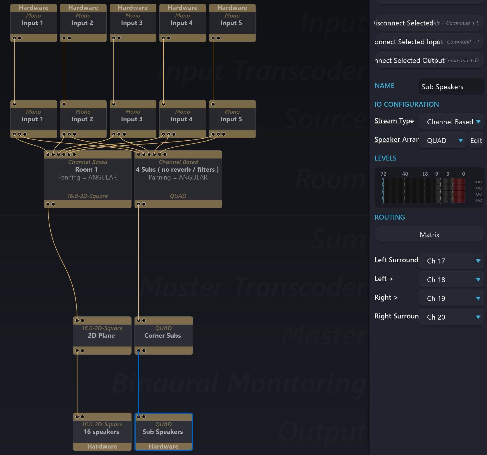

# Spatialised Sub-Woofers

In a venue or a system that has sub-woofers in the corners or at particular locations,
sometimes it is a good idea to use them all independently. Here is a suggested set
up for spatialisation over a system of 16 satellite speakers in a 2D-Square and 4
sub-woofers placed in the corners of a room in a pseudo Quad configuration.

