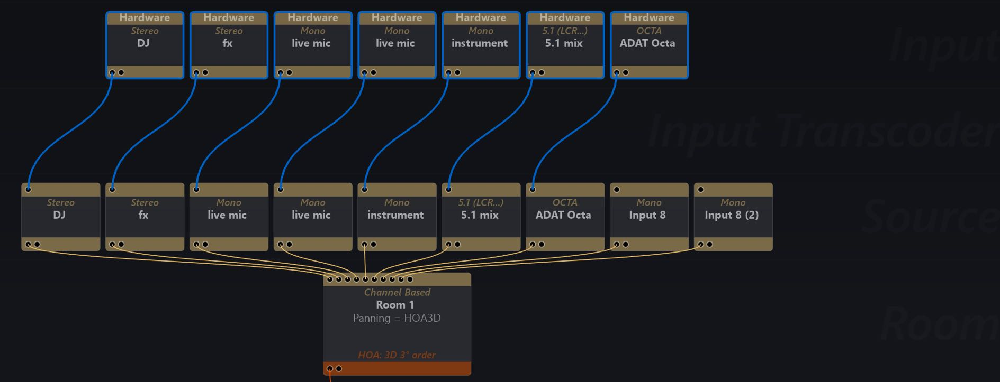

# Single Hardware Workflow

When you have a high channel count hardware IO connected to your SPAT Revolution workstation, it is possible to receive signals from the hardware unit physical inputs into SPAT at the top of the setup environment and route to the units physical outputs at the bottom of the setup graph - these are labeled as 'Hardware' IO in SPAT.

Hardware input connections could include:

- Mic
- Line
- MADI
- DANTE
- AVB
- ADAT

!> _Make sure you have the Hardware Device selected in the SPAT preferences!_

Hardware input formats could be mono, stereo or a format with any number of channels. Channels could be set up as single virtual sources, or as group multichannel sources using only one input/source module.

