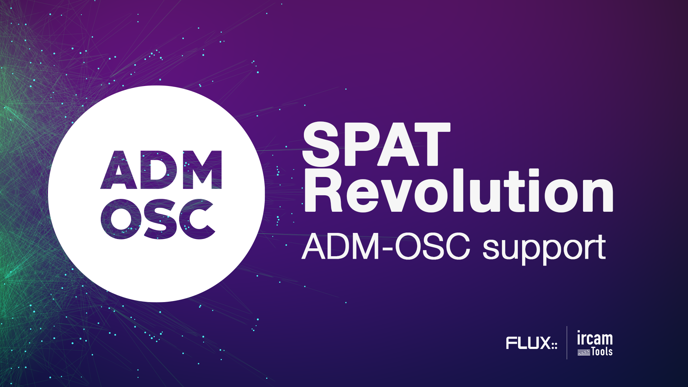
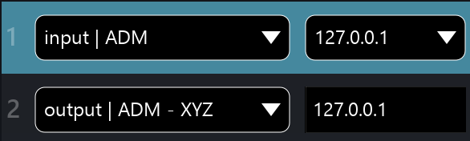
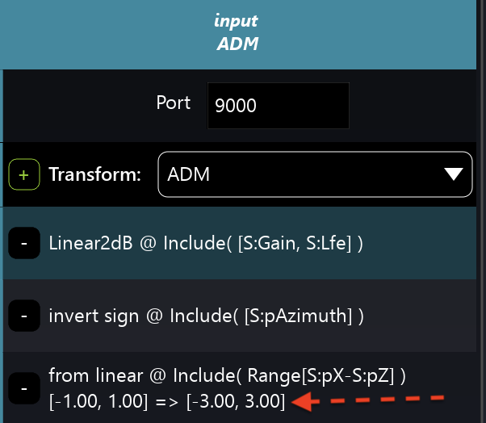
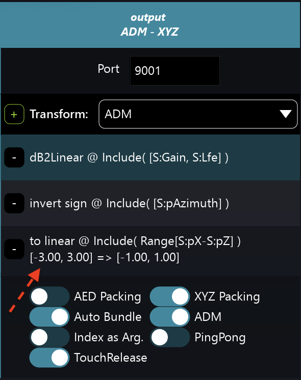
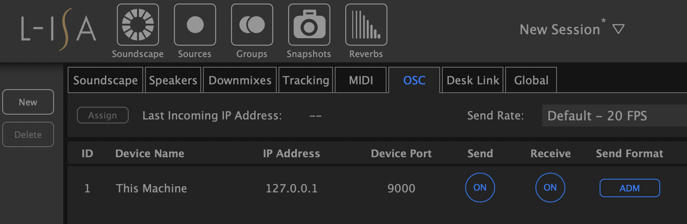
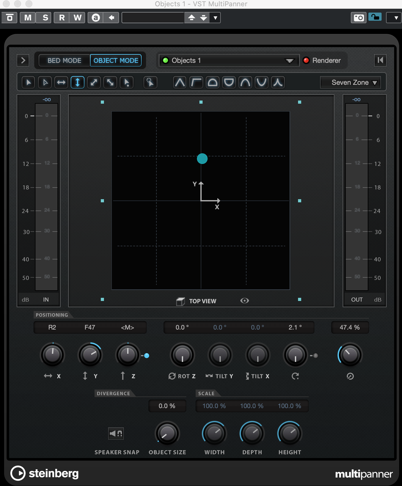

# ADM-OSC

ADM-OSC is an industry initiative developed by **FLUX:: Immersive**, L-Acoustics and Radio France (the later leading the case study and specific application) to facilitate the sharing of audio objects metadata between a live ecosystem and a broadcast or studio ecosystem. 
If tries to define a basic layer of interoperability between Object Editors and Object renderers in a live production workflow. 
It does so with [OSC](http://opensoundcontrol.org/introduction-osc) a communication protocol widely used in the live industry.
 At the base the ADM-OSC is a specif grammar and definition. 

Immersive audio is gaining ground in different industries, from music streaming to gaming, from live sound to broadcast. 
[ADM](https://adm.ebu.io/) or Audio Definition Model, is becoming a popular standard metadata model in some of these industries, with serial ADM used in broadcast or ADM xml files used in the studio.

A first implementation of ADM-OSC is now included with the latest release of Spat Revolution. 
Other industry peers have implemented early versions of ADM-OSC such as L-Acoustics (L-ISA), Merging Technologies (Ovation, Pyramix) and Yamaha Steinberg Media (Nuendo). It is supported by default on OSC input and as an option on OSC output.

## ADM-OSC in Spat Revolution

Spat Revolution supports **ADM-OSC** in input as an alternate grammar, and on output as an option. The specification calls for normalized (linear) data value to provide interoperability and tend to align with the ADM protocol. Typically, object-based mixing renderers will handle the scaling based on the system configuration. 

The specification calls for: 

* Linear 0.00,1.00 for Gain and LFE (Aux send) messages
* Invert Azimuth to clockwise
* Distance normalized to 0.00,1.00
* XYZ to a normalized cube -1.00,+1.00 (square in 2D, XY)

To configure ADM-OSC, make sure OSC is enable and go to the OSC Connection section in the software preferences.

* Choose an **input | ADM** preset to receive ADM-OSC data and select the receiving network interface.

* Choose an **output | ADM XYZ (or AED)** preset to send ADM-OSC data. 

* Enter the IP address of the destination. 
 

On the OSC input connection, you can see that Port #9000 is our default incoming port and that and ADM Transformation preset is applied to match the specification. 
To modify the incoming range (the automation zone), simply enter your desired value. In this example, we are scaling to -3.00, 3.00.

On the OSC output connection, you can see that Port #9001 is our default sending port and that an ADM Transformation preset is applied to match the specification. 
To modify the incoming range (the automation zone), simply enter your desired value. 
In this example, we are sending data form the -3.00, 3.00 zone. 
All output options are already set with the preset.

## Third party example

Recently, L-Acoustics released their new L-ISA controller that can now output ADM-OSC as an alternate method (hardware required) and is functional to be received by Spat Revolution for example. OSC messages can be sent using the ADM-OSC format and be interpreted identically by any ADM-OSC compatible device.

Furthermore, Nuendo V11 adds the support of External OSC renderers mapping bidirectionally the Multi-panner
 

