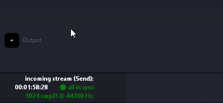

# Snapshot

Snapshots are an important part of a live show.
It can be used to capture an audio scene into Spat Revolution. 
Sources, rooms and masters properties will be stored in a snapshot.
It allows a complete transformation of the soundscape, with interpolation.

!> To use snapshots, timecode need to run in Spat Revolution. 

Two ways to run the Timecode:
- if working with Hardware IO, an audio device must be selected into Spat preferences.
- if working with Local Audio Path, the DAW needs to play back and the Spat session needs at least one send and one return connected together.

The timecode activity is apparent in the bottom left of the screen.
If timecode isn't running, the recall will fail.

 
Snapshots could be controlled of the dedicated menu, and with OSC messages.

 
## Create a snapshot

We can create a snapshot:
- by using the "Create" action into the "Snapshots" menu.
In this case, the snapshot will be added at the end of the list.
The shortcut <code>Alt + Space</code> could also be used to capture a snapshot.

- by using the "Insert Before" action. 
This option is available only if another snapshot exists. 
The snapshot will be insert before the selected snapshot, and all the snapshots will be re-number.

- by using the "Insert After" action.
This option is available only if another snapshot exists.
The snapshot will be insert after the selected snapshot, and all the snapshots will be re-number.

## Recall a snapshot

Recalling a snapshot will interpolate all the current properties with the stored values of the snapshot.
Different options could alter the snapshot running:

- Recall time

This option is available in the menu "Snapshots/Options recall".
The values are range between 0 and 3600 seconds.

- Recall Sources / Room / Master

As all the properties are stored into snapshots, this options give us the possibility to enable or disable the recall of some properties. 
The recall of each section could be separately activated.

!> Be careful with the Room properties recall: changing some properties like Reverberation Density or Size causes reverb reconstruction (and audio drops). 

## Snapshots handling

 Different actions could be executed with snapshots:
 
 - updating a snapshot
 
 - renaming a snapshot
 
 - removing a snapshot
 
 - remove all snapshots
 
# Handle snapshots with OSC

Different actions are available for handling snapshot with OSC messages:

- Create a snapshot: <code>/snapshot/create</code>

The snapshot name could be added in argument.

- Recall a snapshot: <code>/snapshot/recall [index, *time, *Recall Effective Selection, *Recall Actual Selection] </code>
 
 _Index_: the snapshot index to recall. It can be replaced by the snapshot name.
 
 _Time_: optional, it will define the recall time. If not given, the default value is 0s.
 
 _Recall Effective Selection_: optional, if the value is <code>True</code>, the sources' selection on the snapshot creation will be recalled. It's the default value. If <code>False</code>, selection will not be recalled.
 
 _Recall Actual Selection_: optional, if the value is <code>True</code>, only the parameters of selected sources' will be recalled. Else, all the sources will recalled (default behavior).
 
 
- Update a snapshot: <code>/snapshot/update [index]</code>

_Index_: the snapshot index to update. 
It can be replaced by the snapshot name.

- List all the snapshots: <code>/snapshot/list</code>

This will return the list of the snapshot, index and name.

- Len the number of snapshots: <code>/snapshot/len</code>

This will return the total number of snapshots.

- Rename the snapshot: <code>/snapshot/rename [index, name]</code>

_Index_: the snapshot index to rename.
_Name_: the new name of the snapshot.

- Remove a snapshot: <code>/snapshot/remove [index]</code>

_Index_: the snapshot index to remove. 
It can be replaced by the snapshot name.

!> Be careful using it: there isn't any confirmation. 