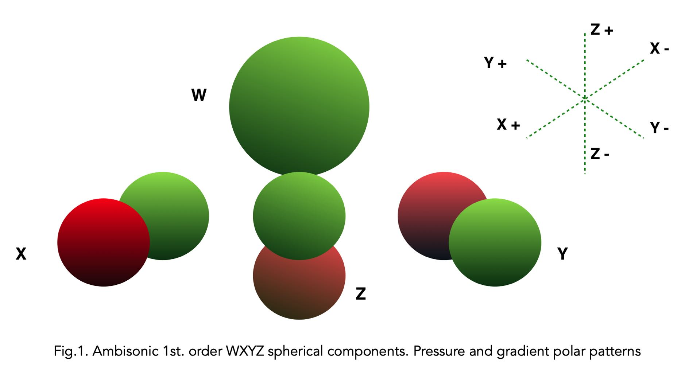
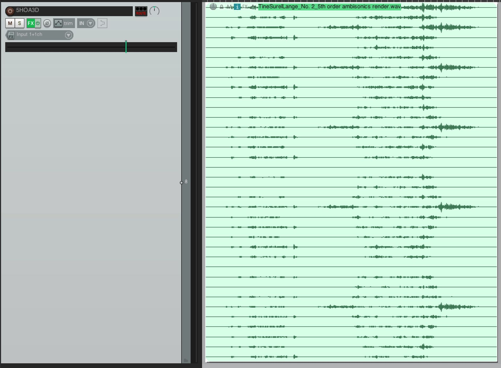
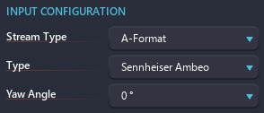

# Scene based streams

## Introduction to Ambisonics

Simply put: Ambisonics is a specific method for creating, capturing and playing back spatial audio. It is radically different from other surround techniques as the technology is capable of reproducing a spherical representation of sound where the directional information of a source is located in a 3D soundfield.

Ambisonics is also both a recording and a spatial synthesis technique, where one can capture the full environment in 3D sound through the use of so called A-Format microphones such as the: Soundfield SPS200, Røde NT-SF1, Sennheiser Ambeo, Coresound TetraMic and more. Alternatively, a sound field can be synthesised from any mono, stereo and multichannel sources to Ambisonics, constructing a virtual 3D sound environment by placing the sources at locations in a virtual 3 dimensional field.

## Encoded audio

Ambisonics as opposed to other surround and spatial techniques and methods does not carry a speaker signal. It is an **encoded** audio signal that has to be **decoded** to the speaker signals. This encoding / decoding scheme has the advantage of being very portable and flexible since one is not bound to a specific speaker setup. i.e you can have your ambisonic mix played on a number of speaker setups, for instance Quad, headphones (binaural), 5.1, 6, 8, 7 speakers etc. based on the chosen decoder.

When Ambisonics is played back on speakers all the speakers contribute to the directional content, what one is hearing is not the sound coming from a specific speaker but from a specific direction.

> Overview of a 5th order HOA 3D Ambisonic File created by Tine Surell Lange.

## Order, normalization, sorting and presets

In the simplest form of Ambisonics - the 1st order, also called **B-format** - only 4 channels are needed to represent a full 3D sound. The 4 channels or spherical components W, X, Y and Z resemble the pressure patterns found in an omni microphone (W) and three figure-of-8 microphones for left/right (Y), front/back (X) and up/down (Z) as depicted in above figure. 

The components' count increases with the order: WXYZUVSTRPQNOLMK... These different components are organised according to different standards, known as sorting. The three most used are available in Spat Revolution: 
- ACN: Ambisonic Channel Number, WYZXVTRSUQOMKLNP...
- SID: Single Index Designation, WXYZUVSTRPQNOLMK... 
- FMH: Furse-Malham Harmonics, WXYZRSTUVKLMNOPQ...

Different normalizations exist also with ambisonics. This normalization defines the relative level of the omni component compared to the other channels. It differs according to the dimension of the ambisonics:
- SN2D/SN3D: Schmidt-Seminormalized.
- N2D/N3D: Fully-Normalized.
- FuMa: Furse-Malham normalization.

To help with these different standards, we have created Ambisonics presets to simplify the use of it. These setups the normalization and sorting with common standards:
- AmbiX: used for example by Youtube and Facebook 360. The normalization is SN2D  /SN3D and the sorting ACN.
- B-Format: the normalization is Fuma, and the sorting FMH.
- Spat Room: the normalization is N2D / N3D and the sorting ACN.

!> Do not forget to transcode the ambisonic input if the format is different than N2D/N3D and ACN.

## A-Format

A-format is a 4-channel audio stream. It is the RAW output of a first-order ambisonic microphone, so it has not been encoded to ambisonic yet. So we need to transcode a A-Format input to an HOA or a channel-based stream. Because each manufacturer has their own strategy to create such microphone, we have almost as many transcoder as A-format microphone builder. Spat Revolution comes with a comprehensive list of A-Format transcoder, including Sennheiser Ambeo, Soundfield, DPA, Oktava etc.

## History and references

Ambisonics was originally developed by the late British mathematician and sound engineer Michael Gerzon and others in the 1970s. Although it was a commercial failure at the time, this very powerful spatial technique has since been advanced greatly by a number of composers, sound designers and researchers. With the introduction of Virtual Reality, fast decoders and related technology, Ambisonics is getting a new renaissance being a perfect format for such applications.

If you want to learn more about Ambisonics and its mathematical foundation here are some good starting points:

- [https://www.researchgate.net/publication/280010078_Introduction_to_Ambisonics](https://www.researchgate.net/publication/280010078_Introduction_to_Ambisonics)
- [Wikipedia article about normalization and sorting](https://en.wikipedia.org/wiki/Ambisonic_data_exchange_formats)
- [Frank Zotter' book about Ambisonics](https://link.springer.com/book/10.1007/978-3-030-17207-7)

<!--[http://flo.mur.at/writings/HOA-intro.pdf](http://flo.mur.at/writings/HOA-intro.pdf)
-->