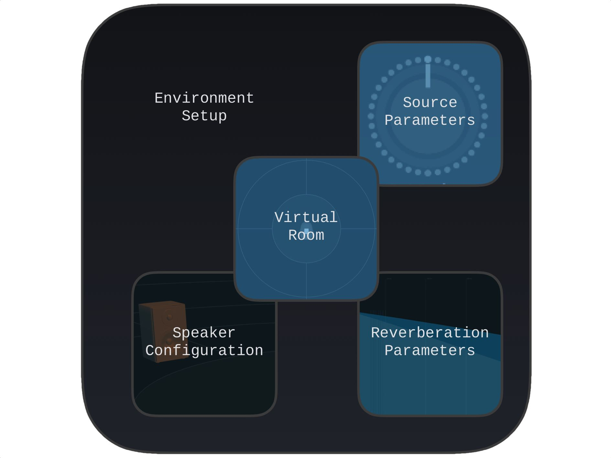

# SPAT Environment

This section will go through the SPAT Revolution software environment in more detail. We will step through each of the main Graphic Editor views.

**Rendering to Speakers**

In order for the virtual scene to translate correctly as an immersive sound experience in a speaker format, SPAT needs to have an accurate model of a _multi-channel speaker arrangement_ which will be used to map the multi-channel information to the destination speakers and render the sound field correctly in a real space.
To this end, you will find a large library of standard and specialized speaker arrangements already built into SPAT which can be used in various places throughout the **Environment Setup**.

Speaker configurations can be used to fit the format of a virtual room to match the actual speaker system being used to diffuse the mix in a real room.
Channel based speaker configurations can also be used to transcode the format of a virtual source into a virtual room.
More about this later.

The golden rule when working with multi-channel based audio is that you must be sure to choose _exactly_ the right formats, speaker arrangements and channel routing throughout; otherwise the virtual space will not map correctly into a physical space.

**Virtual and Real Diffusion**

Successful diffusion of a sound field in space relies on every loudspeaker being assigned correctly to each software rendered output channels.

A diffusion system could range from a simple pair of headphones to a 12 (Essential) or 64 (Ultimate) speakers array and anything in between.
In some of the more virtualized workflows of SPAT Revolution, you may even be thinking about diffusion in a virtual space on configurations of virtual speaker arrangements and channel based formats.
The same rule for successful diffusion applies here—the diffusion in the virtual room will be compromised and sound off if the channel assignments to the virtual systems are incorrect.

In the above illustration, a virtual 5.1 and a virtual Cube arrangement exist together in a High Order Ambisonic Room, which may eventually be rendered to some other channel based end format.
