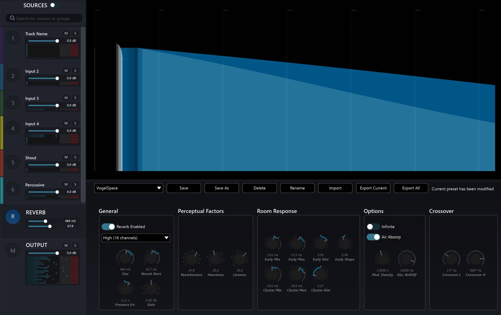
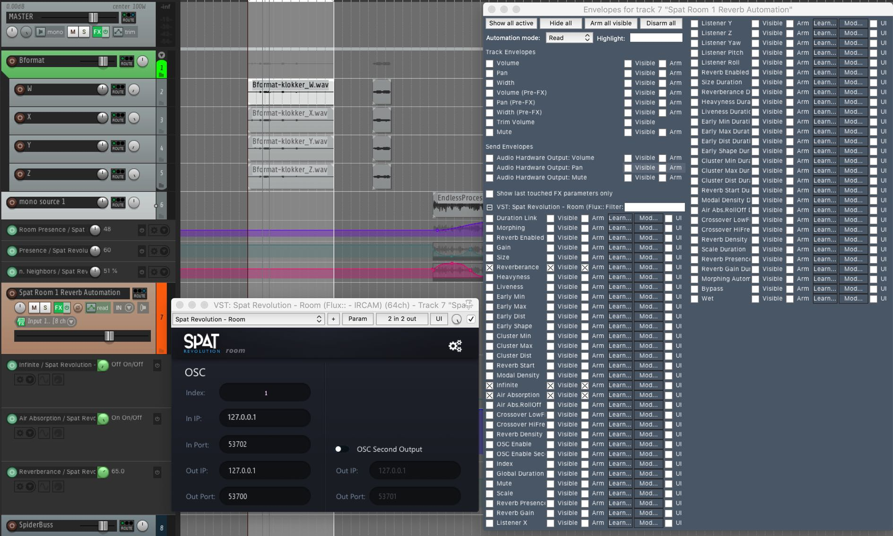
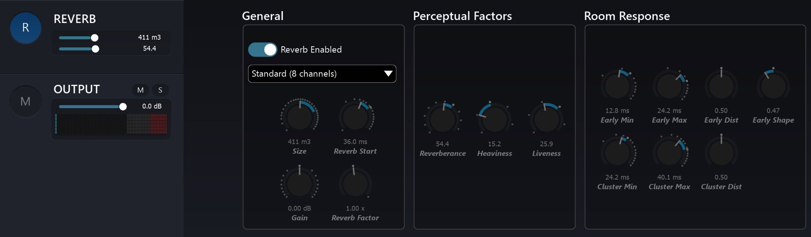
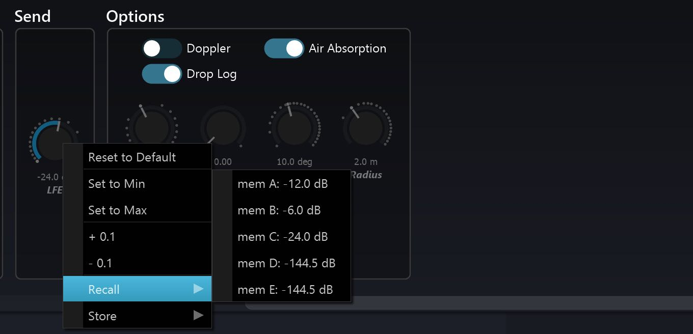

# Artificial Reverberation

Each _Virtual Room_ in SPAT can have its own artificial reverberation. 
Reverberation is a very important element in the psycho-acoustic perception of localised sources and immersive sound fields.
The reverb processor in SPAT is a multi-channel algorithmic 3D reverb based on feedback delay networks.
The SPAT reverberation engine is designed to synthesise the experience of the virtual sources, and the listener all being placed within the same virtual acoustic space.
Virtual spaces can be tuned, scaled and stored.
Open the _Artificial Reverberation_ graphical editor by clicking on the ( **R** ) index at the bottom of the list of sources on the left side panel of the Room, or entering a room directly from a tab in the top _global bar_.

Internally, the SPAT Revolution reverb engine models many technical acoustic parameters, but the user interface has been simplified a great deal, to make artificial reverb design more straightforward and functional.

> **Some Spat Reverb parameters control how the acoustics are _perceived_**

Alongside conventional tuning parameters which you might be familiar with, you will also find perceptual parameters, such as _heaviness_, _liveness_ and _presence_.

These _Perceptual Reverb_ parameters have been derived from the same IRCAM research experiments which were used to define the [_Perceptual Factors_](Spat_Environment_Source?id=perceptual-factors.md) of sources such as _warmth, envelopment_ and _brilliance_.
These can be found among the parameters for each virtual source.

The SPAT reverb designer can be used for a lot more than only simulating a "normal" acoustic space.
For example, you could try to design a totally unreal space with continuously modulating acoustic properties or a space with infinite reverberation.

> _Try to switch the Infinite option for an immediately impressive immersive effect_

# Reverb Parameters

Every variable of the Virtual Room reverberation can be directly edited through the onscreen controls in realtime.

The reverb designer excels at creating static acoustic settings that will add all the dimensionality and immersive depth to a virtual scene.
But it also invites more creative reverberation ideas.
Remember it works in 3D and interacts deeply with the parametric design of all virtual objects that are expressed through it.

### **This is no ordinary reverb.**

The SPAT Reverb is a true acoustic modelling multi-channel reverb, not just a so-called true stereo reverb.
Despite its internal complexity, the user is invited to morph and modulate the characteristics of the virtual acoustics.
To make this process fluid and natural, the parameter controls have been carefully designed so that they do not glitches.
This invites continuous parametric modulation ideas, for designing out of this world reverberant spaces, in realtime.

> _Every variable of each Virtual Room reverberation engine can be smoothly and continuously controlled via DAW automation and OSC._

In order to automate settings from a DAW, you need to instantiate a _SPAT Room_
plug-in which will open access to all the parameter controls (see [automation](10_Automation_10_2_DAW_Automation_-_Manual_setup.md) section).

## Defaults

A double click on any Reverb Parameter dial will reset it to a SPAT default setting.
The default setting of a parameter is indicated around a dial as a larger tick than the other tick marks.
Additionally, a range is graphically indicated between the default setting and the current setting of a variable parameter.

> _Use the defaults as reference points in your spatial sound design._

## Preset Memories

Each parameter has the possibility to store useful preset settings of your own choosing.
Right click on a parameter dial, and a contextual menu will pop up. From there you can store the current setting to a Memory Slot, or Recall a setting from a previously saved memory slot.

## Reverb General

**Reverb Enabled**

Toggle the entire reverberation engine for the room.

**Reverb Density**

Internally, spatial variations are computed using a kind of 3D network of reverb, and this setting toggles between an 8x8 (standard) or 16x16 size (high).
The choice of which sounds best is left up to you, as this depends on the source material at hand, although it must be emphasised that the high density setting consumes fairly more CPU and that the colour of the reverb can be altered by this setting, particularly at some extreme parameter setting combinations.

**Size**

This is a meta-parameter that takes care of varying several other parameters in order to quickly set the equivalent size of the virtual room, adjusting early, cluster and tail reverb parameters to match the room characteristics.

**Reverb Start**

Reverb start sets the duration between the direct, dry source signal, and the first late reflections, or start of the reverb tail.

> Please note its value can never go below that of the cluster minimum time, as the reverb tail is fed with a signal derived from the cluster section.

## Perceptual Factors

**Reverberance**

_Reverberance_ affects the amount by which the listener perceives the music to be prolonged by the reverb when the musical message suddenly stops.
The effect of this setting is also obvious when the source material is of percussive nature.
_Reverberence_ is tightly related to overall decay time of mid-frequencies, which in turn is the time taken by the late reflections to vanish into silence.

**Heaviness**

Relative decay time of low-frequency content.

**Liveness**

Relative decay time of high-frequency content.
Describes the liveliness and movement associated with the reverb tail (late reflections).

## Room Response Parameters

_Early_ refers to the _Early Reflections_ stage of the Room response, which is one of the most significant stages involved in our rapid aural perception of spatial properties and sound source localisation.

_Cluster_ refers to a secondary iteration of room response reflections and is quite significant in the cognition of room acoustics.

_Tail_ refers to the diffuse reverberations that eventually decay in a direct relationship with the size and reflectivity of an acoustic space.
The tail section of a reverb does not contribute much to the localizability of a sound source in a space, but instead gives a sense of depth and ambiance.

**Early Min**

Early reflections minimum time, i.e., the time at which the early reflections start to appear, in milliseconds.
This is the similar setting of the ubiquitous “pre-delay” found on most reverberation processors.
It represents the time between the direct sound and the first early reflection.

**Early Max**

Early reflections maximum time, i.e., the time at which these cease to appear.

**Early Dist**

Early reflections' distribution. Determines the way early reflections are scattered in time, inside the Early Min. / Early Max. interval.
The default setting of 0.5 corresponds to regularly spaced reflections, above these are more grouped towards the Early Max. value, and vice versa.

**Early Shape**

Governs the amplitude rise or fall of early reflections.
The default setting of 0.5 corresponds to early reflections all having the same level.
This mimics an acoustic space where reflective surfaces are all located at roughly the same distance to the listener. Below 0.5 early reflections decay with time, above 0.5 they rise with time.
Decreasing levels of the early reflections would be typical of a space where most of the reflective surfaces are grouped at a range closest to the listener.

**Cluster Min**

See Early Min. Please keep in mind the cluster is fed with the input of the early reflections' processor section, as is shown accordingly on the display.

**Cluster Max**

See Early Max.

**Cluster Distribution**

See Early Distribution.

## Options

**Infinite**

When activated, decay time temporarily rises to infinity, making the signal recirculate indefinitely inside the reverberation engine.
This is best suited for on-off special effects such as “deep-freezing” audio material, or if you’re looking to create something fairly less conventional than a fade-out for the end of your track.

**Air Absorb**

Simulates the frequency-dependent absorption of air, where high frequencies roll off quicker than low-frequencies with respect to distance.
You’ve most probably noticed this real-world phenomenon when you’re far away from a concert venue and only able to hear the bass, and gradually start to hear the whole mix as you get closer.

**Modal Density**

Scales the modal density with respect to the current setting, which is internal to the application engine, and depends on other parameters such as reverberation time.
The modal density governs the frequency “smoothness” of the verb engine.
Increasing this setting reduces the graininess of the reverberation.
Adjust to taste, depending on the source material and desired result.

**Abs. RollOff**

Roll-off frequency for the air absorption simulation. Signal content above this frequency vanishes faster.

## Crossover

**Crossover L**

Sets the frequency below which decay time is determined by the heaviness setting, expressed in Hertz (Hz). Default value: 177 Hz

**Crossover H**

Sets the frequency above which decay time is determined by the liveliness setting, expressed in Hertz (Hz). Default value: 5657 Hz

## Reverb Design Presets

The Artificial Reverberation editor has its own preset management system, where you can save pre-designed models into a user defined preset list or to disk.

This is useful for building up a collection of pre-designed reverberation spaces and for designing models that might closely match the measurements of actual spaces
you already know.
