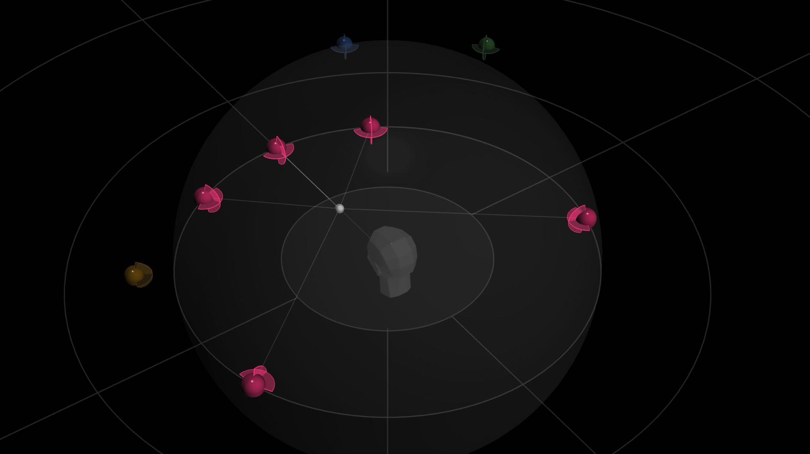

# Barycentric Groups in Rooms

When a Virtual Source in a Room has more than one channel in its format, it will be represented as a single source with ONE unique index.
It will be visualized as a group in its assigned channel based speaker arrangement.

In the above screenshot, the red source consists of 5 channels arranged as a DTU 5.0 surround sound configuration.
A multichannel cluster can be conveniently positioned and manipulated _as a single group_ which maintains its correct internal spatial positioning relationships but moves in relation to the absolute listener position in the Room (the Dummy Head).
The dot at the center of each cluster, where each virtual “channel emitter” is attached is called the “BaryCentric” focus— In other words, a _relative_ listener position that the virtual source configuration remains focused on.

These complex spatial positioning algorithms are computed and controlled in real time using SPAT Revolution’s advanced _Barycentric_ and relative direction source parameters.
A group that may contain many elements can be transformed, scaled,
moved and manipulated in complex ways, through only one set of controls.
See dedicated section for a breakdown of the [**Source Parameters**] (SPAT_Environment_Source? Id=source-parameters.md).
