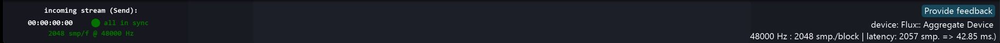

# Global Bars

The Navigation bar appears at the top of all views. As well as links to different editor views and to the preference, it also offers you the possibility to mute and unmute rooms.

The status and help bars appear at the bottom of all views. It gives information about the status of audio connections, sample rate, block size and through latency. Some inline help also appears here when the mouse moves over elements of the SPAT graphical user interface. The _Provide feedback_ button sends a message directly to FLUX:: Immersive support which automatically includes your system information for our support team.

> With Send/Return plug-ins, if sampling rate and block size between DAW and Spat Revolution are different, the status bar will be red. Double-click on this bar to automatically change them into Spat Revolution.