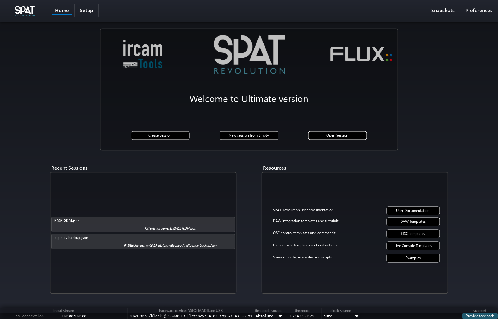
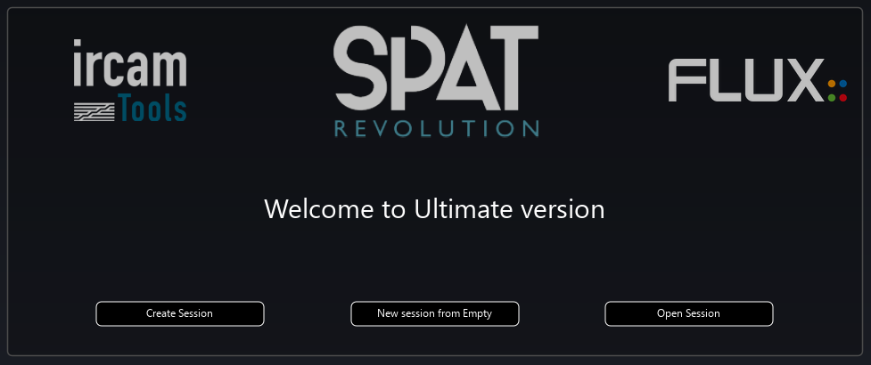
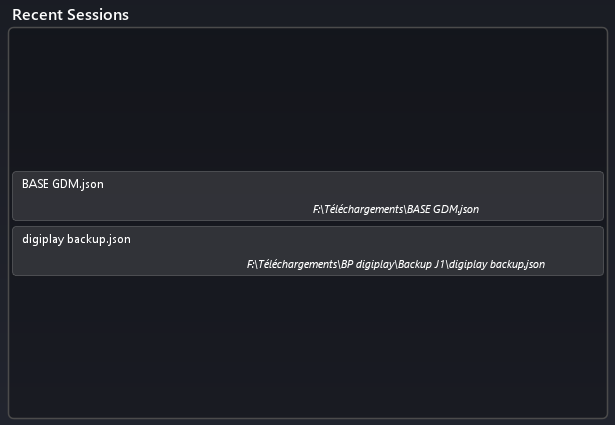
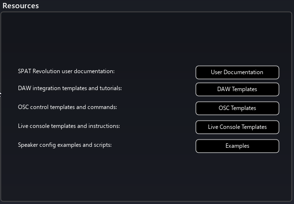

# Home Page

This page is the welcome page of SPAT Revolution. Here you can create sessions, open ones from disk or from a list of recent ones or access to the resources of SPAT Revolution.

## Welcome box

This simple box let you access to basic action of session management.

### Create Session

Create a session with a wizard to set up the routing.

### New session from empty

Create an empty session, without calling the wizard.

### Open a session

Let you open a session from a disk.

## Recent Sessions

This box list the latest open session in SPAT Revolution. You can open one by double-clicking on it.

## Resources

This box gives you direct access to many resources related to SPAT Revolution:
- This documentation
- DAW templates for using LAP
- OSC templates, which include a lemur template and a QLab example session
- Live console templates
- Examples of various scripts 
