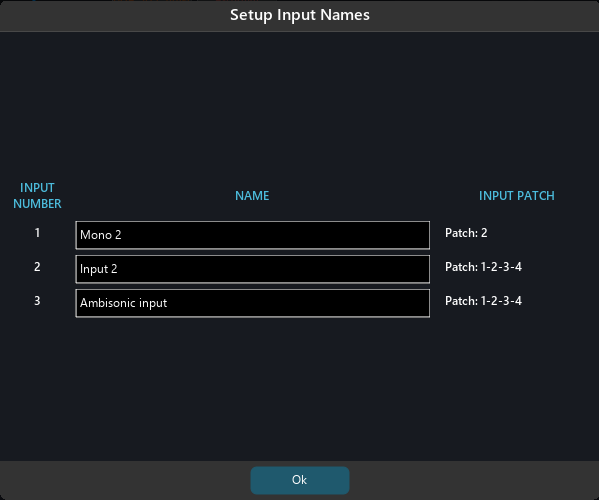

# Inputs

It might be self-evident, but it’s worth pointing out that SPAT Revolution itself does not play audio files. It handles the spatialisation and rendering of signal sources routed through it in real time like some kind of vast spatial sound mixing console.

The top row of the signal graph represents the input sources that will provide the source content for the current project. You add an input module using the <code>+</code> icon, and you can remove ones you don’t need with the “Remove Selected” action. The input streams can be of many formats, the choice of assignable formats will depend on the number of channels each input module represents.

> One Input module can represent any number of audio channels.

The second important distinction between inputs is whether it is a **hardware** input receiving an audio stream from a hardware device or a virtual **send** receiving its audio stream from another program currently running on the same machine as SPAT. The latter is done via a SPAT Revolution _SEND_ plug-in—but before we go into SPAT’s powerful software signal routing integration, let’s focus on the different input formats as these will remain consistent whether the input stream is coming from hardware or from a _SEND_ plug-in.
## Input type

The menu allows to toggle between the actual input of the block and the signal generator. The signal generator type and level are set in the _Preferences_ page.

## Input naming

There are two ways to rename an input. The first solution is to simply select an input in the setup page and to rename it in the inspector on the right side of the SPAT Revolution window.

If multiple input needs to be renamed, the previous method can be tedious. The solution is to select multiple inputs blocs and to choose the option “Edit Inputs Names” in the inspector, or use the shortcut <code>Alt + N</code>. A new window will open with a list of all the selected inputs, ready to be renamed. To quickly navigate through the input names we can use either the <code>enter</code> or <code>tab</code> key.

