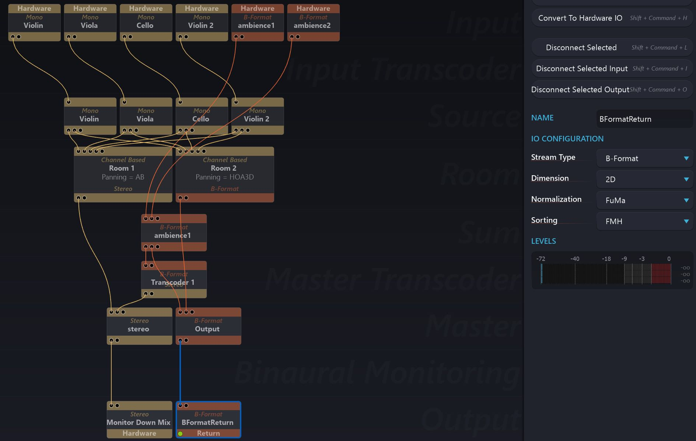

# Output

The main thing to note at the output stage is that you can have any number of output routes.
Like the [Inputs](6_Spat_Environment_6_4_Inputs_6_4_Inputs.md), they may be either direct hardware routes, which returns audio streams (via matrix routing) to the physical outputs of an audio interface connected to your SPAT Revolution workstation.
The Hardware Output workflow is the most direct way to render in realtime to an actual loudspeaker system (or headphones).

Outputs may also be linked to SPAT Revolution RETURN plug-ins, which returns audio streams internally on the same workstation to a valid SPAT RETURN plug hosted in your DAW.
The software RETURN workflow offers an easy way to render the spatial scene to disk, as _Ambisonic encoded_ , _Binaural encoded_ or _Sound system encoded_ multichannel audio.

> Create multiple output routes to capture Ambisonic recordings at
the same time as sound system specific rendering.

