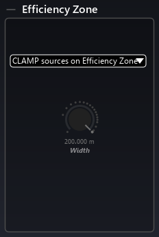

<!--MANY BS HERE, TO BE CLEANED UP!!!-->

# Room

In SPAT Revolution, spatialization of virtual sources takes places inside _Rooms_. To enter a room and open its graphic editor environment, double-click on a room module in the Setup graph, or select a room tab from the Navigation bar.

The first thing to notice is that we can add any number of rooms. In the screenshot above, two HOA 3D rooms are being used, each with differently designed acoustics. There is plenty of flexibility built into SPAT Revolution, in order to encompass different workflow ideas or experimental approaches. For example, the same virtual sources may be assigned into multiple rooms, with multiple end destinations. Or as in the screenshot above, virtual sources might exist in different spaces that get summed together.

!> _Multiple room is only available with the Ultimate license of SPAT Revolution_.

When we enter a Room, we will see the 3D view and all the connected sources. On the left side panel of the room editor, you get a list representation of each source with its index identification number. We can click on the Index number of each source, and the _[source parameters](6_Spat_Environment_6_6_Source_6_6_Source?id=source-parameters.md)_ editor for that virtual source will appear.

> If a source is a multi-channel one, there will be only one index and one set of parameters for the whole cluster.

Two special index items labeled as **(R) REVERB** and **(M) OUTPUT** appear fixed at the bottom of the left panel. By clicking on these, we then enter into two more parameter editors: one relating to the _[Artificial reverberation](8_Artificial_Reverberation_8_Artificial_Reverberation.md)_ and one relating to the room output configuration and [Listener Position](5_Spatialisation_Technology_5_4_Listener_Position.md) editor.

Mutes and solos are manageable for all sources and for the entire room output from this index list.

When you have more than one Room in your project, then the SOURCES switch at the top left of a Room editor can be handy, as it will show all sources from all Rooms in the same editor - allowing edition, mix, solo and mute management of all sources from one Room view.

<!--## Room Graphic Engine

Along with the audio modeling engine, one of SPAT's key features is its ability to model a high definition graphical representation of the virtual space inside each room. We can intuitively interact and move sources and 'camera view' directly with our mouse. Move a source by grabbing its 'emitter' object or in the case of a grouped source grab any one of the emitters that belong to the group. Alternatively, sources can be positioned by manipulating their coordinate-related source parameter controls (see [ Radiation section](6_Spat_Environment_6_6_Source_6_6_Source?id=radiation)).-->

## Room's stream type

The _Room_ module requires all sources to be in some type of channel-based format at its inputs. Internally, however, the Room may calculate spatial positioning and panning using different methods according to the setting of the _Output Configuration_ pull down menu.

A room will compute internal virtual panning, reverberation and output in five possible formats:

- [**Channel Based**](#Channel-Based-Setup-Examples)
    - Virtualized Sources
    - Virtualized Speakers
    - Virtualized Panning Behavior
- [**Binaural**](#Binaural-Room)
    - Virtualized Sources
    - Virtualized HRTF
- [**High Order Ambisonic**](#High-Order-Ambisonic-Room)
    - Virtualized Sources
    - Virtualized Ambisonic Encoding
- [**B-Format**](#B-Format-Room)
    - Virtualized Sources
    - Virtualized Ambisonic Encoding
- [**Mid Side**](#Mid-Side-Room)
    - Virtualized MS microphone arrangement

> Different Virtual Room types can be used in parallel.

In the output section, we can also mute specific speakers. This can be really helpful for checking routing or for diagnostic its system.

## Display output drop-down

Located on top of the 3D view, the “display output” drop-down allows choosing which point of the signal path to display.

For example, working in an HOA room create 3D view that does not show any speaker. This is because of the very nature of how ambisonic work. But it also means that you cannot use Nebula in that kind of room. This is where this “display output” feature becomes handy. Instead of showing the actual HOA scene, it is possible to choose to look at the sound scene at the transcoding stage to see what happens with Nebula on the speaker array.

## Room output parameters

### Output list

<!-- TODO: add the image -->

This panel list all the speakers used in the room (when set to channel based). It allows quick access to the speaker arrangement editor and to the compute function.
Each output has a "test" button that sends the signal from the signal generator directly the routed speaker. The signal generator type and level are set in the _Preferences_ page.

!> Be careful, the generator is post mute and post gain

### Listener

This panel gives access to the listening point. We can change its position, using the _X_, _Y_, _Z_ parameters, and its rotations using _Yaw_, _Pitch_, _Roll_.

### Protection Zone

<!-- TODO: add the image -->

This panel controls the behavior and size of the protection zone. By default, it is set to a diameter of four meters. Please check out the section named "Understanding the 3D view" if you want more information about the protection zone.
Note that the protection zone is attached to the listener position.

+ Source fit speakers elevation
+ Source over listener head
+ Width

### Efficiency Zone

<!-- TODO: add the image -->

This panel contains options related to the efficiency zone.

+ Clamping behavior option (consult the "Understanding the 3D view" section for more information)
+ Depth - change the depth of the efficiency zone
+ Trunc (available only for non-surrounding 2D speakers' setup) - change the starting distance of the efficiency zone

### Scaling

<!-- TODO: add the image -->

#### Distance

This parameter scale all the distance automation (OSC, plugins data and snapshots) by a manual factor. This factor is adapted automatically when editing the arrangement of the room.

#### Tracking

This parameter changes the scale of RTTrPM protocol data.

### Background Image

<!-- TODO: add the image -->

This panel allows you to import a background image in SPAT Revolution and to position it in the 3D view.