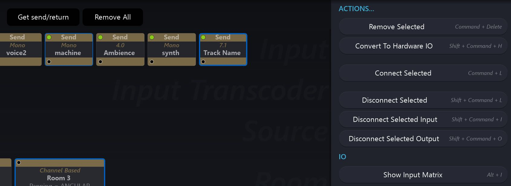
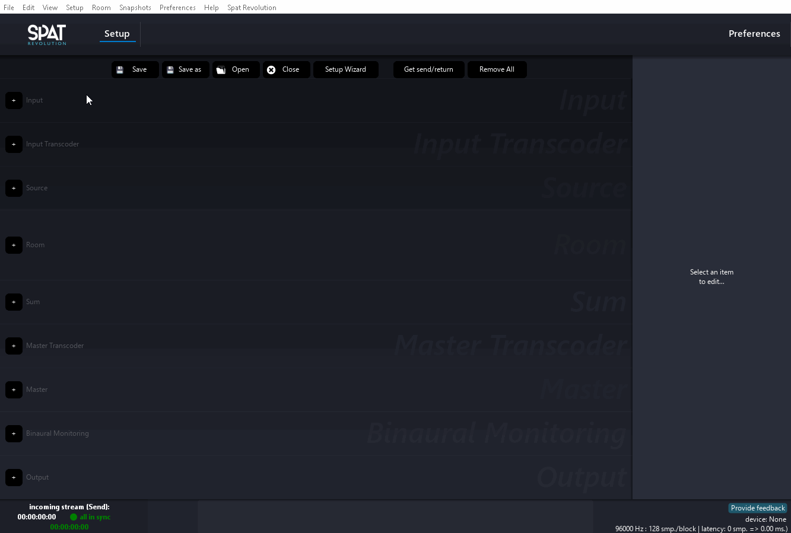
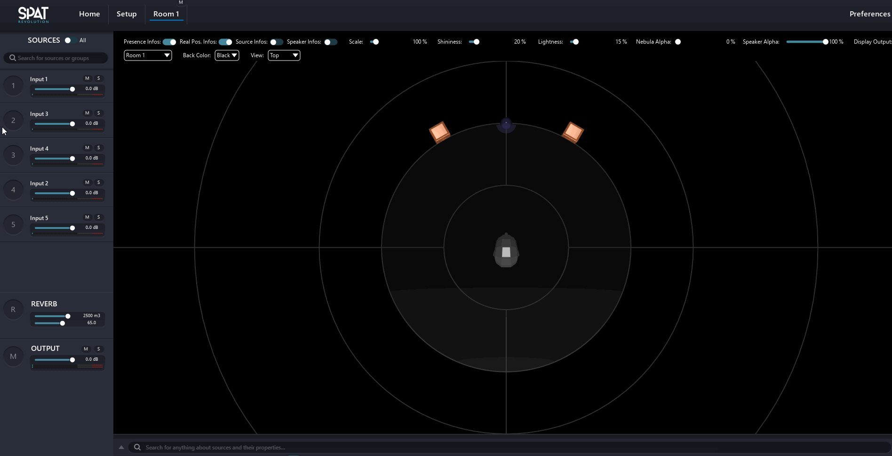
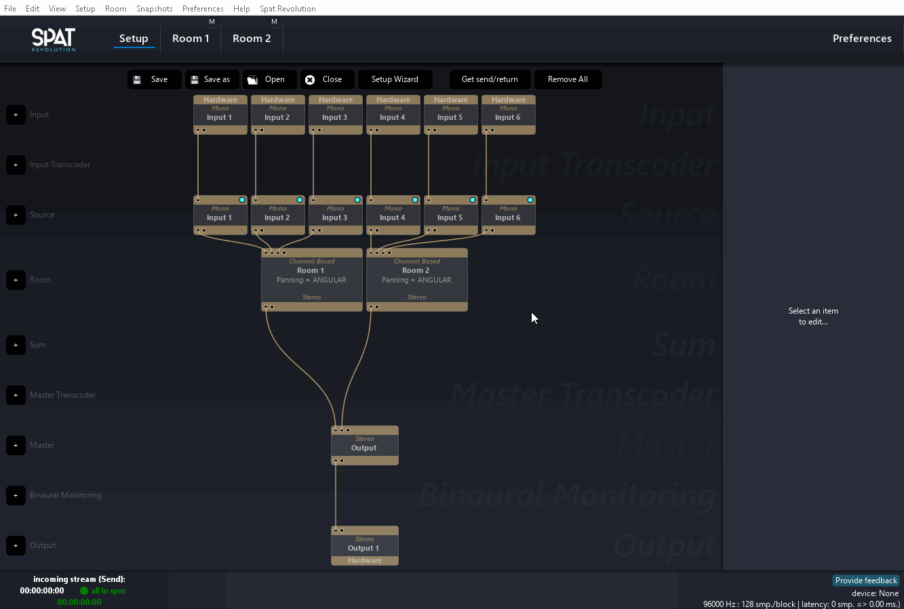
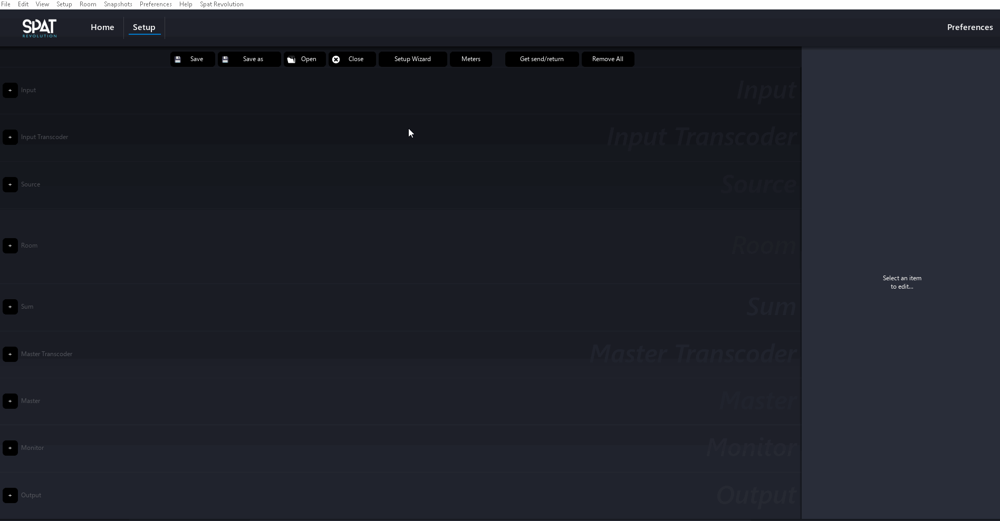
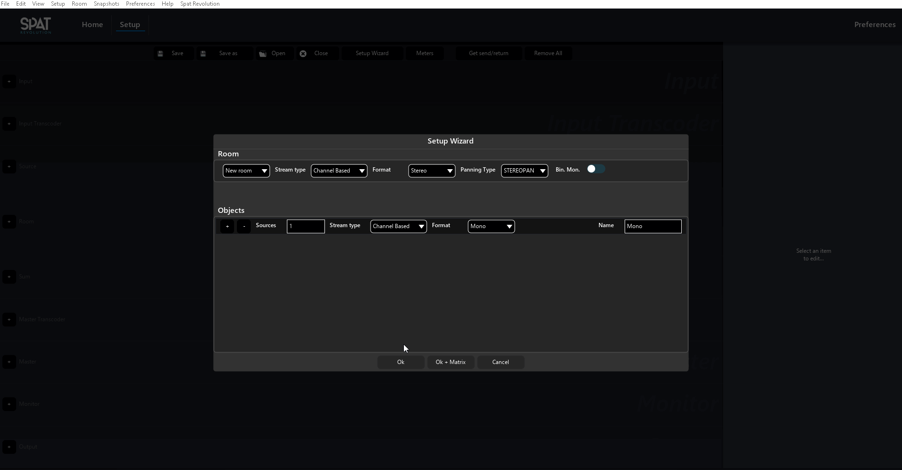
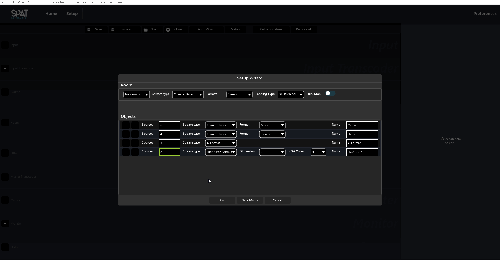
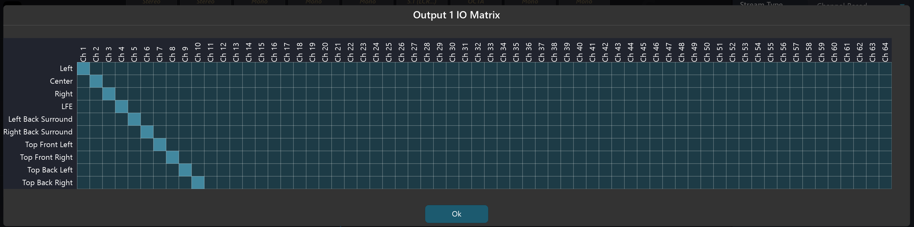
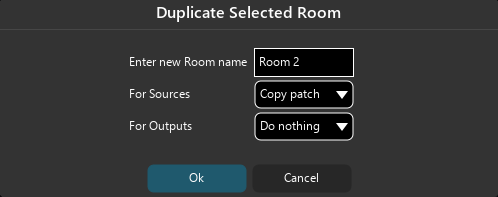

# Setup page

This is where you will generally start a project by designing the signal flow graph that you will be working with. _Setup_ is also where you manage the loading and saving of projects to disk.

## Setup Modules

The _Environment Setup_ editor is a relatively simple modular environment. The signal flow starts from the inputs at the top of the graph and concludes with the outputs at the bottom. You add modules to rows using the small <code>+</code> icon to the left of the window. Modules are:

* [Inputs](6_Spat_Environment_6_4_Inputs_6_4_Inputs.md)
* [Input Transcoders](6_Spat_Environment_6_5_Input_Transcoder_6_5_Input_Transcoder.md)
* [Sources](6_Spat_Environment_6_6_Source_6_6_Source.md)
* [Rooms](6_Spat_Environment_6_7_Room_6_7_Room.md)
* [Sums]((6_Spat_Environment_6_9_Master_Section.md))
* [Master Transcoders]((6_Spat_Environment_6_9_Master_Section.md))
* [Masters](6_Spat_Environment_6_9_Master_Section.md)
* [Binaural Monitors](6_Spat_Environment_6_9_Master_Section.md?)
* [Outputs](6_Spat_Environment_6_10_Output.md)

## Connect/disconnect Modules

Connect or disconnect modules by using <code>command/control + click</code> to select some followed by any of the Actions available in the options panel on the right of the window. Various keyboard shortcuts are also available for each Action. As you connect modules and build up a signal graph, you will see some 'wires' appear which connect modules together. In Spat Revolution these 'wires' represent connections in the signal graph diagram, you do not directly interact with them. It is not a 'patching' type of interface.

> Select multiple modules using drag/lasso selection or <code>Ctrl/Cmd + Click</code> before an Action.

There is no UNDO/REDO paradigm in the signal graph editor at this point. Instead of it is advisable to use <code>Connect/Disconnect Selected</code> actions to re-structure the signal graph. Try to avoid deleting modules until you are certain that is the correct action.

> Modules can be connected to multiple destinations.

It is possible to connect some modules, such as Input or Source, to multiple destinations, as a way of making doubles in a single or doubling a single source into different virtual rooms.

## Drag & Drop

The drag and drop feature allows an easy and ergonomic way to connect and reorganize blocks in the setup page.

### Connect modules

To create a connection  between two blocks, simply drag one on the other. Spat will  automatically connect the two blocks. If it is necessary, Spat will also create supplementary blocks if needed. For example, if we drag and drop an input on a room, Spat will automatically create a "source" block  between them.

This feature also works on a selection of multiple blocks of the same type. For example, if we wished to connect 5 inputs to 1 output, we can select our inputs a drag them  on the output. All the inputs blocks will be patch to a room block thru sources, and the room is patch to the output thru a master block. (With the default stereo room that can be changed later)

### Reorganise modules

The drag and drop feature also allows reorganizing the blocks of the same type. This means that you can now change the order of already created blocks. This gives to the setup page a more ergonomic and flexible feel. 

!> Important to note that this will be changing the index number of the source. So be careful with automation already created. This is specific to OSC like using the plugins with OSC where the index is important. Not the case with software sources/inputs which use a different ID system.

We can also reorganize  sources inside Rooms. Again, a simple drag and drop allows this smooth  reorganization. This modification is mirrored on the Setup page.

## The setup wizard

In our effort to make Spat Revolution easier to use, we created a small utility to help you set up new Spat sessions. This is used mainly when dealing with hardware I/O.

To open it, you can either:

- Click on the <code>Setup Wizard</code> button in the top menu of the Setup page
- Go to the main menu, into Setup, then "Setup Wizard"
- Or, use <code>ALT + W</code> (The shortcut may not work in Windows)

The top part of the Setup Wizard, allows to create a new room (with associated options) or to select an existing room to patch new sources into. If a new room is created, we can choose its stream type and many options linked to it. We can also choose to associate a binaural monitoring block to it.  (virtualizing the room output) Lastly, for each new room created, a master block and an output block is also created.

The main part of the Wizard allows creating up to 8 different types of sources. It works like a table where each line can be used for a specific input stream type. To add or remove a line, simply click on the <code>+</code> or <code>-</code> sign on the left side of a line. You can also use the shortcut <code>Ctrl + Go Down</code> or <code>Ctrl + Go Up</code>.

Other shortcuts have been implemented in this wizard:
- <code>Go up</code> and <code>Go down</code> to increase / decrease the number of source
- <code>Go Left</code> or <code>Go Right</code> to change the Stream Type.
- <code>Ctrl/Cmd + Go Left</code> or <code>Ctrl/Cmd + Go Right</code> to change the format (if Channel Based), or the Dimension (if HOA).
- <code>Ctrl/Cmd + Shift + Go Left</code> or <code>Ctrl/Cmd + Shift + Go Right</code> to change the Order (if HOA).

When we have done creating out different sources, we have to way to validate the operation. We can  either click on <code>Ok</code>, all the sources, rooms and outputs will be created, with a straight routing, or, we can choose to click on <code>Ok +  matrix</code>. This last option will open the input and output matrix of our whole Spat Revolution session to allow us to quickly customize or validate our patch. Also, if you need to easily create a line in Spat matrix, simply hold <code>CMD</code> or <code>Ctrl</code> and click on the starting point of your line. 

## Routing Matrix

As you can imagine routing and patching high density channel counts can get complicated. 
When it comes to that, the SPAT routing matrix is there to help. 
You will find it at many points throughout the **Environment Setup** graph.

> *Avoid cable swapping on the loudspeaker setup, use software routing instead.*

The routing matrix is available on hardware input and output for routing  as well as for remaping within some modules input and output. 
(Input transcoder, Master, and Master transcoder)

The speaker configuration editor, a clear channel labelling and the built-in routing matrix system all help to make the process of signal routing, checking and debugging more straight-forward on location, in the virtual mix and in the studio.

> The shortcut <code>Ctrl + click</code> will route one per one all the following channels.

## Room duplication
 
 
 
 Spat allows to quickly duplicate a room with a few options to help the user
  to optimize the routing process. To access this menu, simply click on the <code>Duplicate Selected</code> button, when only a room selected.
 
 The new pop-up windows allows to:
 * Rename the duplicated room
 * Choose if the sources routed to the original room are routed the new one, or duplicated, or nothing is patched.
 * Choose if the outputs of the original rooms are duplicated, mirrored or nothing is done to the duplicated room.
 
 