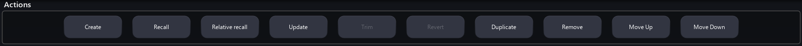
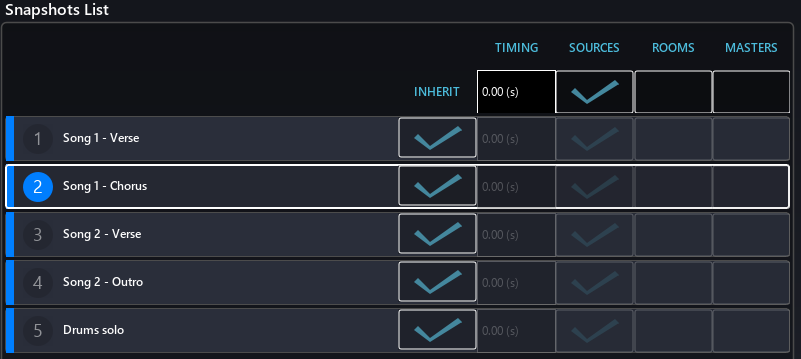
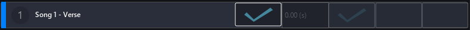
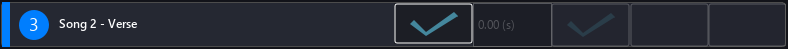
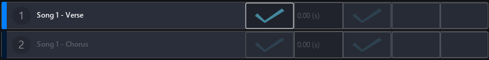
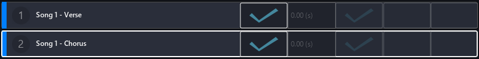
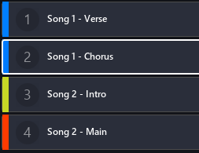
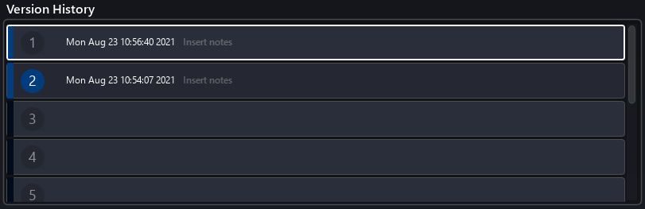
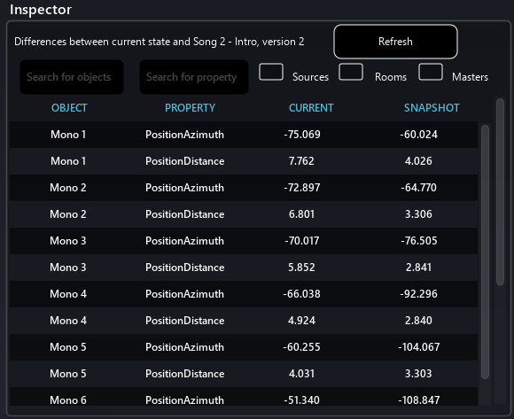

# Snapshot page

The new Snapshots page of SPAT Revolution allows the user to deeply manage its show. Snapshots are an easy way to create different session state. A classic exemple would be to have different snapshots for different songs, or section of a song, in a live show.

The system built in SPAT Revolution is both simple and powerful. As a generality, when a snapshot is created, it store the entire session state. Only the recall function can filter what is recallen.

The page is divided into four different sections : the action bar, the snapshot list, the version history and the inspector.

## The action bar

This action bar countain many buttons to manage snapshots

- "Create" allows to create a new snapshot from the current sources/rooms/masters state
- "Recall" allows to restore a previously saved snapshot selected in the snapshot list.
- "Relative recall" is a more specific recall function. It allows to recall a snapshot while preserving anything that was offseted from the previous state. Here is an exemple. Let's say you have two snapshot, "A" and "B". Sources inside your project have different place in space between the two snapshots. Now, let's presume that once the show is started, you feel that one of the sources, let's say the source "2" is too close. So you grab the distance parameter and put it further away. The "Relative recall" function will preserve this offset to any of the futur recallen snapshot. This allow a perfect blend of live mixing and preparation work.
- "Update" allows to update the selected snapshot in the snapshot list with the current state of the session.
- "Trim" ?
- "Revert" ?
- "Duplicate" allows to duplicate the current snapshot selected in the snapshot list.
- "Remove" allows to delete the snapshot selected in the snapshot list
- "Move up" moves the selected snapshot up one row in the snapshot list
- "Move down" moves the selected snapshot down one row in the snapshot list

Moving snapshots in the snapshot list can be also done via drag and drop.

## The snapshot list

### Generality

The snapshot list serves many purpose. First it display the snapshot organization of your session. You can change the order of each snapshot drag & droping them in the list. Their name can also be edited by clicking on the text field. To recall a snapshot from the snapshot list, simply double click on number of one of them.

A snapshot can have different state. First, it can be selected or unselected inside the list. The state of selection is graphical element that let the user know on which snapshot an action is performed.

Unselected snapshot

Selected snapshot

A snapshot can also be disabled. A disabled snapshot will be darken in the list. It cannot be recallen. The "next" and "previous" snapshot button will automatically skip a disabled snapshot. To activate or deactivate a snapshot, right click on a selected snapshot click on the "Enable / disable" option.

Active snapshot (1) VS unactive snapshot (2)

Lastly, the last recallen snapshot is displayed with a white border around it. This allows the user to monitor where he is in his show.

In-play snapshot (2) VS not-in-play snapshot (1)

### Global snapshot preferences, inheritence and override

The snapshot list also expose four recall options on its top right corner. : the recall time, the source option, the room option and the master option. This parameters affect every and each snapshots.

- The recall time is an interpolation between the current session state and the session state recallen from a snapshot. This allow to smooth out the transition between two scene and can also be used to create some mouvement.
- The source option define if the sources state should be recallen. This refer to the sources position and other properties.
- The room option define if the rooms state should be recallen. This refer to the reverb parameters of rooms and also the listener head.
- The master option define if the rooms state should be recallen. This refer the master level output.

By default only sources are recallen from snapshot. Remember than even if only some parameters a recall, on the creation of a snapshot, the whole session is stored in it.

Beside each snapshot, there is a tickbox, under a collumn named "**inheritence**". If the tickbox is checked, the default value of the property refer to the global value. If the tickbox is unchecked, you can override the global preference and enter a specific recall values for the snapshot.

### Changing snapshots color

To help to a better organisation of the session, snapshots can be recolored. To do so, right click on the selected snapshot and choose "Set colors". A palette, from which you can pick a color, will appear. 

## Version history

In this panel takes place a very powerful feature. For each snapshot, Spat Revolution automatically store the last ten version. Of course, you can recall any of this ten previous state.

Very much like the snapshot list, an entry in the version history list can have various state :

- It can be selected or unselected
- It can be in-play or not-in-play.

An entry in the version history as for the name its creation date and time. It is not editable, but you can also insert a custom note.

An entry can be deleted by right clicking on the selected entry and by choosing "delete".

A previous snapshot version can be recallen by double clicking. 

## Inspector

The inspector let you visualize the difference between the current state of your session and the selected snapshot, of version of snapshot.

It allow to easily monitor what was changed and how it was changed.

You can filter the list by an object name or a property name. You can also choose to show only informations by sources, rooms or masters.