# Speaker Arrangement Editor

## Rendering to Speakers

* Virtual scene is transposed to a speaker system.
* Speaker arrangements to model the diffusion system.
* Panning or Synthesis method.
* Arrangements used for the source, room and transcode.

> *Pay attention to arrangements and channel routing, they are the key !.*

In order for the virtual scene (our room) to translate correctly as an immersive sound experience on a speaker system, SPAT Revolution needs to have a model of a multi-channel speaker arrangement which will be used to apply the panning or synthesis method to map the information to the destination speakers and render the sound field correctly.

To this end, you will find a large library of standard and specialized speaker arrangements already built into SPAT Revolution which can be used in various places throughout the Environment Setup.

Speaker arrangements can be used to fit the format of a virtual room to match the actual speaker system being used to diffuse the mix in a real room. Channel-based speaker configurations are used to define a multi-channel source arrangement, a room speaker source arrangement, and can also be used in the transcoding phase of soundfields.

The golden rule when working with multi-channel based audio is to ensure to have the appropriate format, speaker arrangement, and channel routing throughout, otherwise the virtual space will not map correctly into a physical space.

## Speaker Configuration

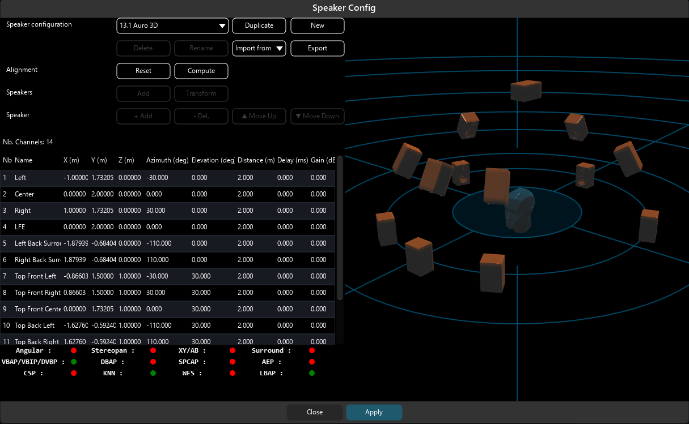

> *★The speaker configuration window showing a predefined 13.1 Auro 3D speaker arrangement.*

The **Speaker Config** editor offers the ability to prepare the model of the sound diffusion system you are actually using.

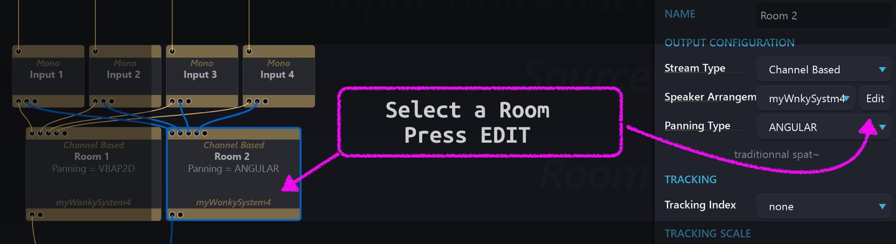

When you find yourself working on a custom multi-channel speaker arrangement, the **Speaker Config** editor is where a model of the sound diffusion system can be defined and stored into the list of speaker arrangements.

Open the **Speaker Configuration** editor by clicking on the <code>Edit</code> button of a Channel-Based room, by the _Speaker Arrangement_ pull down menu. Pre-configured arrangements cannot be deleted but can be **duplicated** (a copy will be generated for editing). A **New** config can also be created.

## Speaker Config Window

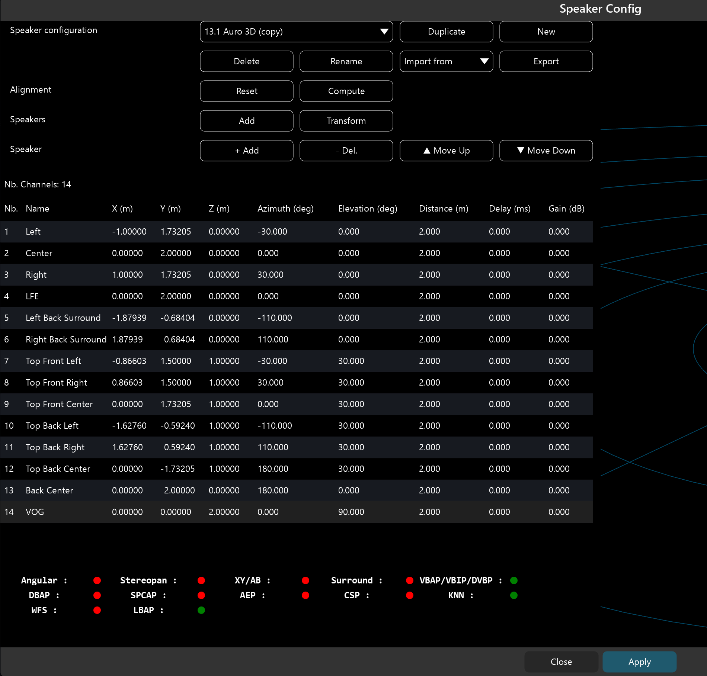

> *Editing a speaker configuration showing a copy of a 13.1 Auro 3D speaker arrangement.*

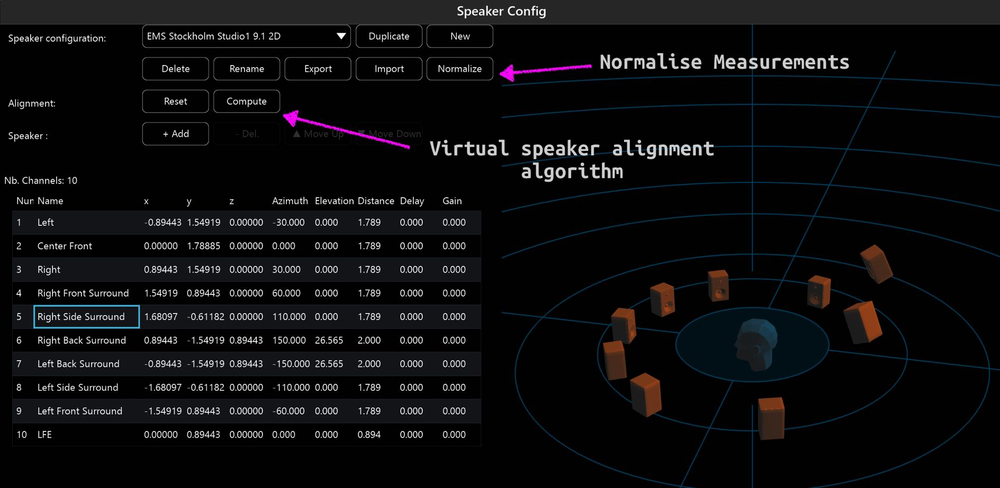

> *Computing and using the Normalize function.*

_!> With a Spat Revolution Essential license, blocks cannot use an arrangement containing more than twelve speakers. 

Note: Managing the **Speaker Configuration** includes the ability to <code>Delete</code>, <code>rename</code>,  <code>import</code> configuration(s) from a file, or <code>export</code> configuration(s) to a file. Note that SPAT Revolution’s predefined speaker arrangements can’t be deleted or renamed, but duplicating them (making a copy) will allow you to edit the arrangement thus starting from an existing configuration.

Once editing a speaker configuration, you can either <code>+ Add</code>, <code>- Del</code>, <code>Move Up</code> or <code>Move Down</code> speakers in the list. Note that the total number of channels in your arrangement is denoted above the list. Your speaker system contains a Low Frequency LFE channel where you want the ability to send audio to it like on an aux system? Simply adding a channel (or channels), called LFE, will do the magic for you here directly. This particular channel won’t be fed from the virtual room panning, but by the LFE Send on each of the sources that will be available on rooms containing an LFE.

## Speaker Position

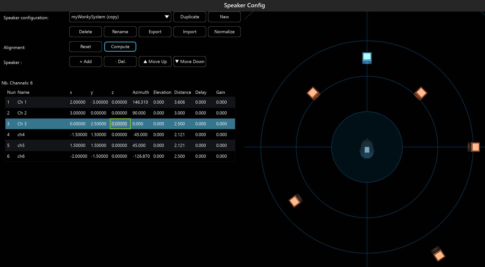

> *Positioning Speakers with XYZ or AES coordinates.*

Position information of the loudspeaker can be entered as X, Y, Z in meters or with azimuth degrees, elevation degrees, and Distance in meters. These positions have an origin of (0,0,0), the Listener Positions, the center of reference. Delay and Gain can be used to manually align the speaker location to a virtual "aligned" speaker, essentially creating a virtual speaker.

SPAT Revolution can accept real world absolute measurements which you have entered manually, and this speaker arrangement can be used in all Channel Based contexts, such as an input array of microphones, simulating the exact physical speakers in a virtual room, virtualizing the speaker sources in binaural or transcoding into channel-based system from an Ambisonic stream.

> A detailed tutorial on advanced scripting of Custom Speaker Configurations using the Python language is available as in some cases, creating speaker setups in an editor is not the most efficient way, primarily when such information is available as a list and was exported by an acoustic and design simulation software like those used with loudspeaker companies. This can be quite practical for some larger more complex setups. Please contact us for more information.

## Automatic Scaling

If you change the speaker arrangement of a room where you already routed some sources, the global sound scene will be scaled to the new speaker arrangement. This will preserve the presence of all the sources in your sound scene.

## Speaker transformation

To modify a speaker arrangement with a predefined action, you can use the "transform" menu. To access it, click on the "Transform" button. A pop-up window will appear.

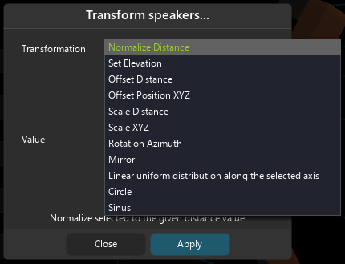

**Normalize Distance**: The further speaker will be place at the given distance. All the other speakers will be placed at the relative distance from it.

**Set Elevation**: The first ring of speakers will be placed at the given elevation.

**Offset Distance**: This transform applies an offset to the distance parameter of all speaker. It preserves relative position of speakers.

**Offset Position XYZ**: Same as above but with XYZ parameter.

**Scale Distance**: This transform allows to scale all the speakers inside a certain range of distance. It preserves relative position of speakers.

**Scale XYZ**: Same as above but with XYZ parameters.

**Rotation Azimuth**: With this transform, we can apply a rotation to our speaker array.

**Mirror**: As its name imply, this transform creates a mirror of the speaker arrangement regarding of a certain axis.

**Linear uniform distribution along the selected axis**: This transform puts all the speakers on the same axis, with an even space between them.

**Circle**: This transform places all the speaker on the same circle, with an even space between them.

**Sinus**: This transform creates a sinus shape with the speakers.

> The **Normalize** can be used to rapidly scale down the speaker arrangement to have the furthest away speaker distance set for example to 2 meters only. All predefined arrangements have this normalization. This 2 meters is as well the default source distance which brings consistency from room to room, This helps as well reduce the virtual room environment size to facilitate working with the parameters range when working with very large speaker setups. Working with arrangements normalized this way facilitates dealing with automation.

!>  Important, when using the **normalize function or any transform function** you should make a copy of the arrangement prior as there is no undo feature.

## Speaker Alignment

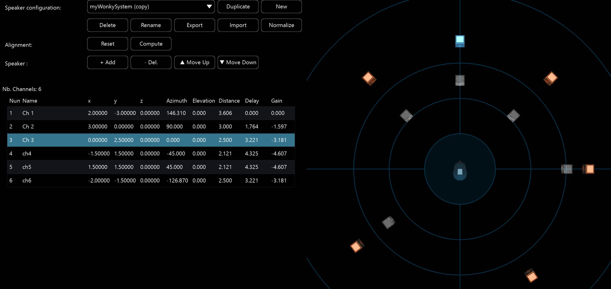

> *★Physical and Virtual speakers after using the compute function.*

The measurements you have entered into the speaker arrangement are also useful to compute (aka. calculate and apply) the optimum delays and gains for equidistance of all speakers to the center of reference listener. This is an advanced speaker management technique made easily accessible by a single press of the **Compute** button.

It is a speaker alignment method on a speaker's physical configuration that may not have speakers located in ideal locations. Basically SPAT revolution will create virtual speakers after calculating and applying the alignment so all speakers become equidistant to the center of reference. This is a technique preconized when using panning methods that are sweet spot centric such as VBAP and VBIP. The methods will provide very smooth panning on arrangements that have all speakers equidistant to the optimum listening position.

> It is preferable to do this alignment in SPAT Revolution instead of external processing as SPAT will use the computed speaker locations (the virtual speakers) for actually spatializing afterward.

## Panning tips

In the Speaker Config window, we can found information about which pan law to use in regard of our speaker array. As there is many options available in SPAT, this simplifies the choice to make.

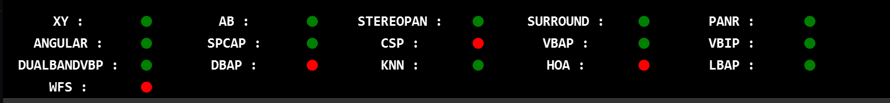

There are five colors associated with the possible panning types:
- Green : this panning type is valid and functional with the selected speaker array
- Orange : this panning type is somewhat functional, but there certainly is a better solution available. Hovering the panning type with the mouse will display a message to help improve the arrangement.
- Red : this panning type is not functional with the selected speaker array. Hovering the panning type with the mouse will display a message to explain why it does not work.
- Grey : Two speakers are located at the same spot (i.e. the speakers are coincident). The speaker arrangement is incorrect.

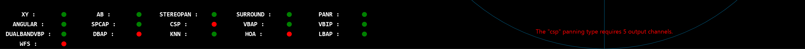

> Error display with HOA panning type.

For more information about each pan law, check out the section [Panning algorithms](5_Spatialisation_Technology_5_5_Panning_Algorithms.md).

## Import Speaker Array

For systems that are regularly changing such as in live production, setting up the speaker configuration in the simulation software and then  repeating it in the immersive software is not the most fun part!

To ease this part of the setup, you can now import from software of Nexo  (NS-1), Adamson (Blueprint), d&b (ArrayCalc), CODA Audio (System Optimiser) and the standard EASE software.

This import is integrated into the "Speaker Config" editor where you can find the Import from button.

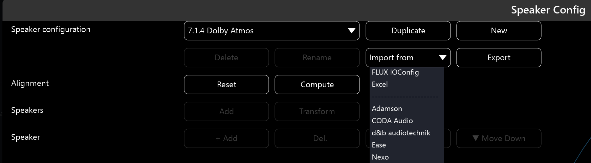
To begin is the FLUX IOConfig. This is the FLUX:: speaker arrangements file format. This can be a great tool to export and save your FLUX:: arrangements or to import an arrangement into another session / computer system.

In SPAT Revolution, it is important to understand that speaker arrangements **DO**  follow the session file. So if you are opening a .JSON with an arrangement new to you system, SPAT Revolution will create that arrangement and it will then be part of the user created arrangements always available.

You care to know where these arrangements are stored? <code>Document/FLUX SE/Spat Revolution/Config</code> is where your master IOCONFIG file is located. It includes all the manually created or automatically created by session opening. Note that the repertory <code>Document/FLUX SE/Spat Revolution</code> is now the folder that contains all of your SPAT preferences. A troubleshooting trick is to thrash this folder if data as become  corrupted. So yes, exporting your arrangements or backing up <code>Document/FLUX SE/Spat Revolution</code> is never a bad practice!

How to import a speaker configuration from:

**Nexo NS-1 :**

In NS-1, to export all the speakers : Go to the <code>Speaker Positions Windows</code>,  <code>Speakers/Speakers Position</code> or <code>Ctrl + P</code>. Select all the Speakers, and click on <code>Export, File...</code>. This will export a .txt file, readable by SPAT Revolution.

**Adamson BluePrint:**

In BluePrint, to export all the cabinets: Go to the Cabinet tab. In the  line <code>Cabinet Group</code>, click on the 4th button, <code>Export All Cabinets</code>. This will export an .arys file readable by SPAT Revolution.

.png)

**d&b ArrayCal:**

In ArrayCal, export all the sources with "Files/Export/EASE/Coordinates of all sources". This will export a .xld file readable by SPAT Revolution.

.png)

**Excel**

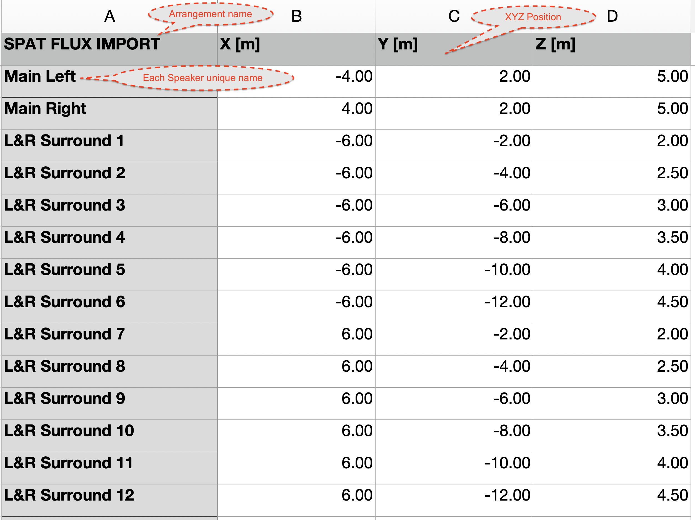

**[Speaker import from Excel template](https://public.3.basecamp.com/p/w1VQL9UbbndSXP5P3qpU6DnU)**

## Speaker arrangements examples

Here is some example of speaker configuration you can find in some venue, like RadioFrance Studio 115, Montreal Satosphere, or Berlin Planetarium. To discover it into SPAT Revolution, copy the python file on your desktop: **[Speaker arrangements for various domes and planetariums](https://public.3.basecamp.com/p/pPtg3qFrUsxyPPmQ3b3JLPqW)**.

## Speaker Arrangement Python File

If you want to build your own custom speaker arrangement script, explanation are provided into the following python file:
**[Custom Speaker Arrangement Script](https://public.3.basecamp.com/p/rQStK3igPkaXisYS4Gs5sJ2g)**.
