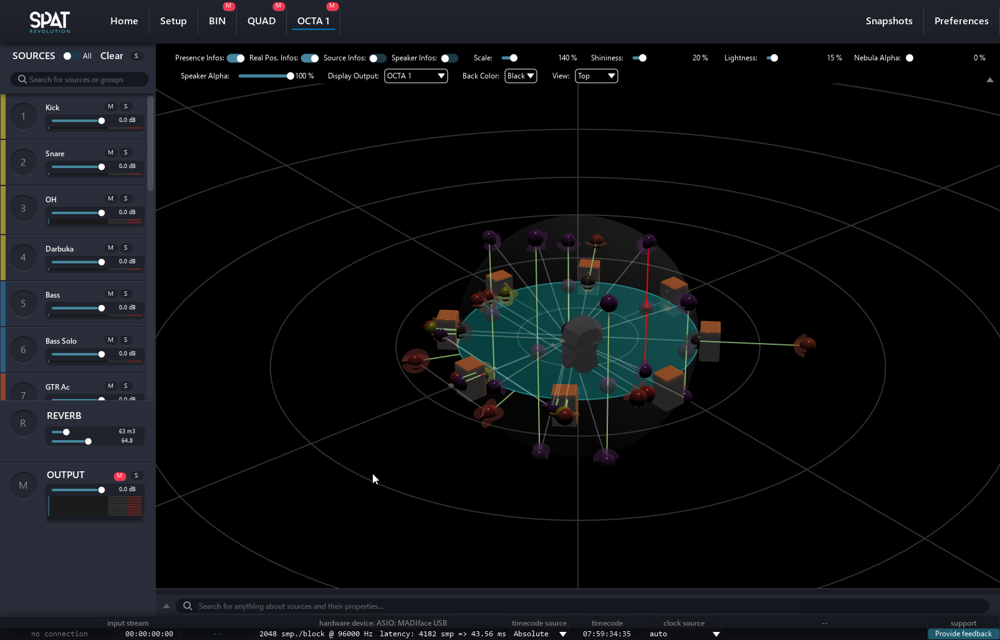
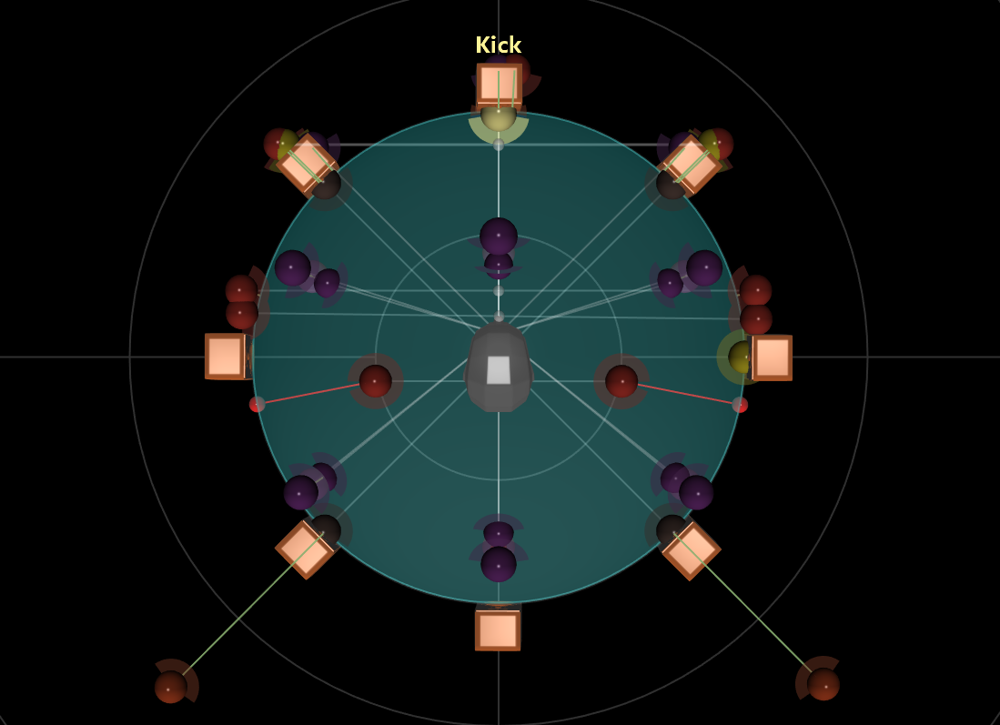
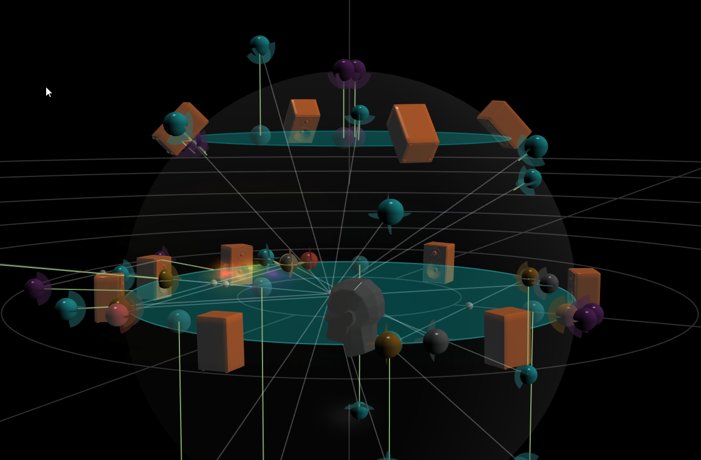

# Understanding the 3D View

The whole mixing experience of Spat Revolution takes place in the 3D view. It is really simple to create a mix this way: simply grab a source and move where you want to. But there are a few subtleties that are important to get right.

## The presence of a source

A sound source in Spat Revolution has a presence factor. It defines its overall level and brightness inside the virtual acoustic space. This presence factor can be changed by many parameters:

- The distance
- The presence
- The drop factor

Putting a source closer or farther away from the listener point will have the consequences of modifying the presence. The closer the source is, the more presence it has. The farther it gets, the less presence has a source.

The parameter presence directly affects the presence factor of the source.

The drop factor defines the relation between the distance of the source and the listening point and the loss of presence. It is set by default to follow the acoustic law of our world, where we lose 6 dB of presence each we double the distance.

The overall presence of a source is displayed by a green vector, drawn between the source and the protection zone. The intensity of the green color is proportional to the presence factor. 

## The protection zone

When a source is placed inside the protection zone, its distance will no more induce a drop of presence, meaning that the distance does not have any effect in this zone. By default the protection zone is set to be flush to the speaker array of the room.

It is important to understand that we should not put a source inside this zone, as most of the pan law or spatialization strategy are incapable of creating the illusion that a sound source comes from in front of the speaker.

As its name implies, the protection zone exists to prevent weird behavior when sources are placed inside itself. Thus, in this case, you will notice that the presence vector turn red. This should warn you that what you see may not be related to what you hear.

Two behaviors can happen when a source is inside the protection zone. It can either be replaced at the top of the sphere or being looked at a constant azimuth. This behavior is set by the “source over listener head” parameters, which is on by default.

## Understanding when a speaker arrangement, or a sound scene, is 2D or 3D

We have seen that we can create custom arrangement. So we can quickly be tempted to create very precise speaker array, including height information where it may not be necessary.

The rule of thumb is to think in plan and not in absolute height. If the speakers are meant to reproduce the same sound plan, they should have the same height. Also, the main sound plan has to be set at a height of zero meter.

### Height clamping

#### 2D Speaker Array

When dealing with a 2D speaker array, there is no point at placing a source above or below the horizontal plan. If you choose to do so, or use a 2D room to translate a 3D mix, you will see phantom sources that are the projection of each sources on the horizontal plan. The position of the phantom source is the data used by the DSP to place the actual source in the virtual space. But it will preserve the presence of the main source.

#### 3D Speaker Array

A 3D speaker array will have a top speaker plan and a bottom speaker plan. If a source is placed above the top plan, or below the bottom one, the source will be clamped to the closest plan. The clamping behavior, like with 2D speaker array, is shown with phantom sources that indicates the position used inside the DSP stage of Spat Revolution.