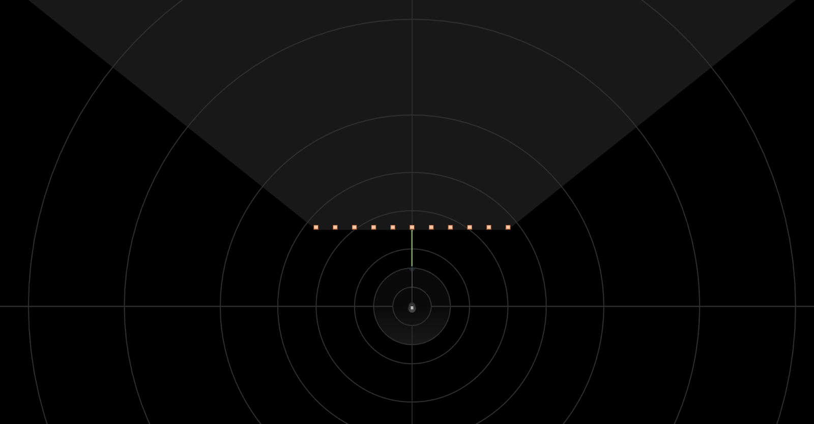
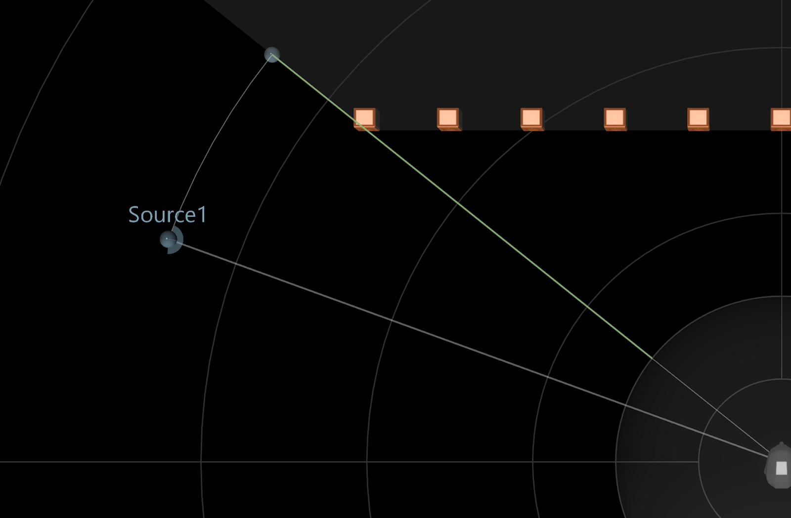
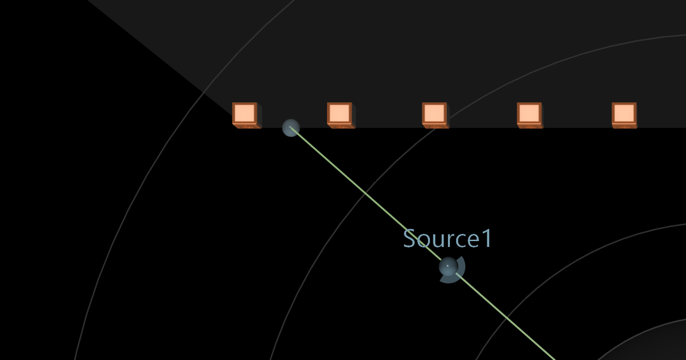
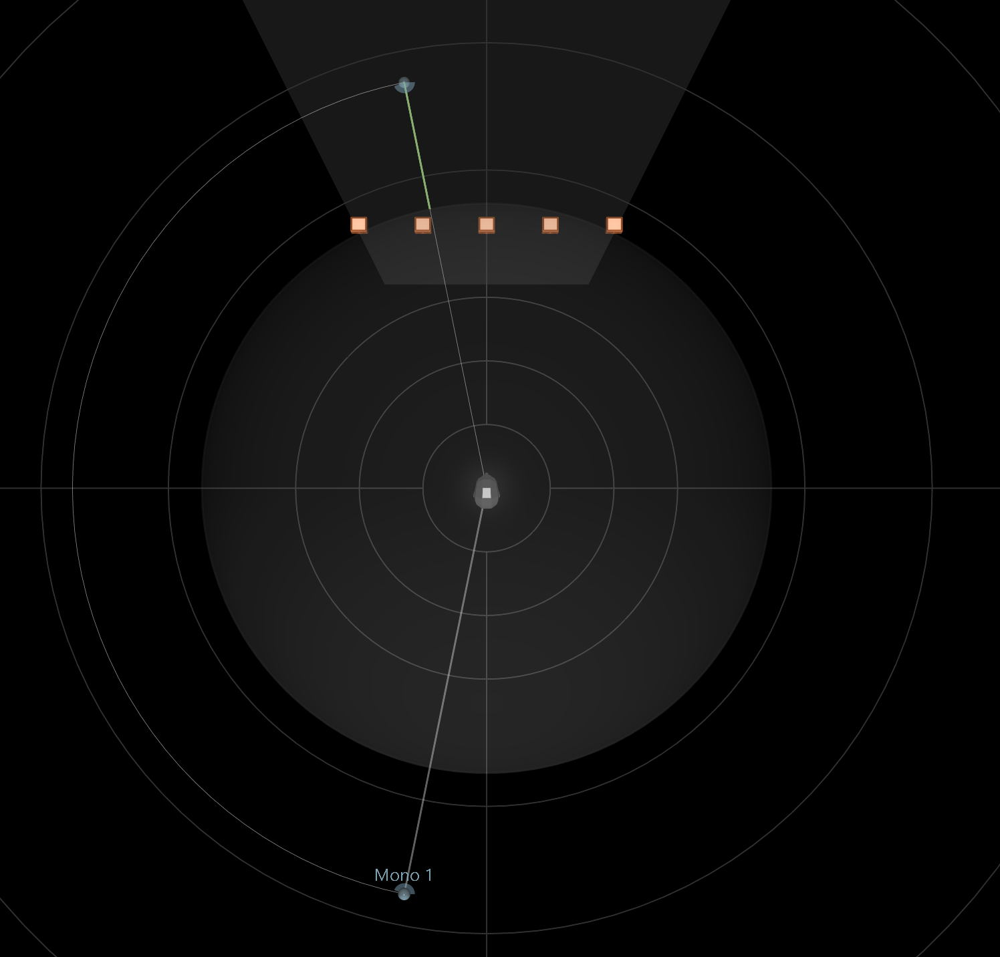

# Understanding the 3D View

The whole mixing experience of Spat Revolution takes place in the 3D view. It is really simple to create a mix this way: simply grab a source and move it where you want it to be. But there are a few subtleties that are important to get right.

The first important things to understand are that there are two main zones in the SPAT Revolution 3D view:
+ One inside which you should put sound sources in (the efficiency zone).
+ One inside which you shouldn’t (the protection zone).

Depending on if you are working with a room using channel-based or not, or depending on the speaker arrangement used, these zones will have different shapes and usages that we will discuss below.

## The protection zone

The protection zone is an area of the 3D space represented as a sphere around the listener head. On channel-based room, it is set up by default to fit the radius of the speaker arrangement. On non-channel based room (binaural or HOA), it is by default set to two meters.

It is important to understand that we should not put a source inside this zone, as most of the pan law or spatialization strategy are incapable of creating the illusion that a sound source comes from in front of the speakers.

When a source is placed inside the protection zone, its distance will no more induce a drop of presence, meaning that the distance does not have any effect in this zone.

As its name implies, the protection zone exists to prevent weird behavior when sources are placed inside itself. Thus, in this case, you will notice that the presence vector turn red. This should warn you that what you see may not be related to what you hear.

Two behaviors can happen when a source is inside the protection zone. It can either be replaced at the top of the sphere or being looked at a constant azimuth. This behavior is set by the “**source over listener head**” parameters, which is on by default.

## The presence of a source

A sound source in SPAT Revolution has a presence factor. It defines its overall level and brightness inside the virtual acoustic space. This presence factor can be changed by many parameters:

- The distance between the source and the **protection zone**
- The presence parameter
- The drop factor

Putting a source closer or further away from the protection zone will have the consequences of modifying the presence. The closer the source is, the more presence it has. The farther it gets, the less presence has a source.

The presence parameter directly affects the presence factor of the source.

The drop factor defines the relation between the distance of the source and the listening point and the loss of presence. It is set by default to follow the acoustic law of our world, where we lose 6 dB of presence each time we double the distance.

When “Presence infos” on the top bar of the 3D view is enabled, the overall presence of a source is displayed by a green vector, drawn between the source and the protection zone. The intensity of the green color is proportional to the presence factor. If the source is inside the protection zone, the vector will turn red and a small sphere of the same color will be drawn on the surface of the protection zone.

While a source is in the protection zone, there is no variation in presence.

## The efficiency zone

<!--TO BE COMPLETED-->
By definition, the efficiency zone is where the virtual sound sources should be localized.

Inside a channel-based room, the efficiency zone is defined by the speaker arrangement used in a room:
+ When using speaker setup that surrounds the listeners, the efficiency zone is a sphere (or circle in 2D), which span from the border of the protection zone to the farthest distance you can put a source (100 m). A speaker array is considered as surround if the angle between the foremost left and right speakers is over 180°. For readability reasons, the efficiency zone is not drawn in this case. Only if its depth is set inferior to its maximum value (100 meters), the efficiency zone is drawn.

+ When using a non-surrounding system (stereo, frontal line, etc.), the efficiency zone become a “piece of pie” and is displayed in the 3D view. Its width is defined by the angle between the foremost left and the foremost right speaker. The visualization of the efficiency zone should help to understand the limitation of these systems in terms of spatialization options. For instance, placing a source behind the listener head in stereo will never produce the effect of a source coming from behind.

The range of the efficiency zone is set by the “depth” and “trunc” parameter. The first one sets the maximum and the second one the minimum of its span.

Inside a non-channel-based room, the efficiency zone is a sphere, because there is no speaker to constrain the diffusion area. Still, it can be edited with the same “depth” and “trunc” parameters for multi-room and creative applications. More informations below.

### Behavior of sources outside the efficiency zone

When a source is out of the efficiency zone, SPAT Revolution offers three behaviors:
1. The source is clamped to the efficiency zone
2. The source is muted
3. It does nothing

This option can be set in the room’s output section. Check out the “Room” section for more information on this matter.

> By default, the source is clamped to the border of the efficiency zone.

Clamping the source to the efficiency zone help to keep coherent sound scene, while the "mute" mode help to create ins and outs effect. The mute only occurs in the actual room.

> When in mute mode, a slight fade out is applied to avoid clicks. The length of the fade can be adjusting by making the source go faster or slower.

Note that the prefered behavior are clamping or muting. **Clamping or muting will prevent abberant render in sound and localization.**

The pictures below shown some key cases of clamping: 

On non-surrounding systems, trying to escape the efficiency zone will result in the source being clamped to its foremost left or right.

If a source is placed in front of the speakers, the source will be clamped to the front line they formed while preserving the azimuth angle.

When a source is on the opposite side of a non-surround system, the projection of the virtual source will mirror the behavior of the actual source, thus, removing any jump or abrupt change in position of the source.

### Height clamping

The height clamping helps to keep sources inside coherent space in regard of the speaker placement inside the room. It only happens with channel-based configurations.

It can be activated by the *Source fit speakers elevation* parameter, in the room options. Height clamping works in a different way depending on if you are working with a 2D or 3D speaker array.

+ **2D Speakers Array**

When dealing with a 2D speaker array, there is no point at placing a source above or below the horizontal plan. If you choose to do so, or use a 2D room to translate a 3D mix, you will see phantom sources that are the projection of each source on the horizontal plan. The position of the phantom source is used by the DSP to render the actual source position in the virtual space, but, it will preserve its presence factor.

+ **3D Speakers Array**

A 3D speaker array has at least two plans of speakers. Such plans are defined by three non-align speakers sharing the same height (z). If a source is placed above the top plan, or below the bottom one, the source will be clamped to the closest plan. The clamping behavior, like with 2D speaker array, is shown with phantom sources that indicate the position used inside the DSP stage of Spat Revolution.

## Limit cases

+ Height clamping does not occur with DBAP-based pan law when using 3D speaker array. This prevents some jump and aberration in sound.
+ When using 2D non-surrounding speaker array, efficiency and height clamping are tied together. If efficiency clamping is activated, SPAT Revolution automatically switches one the height clamping. On the contrary, if height clamping is turned off, then, so is the efficiency clamping.
+ WFS is the only case where it can make sense to put virtual sources in front of the speakers, to take advantages of the focus zone. This zone and the behavior associated is detailed in the WFS section of this user guide.