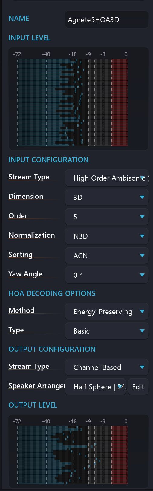

# Vu-Meters

Throughout Spat Revolution's different editors, you will see a complete set of accurate decibel meters giving you a visual display of all channels activity in an audio stream, whether Ambisonics or Channel Based. 
They are very useful to see when clipping might be occurring in any of the channels, and to debug signal flow routing in general.

Also, notice how the 'wire' that graphically connects Modules in the Set Up signal graph does not visually change even though it is handling a load of channels.

