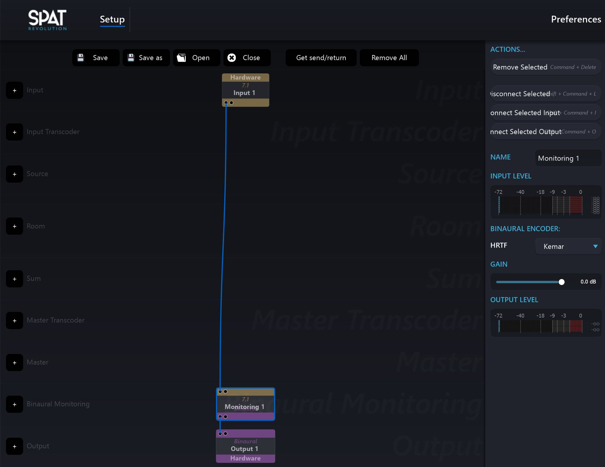

# Binaural

## Introduction

The expression “binaural technology” covers various methods of sound recordings, synthesis and reproduction which can render 3D spatial audio content over headphones. For instance, binaural field recordings can be made by placing miniature microphones in the ear canals of a listener or of a dummy head (like ’ **Kemar** ’ or ’ **KU100** ’) and when played back over headphones such recordings can produce an authentic immersive auditory experience with enhanced spatial aspects. Recent advances in signal processing technology have made it possible to synthesize binaural signals without the need of microphones.

Using binaural synthesis, a sound can be arbitrarily positioned around a listener synthesizing the sensory experience of extended spatializations. Like some other two-channel formats such as Mid-Side Stereo, binaurally encoded audio recordings are not compatible with stereo speakers. If a binaural encoded audio file is played on a normal stereo setup, audio will be heard, but it won’t sound good.

!> It is important to point out to a client who might be new to binaural monitoring, _that binaural files should only be listened to on a good pair of headphones._

## HRTF

HRTF is an abbreviation for Head Related Transfer Function. The function is a mathematical model of the filtering effect caused by a listener’s own head, external ear and torso. This filtering plays a significant role in the way we localize sounds around us and is unique to every individual.

When synthesizing binaural monitoring, a perfect result could be attained by rendering through the exact HRTF that matches the body filtering effect of an individual. In practice this is not easily done, so SPAT Revolution offers many choices of pre-analyzed HRTF profiles which you can apply for monitoring and encoding binaural audio. You can manage the selection of HRTF profiles in the SPAT Revolution Preferences where you will find a number of different profiles including the option to load your own HRTF. The default HRTF is the Kemar dummy head model, which is often used as an all-round generic head and shoulder filter.

!> _Management and importing HRTF is only available with Ultimate license._

## HRTF Profiles

The included HRTF profiles in SPAT Revolution are taken from a number of large-scale laboratory research projects where measurements were taken on many individuals\*. The chances are that one person’s ears may sound more natural to you than others. For a quick way to monitor binaural, you should try to find a profile that you feel most comfortable with when monitoring your virtual scene on headphones. If you are providing a 3D in-ear monitor mix for a performer or a visitor to an installation, try to find an HRTF that suits them best. This can be fun. If you are not comfortable listening through someone else ears—which is understandable—you could look into creating a personalized HRTF from your own head and upper torso measurements. There already exist a number of services that can create HRTF profiles taken from laboratory measurements. If you decide to do this, for yourself or someone else, then you can add the personalized profile to the list in the HRTF Manager. In fact, you can import any HRTF in SOFA format to the SPAT Revolution binaural encoding list, making SPAT Revolution a very flexible solution for binaural monitoring and rendering.

!> _An imported HRTF profile should be in SOFA format and should match the sample rate for your project. It is preferable to use a “SimpleFreeFieldSOS” IIR type of HRTF._

\* The profiles come from the “LISTEN”, “CROSSMOD” and “BiLi” databases.

## Binaural algorithms

### Normal binaural mode

This mode uses the selected HRTF in order to recreate the sound field. This is the only pan law available in the Essential version of _SPAT Revolution_.

### Advanced algorithms

!> _These advanced binaural “modes” are only available with the Ultimate license of _SPAT Revolution_.

#### Near-field binaural

HRTF are generally measured at one or two meters of the listener.
In reality, the HRTF are changing with the distance between the source and the listener, especially when sources are closed.

The Near Field Binaural tends to recreate close HRTF, with an additional filter set applied.

#### Spherical head model

This binaural synthesis simulates the head like a rigid sphere, instead of using HRTF.

As this model doesn’t use HRTF, this synthesis consumes less CPU.
However, the localization is clearly less precis.

#### Snowman model

This synthesis is the improvement of the Spherical Head Model.
Besides the head reflections, torso ones are simulated, like two spheres one on the top of the other.
Hence its name, “snowman model.”

#### Head scale

The parameter “head scale,” available for the four binaural algorithms, allows adapting the head size to the listener.
This will adjust the interaural time and level differences.

## Binaural Monitoring Module

_!> Routing example available with Ultimate license._

In the _Environment Setup_ of SPAT Revolution, you will find a module dedicated to Binaural Monitoring. Its purpose is to monitor any kind of speaker setup using headphones and binaural encoding. This can give you an impression of how your spatialization might sound on a particular channel based system when you are off location.

You can add a Binaural Monitoring Module by clicking on the <code>+</code> icon of the Binaural Monitoring row towards the bottom of the **Environment Setup** graph. The module is very simple to use. It will automatically detect the type of channel based audio stream you connect into it.

The Binaural Monitoring module works by virtualizing each speaker, not each source, so any real world speaker phenomena will be reflected in the binaural rendering. For example, a virtual source positioned in the center between two virtual speakers will be rendered with the same “phantom speaker” in the binaural monitoring as in the physical world, because there is no virtual speaker at the center point either.

To listen to the binaural stream on headphones, you should select the HRTF you would like to use for the encoding, and connect the output from the module to a dedicated output module at the bottom of the graph. The output should be routed to the headphone monitor outputs of your audio hardware.
