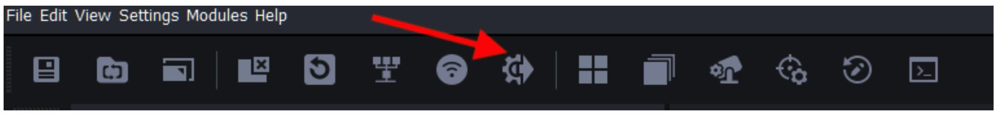
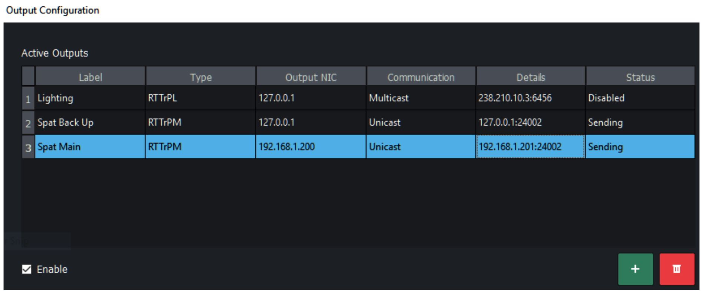
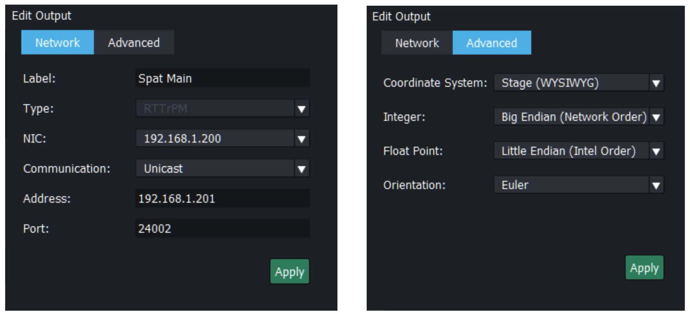
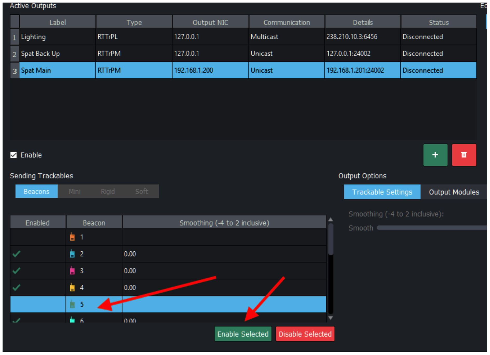
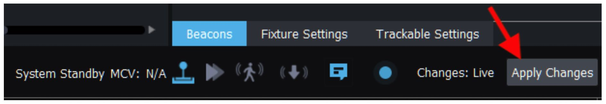
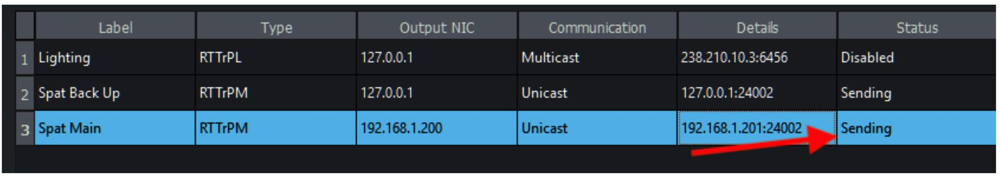
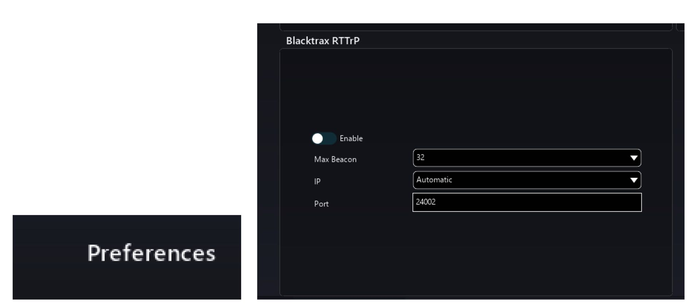
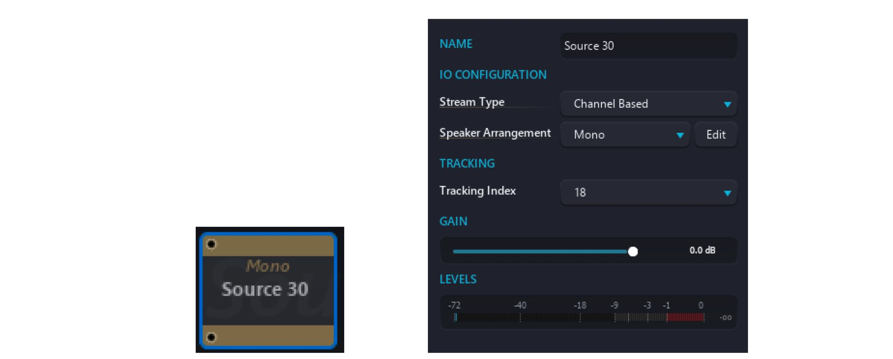
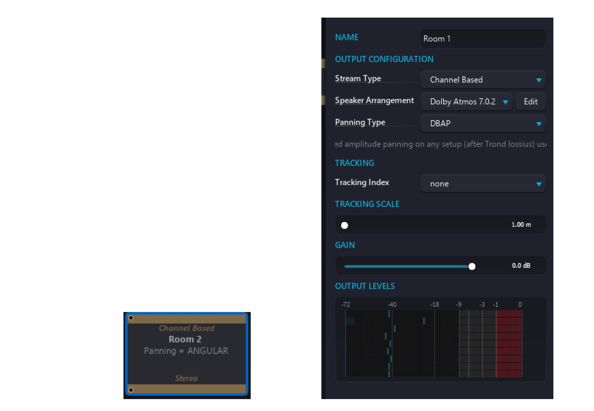
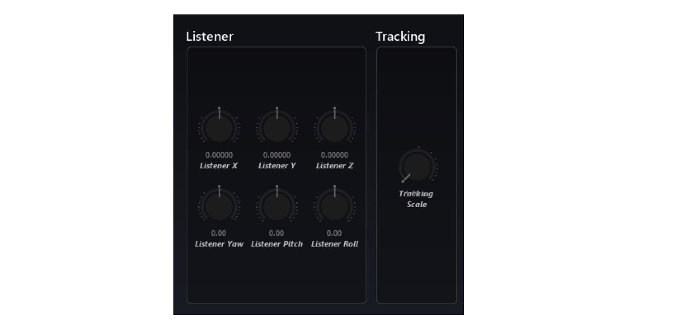

# BlackTrax integration

Starting in Spat version 1.1, a new UI implementation is available in order to integrate BlackTrax RTTrPM tracking protocol in Spat. This provides a way to map BlackTrax tracking beacons with Spat source objects and Spat room listeners. In order to do this, you will need to configure the output configuration of a BlackTrax system and have your Spat (or multiple Spat) computers networked on the same third party network interface (NIC) of the BlackTrax server hardware. In the BlackTrax software, press on the output configuration button or access output configuration via the menu bar in the Settings section (shortcut <code>Ctrl + T</code>).

In the Output Configuration window, you will need to create with the <code>+</code> sign 1 (or
multiple if running a main and a back up Spat computer engine) output that will be
sending tracking RTTrPM data to Spat. Clicking the <code>+</code> sign will give you an edit window.

In the edit window, you will first label you Output to the desired name (Ex: Spat Main). Type of output will be RTTrPM, the third party motion protocol of BlackTrax. NIC is the actual network interface that you are doing the integration to Spat. The default NIC of BlackTrax server for RTTrPM is <code>10.133.3.9</code> <code>255.255.255.0</code>. They do have multiple NIC for various use such as lighting and the actual BlackTrax network itself. You will want to make sure your Spat is either in the same range as this address (<code>10.133.3.x</code>, <code>255.255.255.0</code>), or use your addresses of choice in the same range. Please consult with a certified BlackTrax support representative before to attempt to change IP. 

In the below example, addresses of the Blacktrax NIC was changed to <code>192.168.1.200</code> Communication should be set to Unicast. Please refrain from using Broadcast unless specific circumstances. Currently, Multicast is not implemented with Spat software. Port number should be left to the default port # <code>24002</code> as it is the default port for the BlackTrax system and the default port preconfigured into Spat software. Press <code>Apply</code> and you are set with this step.

Pressing the Advanced button will give you some advanced option. Your default Coordinate System should be <code>Stage</code>. You can apply these settings. You are now set. Before BlackTrax will actually output anything to the Spat system, you will need to enable the Beacons present in the system that you actually want to be sending tracking data. In the Active Output window, select you Spat Main output. On the bottom right, select the Beacon you would like to have data sending and press Enable Selected. You can multi-select when pressing the <code>CTRL</code> key or select all with <code>CTRL + A</code>.

When done with all operations with BlackTrax, you want to <code>Apply</code> the changes to the system. You can at this point close the Output Configuration window and go back to the main BlackTrax page. You will want to apply the changes to the system.

You can confirm that you are actually sending data by going back to the Output
Configuration page. The status will give you this information.

Now let’s go and configure the Spat software. In the preference page accessible by
clicking on the top right button, you can scroll down to the BlackTrax preference
section.

You can from there, Enable BlackTrax RTTrPM tracking, Select the amount of Max Beacon you system may need (1, 2, 4, 8, 16, 24, 32 or more), Select the network interface you are using on your computer for the BlackTrax integration (Or leave to Automatic) and then the port # which is already set at the default port # used by BlackTrax RTTrPM output. You are set. These new preferences will be store with all your preferences and
remain after closing and restarting Spat Revolution software. 

First option is to assign a Beacon ID to an actual audio source object. Selecting a source will give you the source menu options. In the option are now Tracking options and a pull down menu to choose the Tracking Index (the beacon ID number you want for this audio source). The list will be based on your Max Beacon preference. It is possible to have the same Index for multiple sources providing the ability to have multiple sources track a single beacon.

Your second option is to assign a Beacon ID to an actual room in order to have the listener position tracked. Selecting a room will give you the room menu options. In the option are now Tracking options with a pull down menu to choose the Tracking Index (the beacon ID number you want for this room listener). The list will be based on your Max Beacon preference. A Tracking Scale setting is as well provide which would allow to scale the incoming data to adjust to your speaker output setup size if needed.

In the actual room output parameters in the room view, you will also see a tracking option become available.

