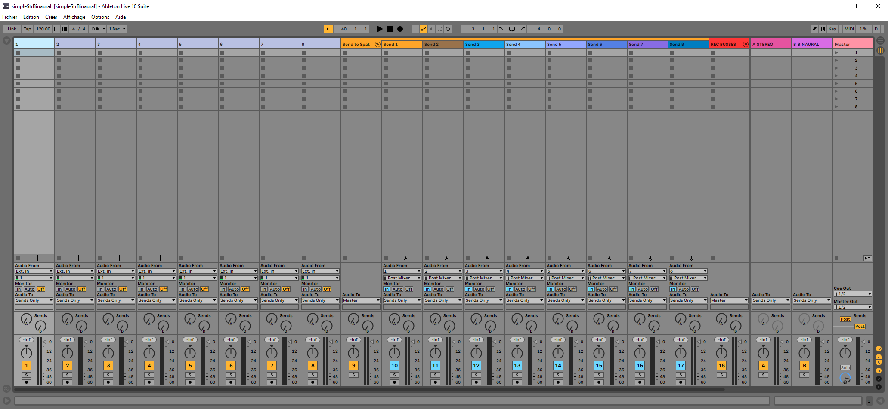
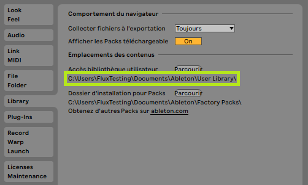
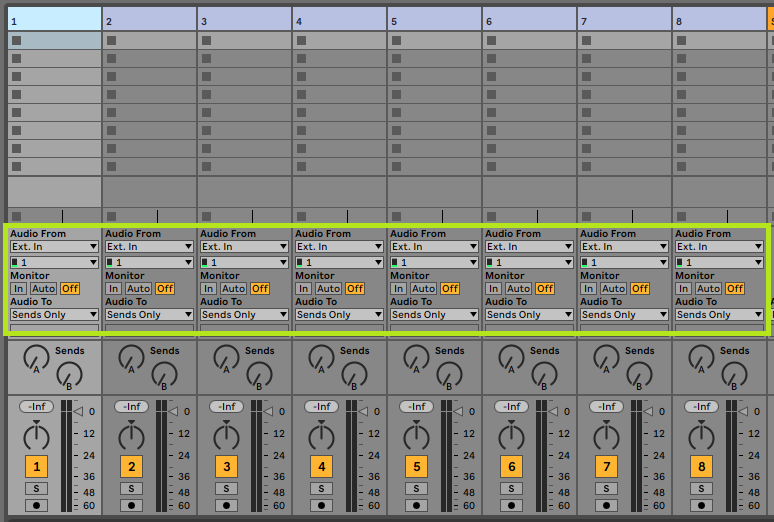
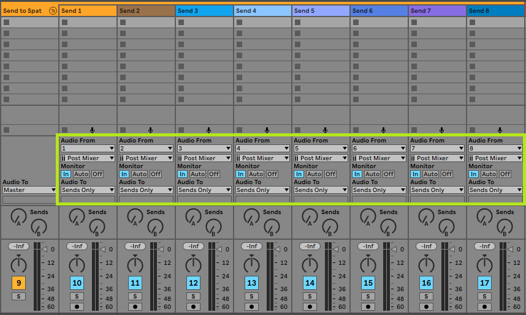
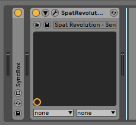
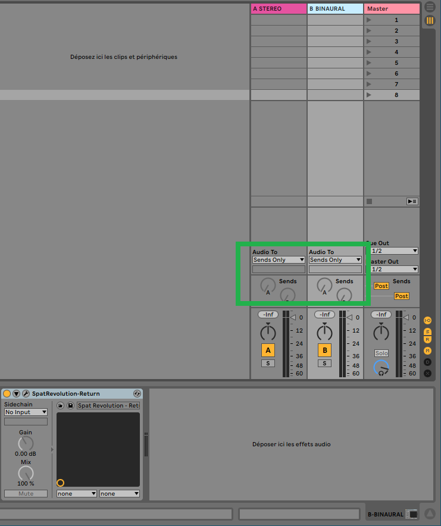
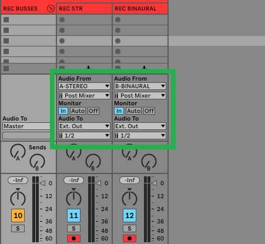

# Ableton Live 

## Templates

Ableton Live is a very well known DAW for its creative possibility and has been preferred by content creator since many years. 
The fact that audio tracks in Ableton Live are always stereo, or at least, they only support two channels audio streams, does bring limitation to dealing with multi-channels immersive content and the ability to return to Live the various streams.

One workflow is to use Ableton Live sources as objects to SPAT, use the SPAT plug-ins suite SEND and ROOM for automation parameters and route audio via various hardware audio interface (including virtual soundcards and network audio) in a single or dual computer setup. 
The dual scenario is preferred as this level of processing can become heavy on larger session, at a higher sample rate, and with much automation.

In order to use the Local Audio Path (LAP) feature of the SPAT SEND and RETURN plug-in, a workaround to the stereo limitation needs to be applied if wanting to integrate the audio portion in this manner.

New templates are available for use with Ableton Live. 
They are start sessions and can be used as examples to see how to integrate SPAT Revolution using the SPAT plug-in suite SEND and RETURN. 
Now let's dive in how to use SPAT Revolution with Ableton Live and how our templates work.

You can download the following session templates:

**Project Sessions and Templates downloads.**

* [Simple Stereo Binaural Project Template](https://public.3.basecamp.com/p/EidSWQKQTQTqGTsKYrxuPjoW)

The console is organized in this way:

- The eight first tracks are the one where you will put audio event or even live input.

- Then is a folder containing eight other tracks. Each of our audio input tracks are routed to one of these tracks. These tracks are hosting SPAT SEND plug-in. They are your SPAT sources/objects and the bridge between Live and SPAT Revolution.

- A "REC" folder contains another bunch of tracks. They are for recording your audio streams returning from SPAT Revolution. 

- Lastly are a couple of "return tracks", as named after Ableton Live nomenclature, which host your SPAT RETURN plug-ins.

> To keep the console organized, we put tracks inside folders. 
> But, as there is a SPAT SEND on each of the sending tracks, and as the recording tracks are routed straight to our audio interfaces, there will never be any audio on these folders.

## DAW optimization

**How to bypass Ableton Live optimization**

As you may now, Ableton's DAW is very focus on live performance and comes with many optimizations to reduce CPU usage. 
Its strategy seems to deactivate every processing unit, like tracks or plug-ins, that does not receive any signal at their input and does not send any to their output. 
If a track is actively monitoring input, no optimization is applied.

If it may be very efficient from the point of view of CPU consumption, it is a real problem with our SPAT plug-ins. 
This means that if a track hosting a SPAT plug-in does not play audio for a certain amount of time, the plug-in will be deactivated behind the hood and SPAT Revolution will lose the sync.

**To each problem, a solution**

To overcome this behavior, we create a very simple Max4Live device which keep a track "alive". 
It's called "SyncBox": it generates an inaudible pink noise to keep the processing of following devices on. 
To unsure a steady sync, you will have to add this device upfront every SPAT send devices in your session.

If you do not own a Max4Live device, you have to make sure each track hosting a SPAT SEND plug-in must be fed with audio at any time. 
Another trick may be to route a silent input of your audio interface to tracks hosting a SPAT SEND plug-in and activate the monitoring input to force these tracks to stay awake.

***How to install our Max4Live device***

To install our Max4Live device, simply go to your Ableton Live's user library. 
If you don't know where it is located, go to your preferences, under the tab "Library". 
You will find the information like in the screenshot bellow.

Then, from the User Library, go to this location:

<code>User Library\Presets\Audio Effects\Max Audio Effect</code>

Now, simply drop the *SyncBox.amxd* device in this folder. It can be downloaded here.
 
[SyncBox Optimization workaround](https://public.3.basecamp.com/p/UzFGokKV5483RXDxY5RpCifX)

## Ableton Live routing

The golden rule when working with SPAT Revolution plug-ins is to make sure each track containing a SPAT SEND plug-in is routed to **every and each** track containing a SPAT RETURN plug-in. 
This way, we are absolutely sure every SPAT SEND plug-in are processed before each SPAT RETURN plug-in.

For our purpose, Ableton Live has a very interesting type of track called a "Return track". 
It is very similar to an auxiliary bus in an analog console. 
When a new return track is created in Ableton Live, all the audio and midi track are automatically routed to it. 
This is a very good solution to work with SPAT Revolution as it save us from a lot of routing we have to do in other DAWs.

### Audio source tracks

Your audio tracks will have their audio to routed to "send only". 
This way, they do not send any audio to the master track.

Source audio are being play/read on these tracks. 
If you are wondering where their signal is going, just continue reading, it will become clear below.

### Object tracks "Send to SPAT"

In the "Audio From" section, you will notice that you are receiving audio from your source tracks. 
Again, these tracks are not routed to the master.

You will notice than these tracks have their send volume set to -inf dB. 
We do not need to send audio to validate the routing priority.

If you select one of this track, you will reveal a SPAT send plug-in and our SyncBox workaround.

### Return tracks

Our return tracks in Ableton Live host our SPAT Return plug-in and are unrouted from the master.

## Recording the immersive creation

Now that we have audio going to, and coming from SPAT, we can record our work to publish or archive it. 
As it is not possible to record audio on a return track in Ableton Live, the output of your return track are sent to the actual audio tracks.

To do so on a manual setup, we need to create as many audio tracks as we have return tracks hosting a SPAT RETURN plug-in. 
Then, for each new audio track, we will go to the I/O and under the label "Audio From" choose each return track.
Now for the actual return track, we will unroute them from master. 
In the I/O of each audio tracks, we will go under the label "Audio to" and choose "send only".

Lastly, to ear our audio, we will need to put the monitoring mode of our recording track on "In". 
Of course, to record something we will also need to arm our audio track.

In the template, the tracks allocated to recording are configured to get their audio from the return track of Ableton Live. 
Their monitoring is switched on, and they are armed for recording. 
Also, their output is routed directly to the audio interfaces. 

> **You will need to manually adjust this routing for your needs.**

## Higher number of channels

* [Dolby Atmos 7.1.4 and Binaural Project Template](https://public.3.basecamp.com/p/n7mNHM6PJTeep8ewttYNFxtr)

As we discuss above, Ableton Live can only handle two channels audio streams. 
To overcome this limitation, we have to use several return plug-ins to get our signal from on a multichannel room output stream. 
In this template, we show how to return the audio from a 7.1.4 Dolby Atmos room. 
As we need 12 channels, 6 different SPAT stereo RETURN plug-ins are used.

The internal routing in Ableton Live remains the same as in the earlier stereo & binaural template above.

---
