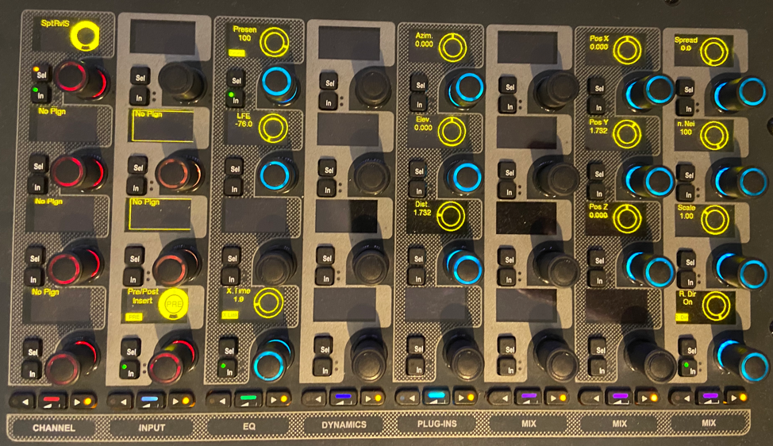
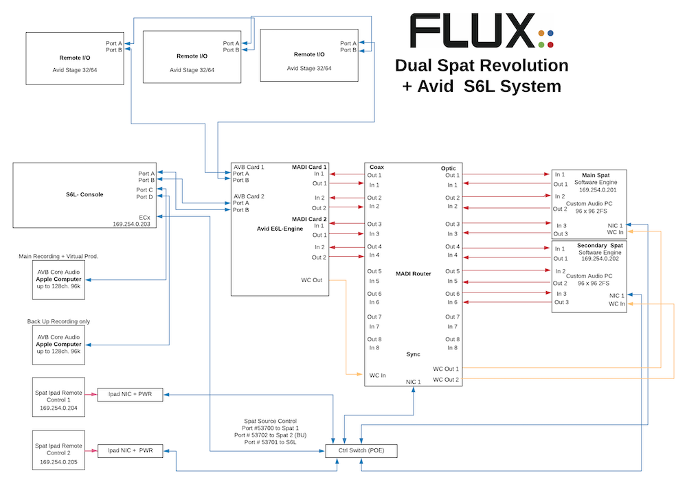
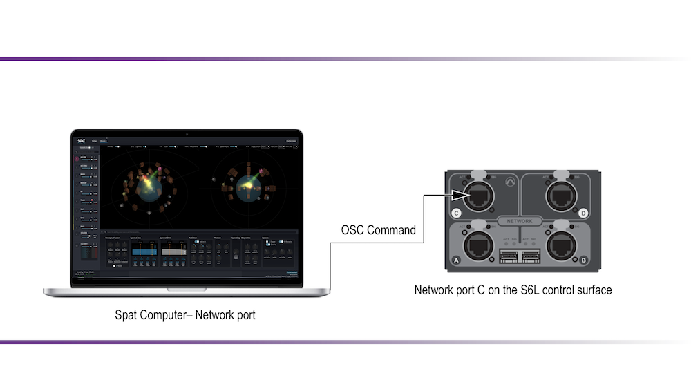
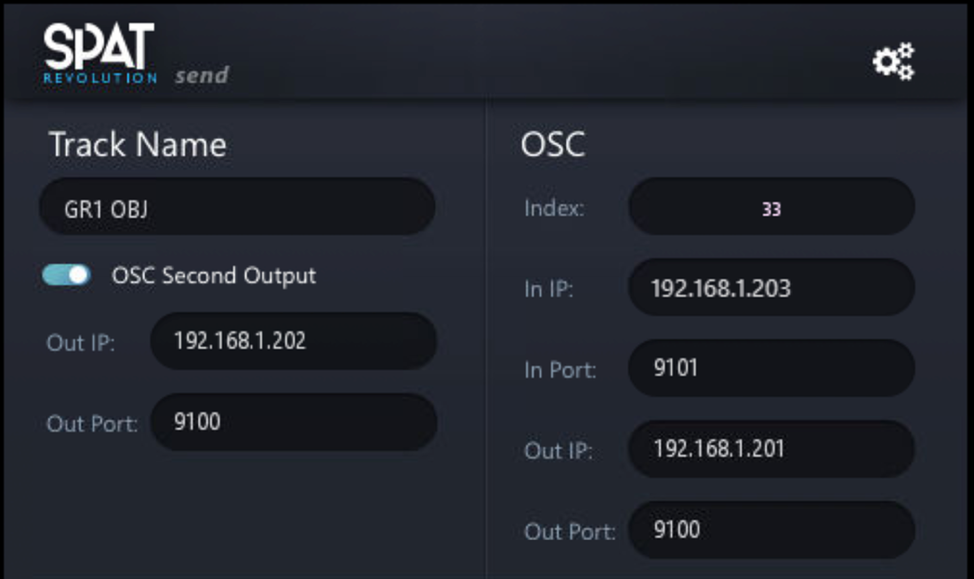
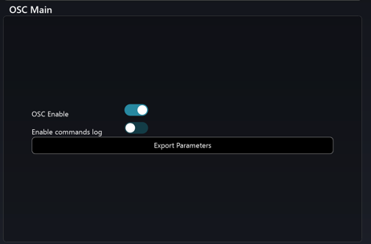
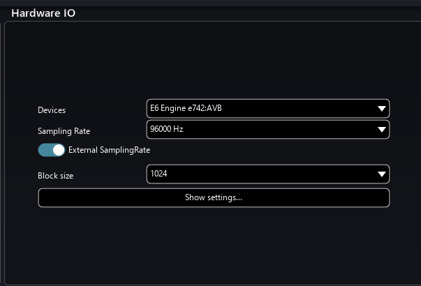

# Avid VENUE S6L

Currently, Spat Send is the only available plug-in from FLUX:: Immersive for the Spat Revolution integration to **Avid VENUE S6L** platform. The mono or stereo plug-in instances provide the integration of the Spat source/object parameters into the channel strip (insertion on the channel for source parameter control, no audio processing). This channel strip can be a pure input channel or an actual bus (aux, group) for working with stem objects.

The plug-in offers the ability to control the Spat source/object parameters directly on encoder, and automate them within the VENUE show file and snapshot system. And ultimately, having a completely integrated control of the objects in the 3D space. Added to the Spat source/object parameters is a **time** value where the user can set a linear morphing between two parameters states over a time period to create smooth transitions. Thus creating movements with interpolation time with the VENUE Snapshots.

New with version 20.12:

* Single X-Time (Interpolation) value for all parameters of PI
* X-Link allows to link all Spat PI plug-ins interpolation time
* Page Table updated.
* Scale (for stereo) and LFE Send parameters were added.
* Communication improvements and optimization.

The OSC (Open Sound Control) part is the key aspect to this integration as when properly configured, the console will be sending OSC commands to Spat Revolution software engine (OSC Out) and receiving OSC commands into the S6L console (OSC In). Thus, for a bidirectional configuration. This is what the Spat Send plugin does on the console. Optionally is the ability to enable a second OSC output from the console to send to a backup Spat Revolution computer engine (unidirectional). The bidirectional aspect will mean that creating a sound scene in Spat revolution interface (or from third party interfaces) will automatically push the information to the plug-in instances on the console. Furthermore, the pushed data can be captured in a console snapshot. Automation prepared in pre-production (third party like DAW or controllers) can be captured by the console PI snapshots.
 

 
**Spat plugin on S6L CKM module – Page 1 of 3**

The integration will include ultimately 2 parts: the control portion, and the audio portion. Our control will always be using OSC and will be communicating via either the ECx port of the console, or via the AVB network interface (port C/D). You can choose the network interface the control is flowing in. The audio routing portion can take different scenarios. An example could be using the AVB audio entity capability of the S6L system integrated to a Mac qualified computer. In this first case audio and control will be flowing on the same network port (Port C/D on console). As this AVB is often used for other use (virtual production) more frequently than other people will rely on legacy MADI integration in order to leave the AVB entity dedicated to Recording and playback scenarios. New scenarios will be possible shortly as the new Avid MLN-192 (Milan AVB) expansion card becomes available and qualified interfaces joins the Milan party. If the route of the MADI integration is taken, then control will be happening from the EXc port on the console. This makes it as well a cross platform solution Windows or Mac. 

 
**Dual Spat Revolution integration to S6L via MADI**

 
**Spat Revolution integration to S6L via the AVB port for audio and control**

## Configuring OSC

Now let’s look at configuring the control (OSC) part of this integration. The OSC settings (Spat send plug-in and Spat Revolution) are specific to your console IP address and to the Spat Revolution preferences.

  
**Spat Send Plugin in the Plug-Ins rack of VENUE**

 
 
**Spat Send Plugin setup**

The PI interface doesn’t have much and is straight forward:

- Track name doesn’t get populated by S6L as you insert it to a channel. That said, If connected to Spat Revolution, changing the track name to your desired name will rename your source/object name in Spat Revolution software! Names are part of snapshots as well. The below Spat / S6L templates have all the start naming set!

- Index refers to the object/source number in Spat Revolution application. This gets automatically generated every time there is a new instance of Spat sent plugin in the console plugin rack. It can be changed by snapshots, but it is unique and no instance can take over a currently used index. As Index number is part of snapshots, be careful not to change them after creating snapshots or while using snapshots.

- In IP: Pull down menu will allow you to choose the ethernet interface you will be listening to OSC commands in the S6L coming from Spat Revolution. You will need this address for setting up Spat preference later. This can be the AVB port 169.254.x.x, or your ECx port network interface of the console depending on the integration route. In the above example, ECx interface with IP 192.168.1.203 is chosen.

- In Port#: This port <code>#9101</code> is already set for you and matches the corresponding Port# used by the Spat Revolution OSC preferences / Avid S6L preset. It can be left to default unless conflicting with other OSC traffic.

- Out IP: This IP address is the manual address (above example 192.168.1.201) that your Primary Spat Revolution computer is configured at. 

- Out Port#: This port <code>#9100</code> is already set for you and matches the corresponding Port# used by the Spat Revolution OSC preferences / Avid S6L preset. It can be left to default unless conflicting with other OSC traffic.

- OSC second output activates OSC messages to a second Spat computer (such as your backup/ redundant computer engine). Output IP is the destination IP so the IP of the second Spat computer. Same port# as primary is already set for you and matches the corresponding Port# used by the Spat Revolution OSC preferences / Avid S6L preset. Note that the backup computer is not bidirectional to S6L and will only receive messages. So Spat Primary computer is the one that is bi-directional (so updating plugins live with movements so you can take a snapshot of it).

> Note that any changes you do to properties to the Spat Send interface gets done across the board (across all PI instances, except the index which is unique).

## Setting the preferences of the Spat Revolution Application

Let’s now setup your preferences in Spat Revolution preferences page:

- Hit preference in the top right corner. Look for the OSC Main section. First, you want to make sure the checkbox OSC Enable is engaged.

**Spat OSC Main Preferences**

 

- In the OSC Connections section, you will see 8 OSC connections slots. Set one connection to Input Avid S6L and one to Output Avid S6L. We will use 2 slots for this. Output will be to go to S6L Spat Send Plug-in, In will be to listen to S6L in Spat Revolution.
		
**Spat OSC Connections Matrix**

.png) 

.png) 

.png) 

### Spat OSC Connections preferences

- Set the In IP address by pulling then the menu and choosing the network interface of your Spat engine computer (for example the 192.168.0.201 of whatever network interface/IP you are using for this communication as long as it is in the same network range as the console IP address).

- The input side (receiving the OSC parameters from the Out IP of the console) doesn't need anything specific as the OSC input is ready for Avid S6L. You simply need to choose the **Input | Avid S6L** preset. As mentioned above in the S6L setup, the port # is predefined to port <code>#9100</code> on both side (PI and Spat OSC preset for S6L). 

- On the OSC output connection, you will simply need to choose the **Output | Avid S6L** preset and put the destination IP of the console, see above 192.168.1.203. The port # is already predefined (9101) and matching the Avid Spat Send PI Input. Port <code>#9101</code>. This IP address is the IP address found in the PI interface (most of the time the ECx port IP setting). With the preset, the default output option checkboxes are all set for S6L.

> If desired, OSC Log can be seen for testing. In the Spat OSC Main section, you can use the "Enable commands logs" option in order to confirm OSC communication. Pressing Shift + F7 or going to the help menu of Spat will give you option for a mini log window to see if the traffic is flowing as you are moving a source either in Spat software or on the parameters on the PI encoders. It is not recommended to leave commands logs enabled past the confirmation testing step. This will ensure that you don’t take up resources.

## Configuring Audio Connections ##

Let’s now look for the  Hardware I/O connection. This is where you will configure the hardware input and output (audio interface) for Spat Revolution. 

**Spat Hardware IO (Audio) preferences – AVB example**
	

- In Devices, please select your Core or ASIO audio device. In this example, we are using the AVB Core Audio E6 Engine, but this could be as well your MADI interface of choice such as an RME MADIface, MADIface XT, Soundgrid MADI device or any preferred interface. Not that the choice of interface will have an impact on your overall  possible system latency combined with the computer hardware.
 
- Sample rate should be set at 96000 Hz (unless sample rate converting from the S6L to 48K), and buffer can be set to your desired buffer (mind lower buffer requires a qualified computer and optimized resource).

*Congratulation, you are done! You're ready to go to the setup page in Spat and configure your Spatial audio system.*

## Templates

As of Spat Revolution version 20.12.0, we are proving our users with 3 different start templates that can help them built their session or simply review an example of Spat Revolution integration. They have been updated on our latest release, built with S6L v6.3 and qualified/tested for S6L V7.

>**To note** that show files built with Spat Send version 48020 or 48049 can't use Spat Send 20.12.0. Version 48049 is the version to use for these older showfiles. That said, Spat Revolution 20.12 release works good with these older sessions (nothing prevents a user to update to the latest Spat Revolution just keeping the old Spat Send version for show file (snapshot) compatibility.

[SPAT_S6L_V7_64MONO_20_12](https://public.3.basecamp.com/p/2WqGPJ4ner3k3No1AtbYB6Gw)

**SPAT_S6L_V7_64MONO_20_12** is the exact same template file as we provided before. It is for the model that all channels are being sent to the spatial renderers. Channel 1-64 have a Spat instance inserted and its direct out post-fader signal are assigned to MADI card 1, 1-64 and in parallel connected to the PTAVB entity channel 65-128 (for alternative routing that some have used). MADI 1-2 is patched to Stereo channel 65 as a means of return of the binaural room (and headphone mix) coming from the Spat template session (.JSON file). The S6L file contains 3 snapshots:
- **Reset all**, resetting all sources to default position without reverb (acoustic simulation) and 2 other test snapshots called
- **Circle and Horizontal Line**. Plugins are set with a 2 seconds interpolation time showing how time value is used to smooth out transitions. The accompanying Spat session file contains the 64 sources/objects connected to a Binaural Room as a start point.

[SPAT_S6L_V7_32MONO_16ST GROUPS_20_12*](https://public.3.basecamp.com/p/UQU8nhgHxy3FUjVgPndb8baK)

**SPAT_S6L_V7_32MONO_16ST GROUPS_20_12** contains an S6L file with 32 Mono Spat send sources/objects ready to be inserted on the channels you are using as direct out to Spat Revolution. These are name source/object 1-32. The file is all well ready with 16 Stereo groups for your source/object stems (33-48). Two test snapshots are preconfigured to **reset all source positions** and one as a snapshot test recalling all sources in a **horizontal line**. Plugins are set with a 2 seconds interpolation time showing how time value is used to smooth out transitions. The accompanying Spat session file contains the 48 sources (32 mono and 16 stereo) connected to a Binaural Room as a start point (It's a 64 channel of audio setup). The audio routing is not applied yet on this file but post fader pick off point option is set in order to be ready to route direct-out post-fader out of the channels.

[SPAT_S6L_V7_8MONO_8ST GROUPS_20_12](https://public.3.basecamp.com/p/EjezQzaYqtVWuwiqqZrJzNPd)

**SPAT_S6L_V7_8MONO_8ST GROUPS_20_12** is a basic entry S6L file with 8 mono Spat send objects ready to be inserted on the channels you are using as direct out to Spat. These are source/object 1-8. The file is all well ready with 8 Stereo groups for your source/object stems (9-16). Two test snapshots are preconfigured to **reset all source positions** and one as a snapshot test recalling all sources in a **horizontal line**. Plugins are set with a 2 seconds interpolation time showing how time value is used to smooth out transitions. The accompanying Spat session file contains the 16 sources (8 mono and 8 stereo) connected to a Binaural Room as a start point (It's a 24 channel of audio setup). The audio routing is not applied yet on this file but  post fader pick off point option is set in order to be ready to route direct-out post-fader out of the channels.