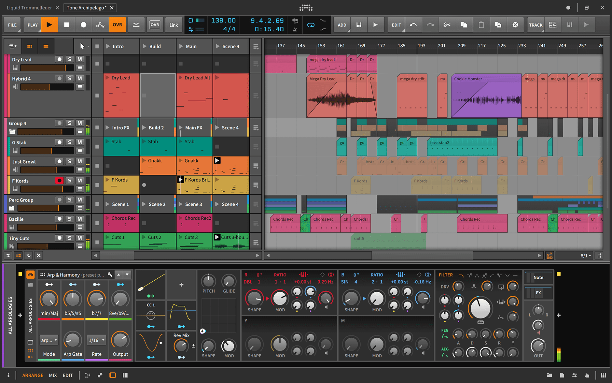
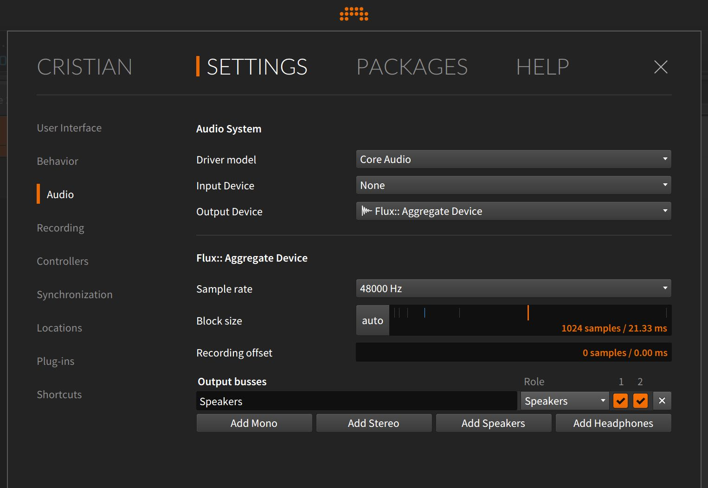
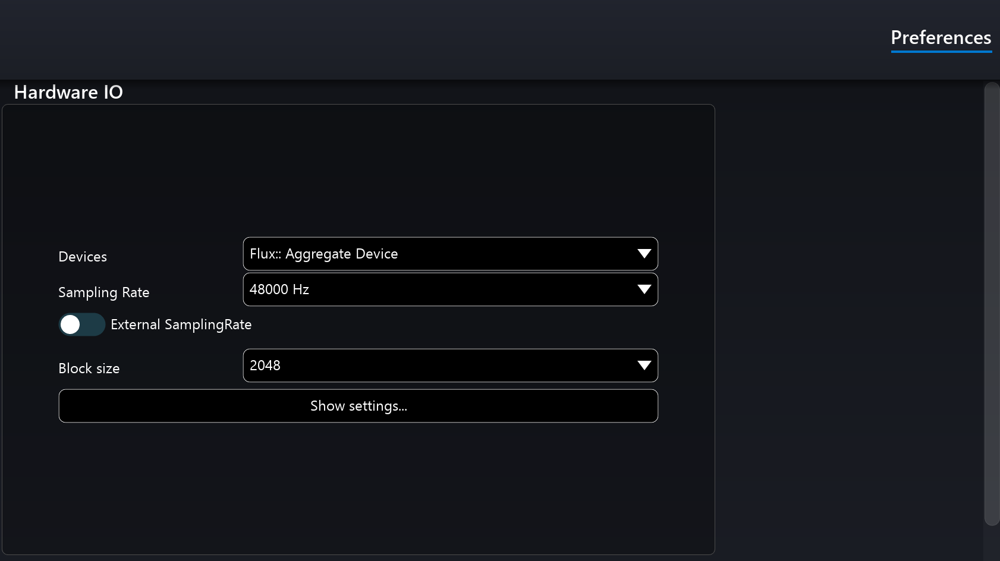
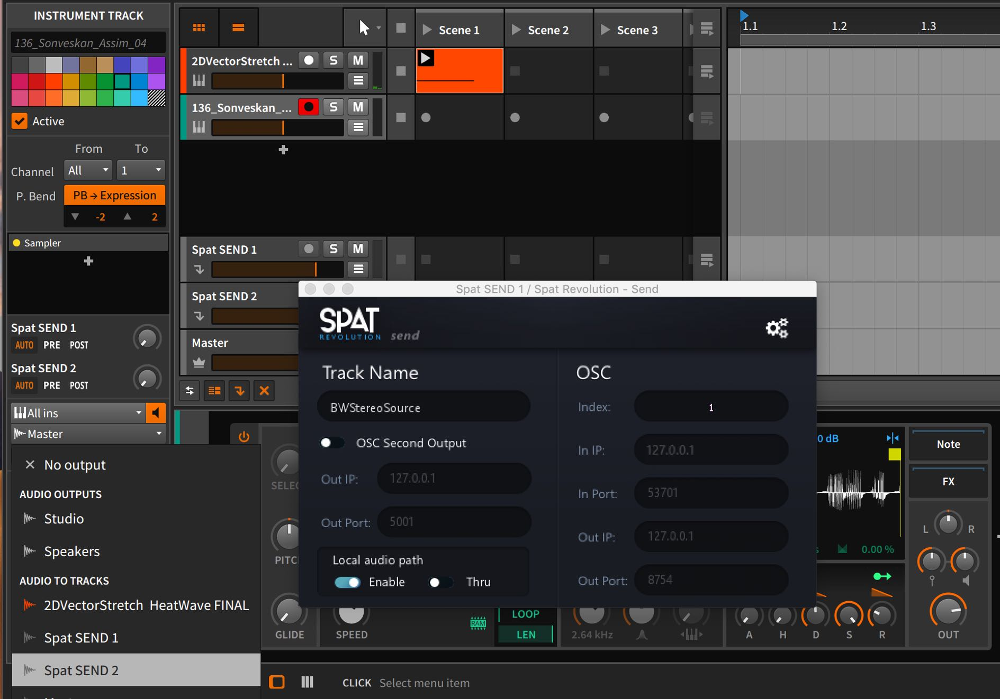
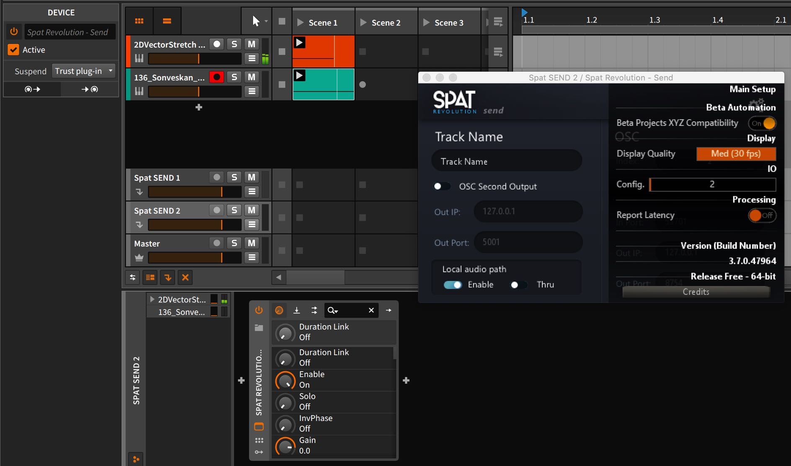
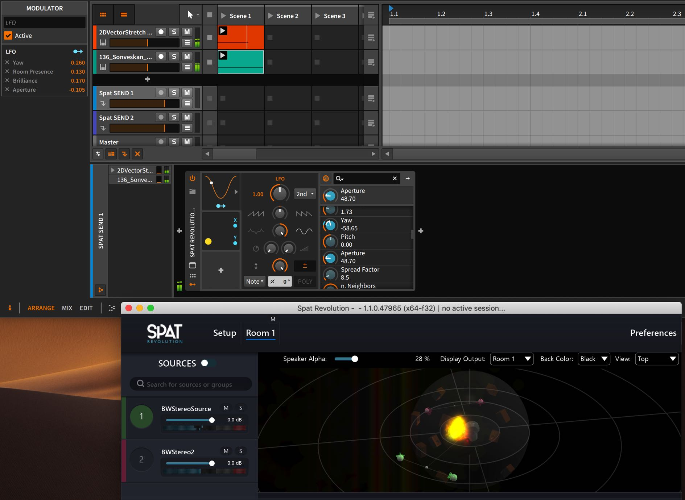

# Bitwig Studio

Bitwig Studio is a DAW designed in Berlin with a live hands on philosophy to it.
Along with its highly animated and intuitive graphic interface, it offers well designed clip-based and timeline arrangement paradigms for composing. The Bitwig
designers have included a complete suite of powerful and great sounding native
effects and digital instruments, with many performance and modulation features for any type of users. Its the parameter modulators and their well designed routing system makes it compelling to create music and sound design in BitWig.

**Setting Up Sync in BitWig**

When using the Local Audio path (LAP), the buffer size and sample rate must be matched in both Spat Revolution and Bitwig Studio. In Spat, you do this in the preferences, and in Bitwig, you do in the audio engine settings. If they don't match at first, you _may_ need to restart  both applications to get the correct green sync status between the apps.

**Setting Up Tracks in BitWig**

One good way to work with Bitwig and Spat together is to set Bitwig tracks to output their audio to _Effect Track_ types - they are like Aux busses in other software you do that routing from an audio track output assignment settings.

**Setting Up Spat SEND in BitWig**

Put the Spat SEND plug-ins on individual _Effect Tracks_, enable the local audio path with **THRU** set to off, so all audio streams are rendered to output in Spat.

Like in all Local Path Audio workflows, you should see Spat SEND inputs appearing in the Spat Environment Setup, which relate directly to the plug-ins hosted in the other software environment, reflecting their TrackName and channel count.

**Spat Source Automation in BitWig**

Now the fun starts - on the Bitwig Send tracks, which host the Spat SEND plugins, you will see all the parameters of Spat sources available as dials. 

Use the Bitwig <code>+</code> to open the Device Parameter Modulators and assign the many and varied modulation sources to control Azimuth, Distance or other Source Parameters.

**Setting Up Controllers in BitWig**

BitWig has comprehensive support for many popular MIDI controller surfaces.
These can be very easily mapped to Spat SEND parameters for hands on control of virtual objects and rooms.

**Troubleshooting**

For troubleshooting, please review the **[Appendix B - Troubleshooting](Appendix_B.md)**

---
