# Cockos Reaper

Reaper, a DAW developed by Cockos, is a reliable, fully-featured  and highly customisable digital audio workstation. 
It is available to evaluate freely from https://www.reaper.fm/. 
Many composers and designers working in spatial audio use Reaper because it is very good at handling multichannel interleaved audio (up to 64 channel WAV) and has a straightforward approach to routing. 
It also features a great automation system which is important for precise composition in Spat, has native OSC support for navigation, transport and more. 
It is one the most complete flexible DAW regarding immersive sound production.

Reaper seems to integrate well with the Spat Plug-ins and the Local Audio Path workflow described in section **[Spat PI : Local audio path](7_SPAT_Plugins_7_3_DAW_Automation_-_Local_Audio_Path.md)**.

If you are using the Local Audio Path, it is also recommended reviewing the **[Appendix B - Troubleshooting](Appendix_B.md)** of this guide.

## Templates 

New recent templates are available for use with Reaper. 
They are start sessions and can be used as examples to see how to integrate Spat Revolution using the Spat plugin suite SEND, RETURN and ROOM.

A tutorial on **[How to set up Spat Revolution with Reaper](https://youtu.be/XRhO-FJm2KU)** is available here for a quick dive into this integration.

You can download the following session templates:

**Project Sessions and Templates downloads.**

* **[Reaper Tutorial Template](https://public.3.basecamp.com/p/gWoxvBdp33k1fb7xsoh6UAPC)** is the template used in the above video tutorial and includes send and return setup for rendering Binaural, 5.1 and NHK 22.2 output formats.

* **[Basic music REA](https://public.3.basecamp.com/p/gWoxvBdp33k1fb7xsoh6UAPC)** is a basic template using send and return to render Stereo, 5.1, Atmos 5.1.4  output formats with Binaural monitoring.

* **[Advanced multi-format REA](https://public.3.basecamp.com/p/Lnmvz9x7FhpfciDaP5mSdpVM)**  is an advance template using send and return to render Atmos 7.1.2, NHK 22.2 and multiple binaural output.

* **[Ambisonic HOA mixing REA](https://public.3.basecamp.com/p/CRr6noBmpk7ms3hCarGxPMT3)** is a template for using 3rd order HOA and  binaural monitoring output formats.

Following are information on ReaVolution customization package, the details for manual configuration and to understand better Reaper integration.

## ReaVolution

Release in 20.12 is ReaVolution. 
ReaVolution is an attempt to provide a customization to Reaper standard configuration in order to simplify its integration to Spat Revolution and provide a complete simple immersive audio creation package.

The ReaVolution package includes macros (scripts), customized toolbars,  system behaviour preference enhancements and makes the integration of Spat Revolution to Reaper a charm.

Please follow this link for more information on [ReaVolution](Third_Party_ReaVolution.md).

## Setting Up Sync

As described in section **[Spat PI : Local audio path](7_SPAT_Plugins_7_3_DAW_Automation_-_Local_Audio_Path.md)**, when you are using the Local Audio path, the buffer size and sample rate must be matched in both Spat Revolution and Reaper. 
In Spat, you set this in the preferences and in Reaper in the Audio Device preferences.

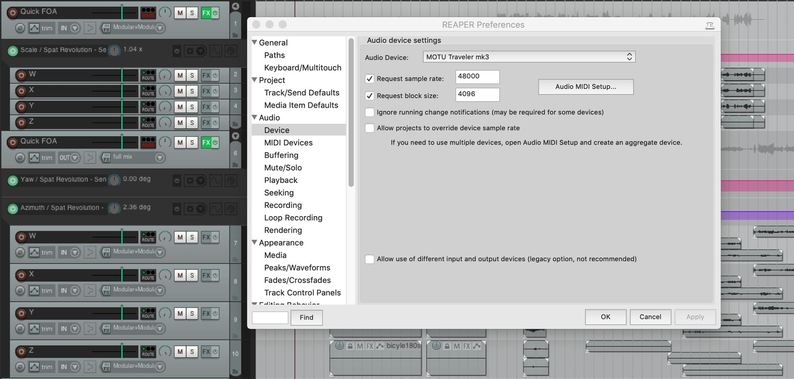

## Setting Up Tracks

It is a good idea to work with Track Folder structure for your organisation.

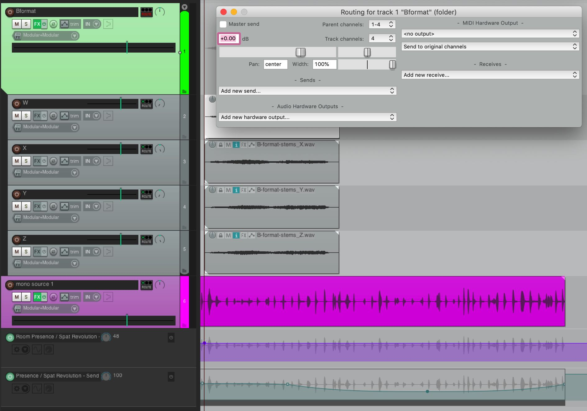

In the above screenshot, the B-Format Master has been set to be a Folder Parent with 4-Track Channel. Reaper channel routing is set on a track by track basis, using the _TrackIO Route_ button of each Track. All the Child tracks that route to the Parent can be assigned to one of the four receiving channels on the Parent track. In this example, the W is assigned to Track 1 by setting the track Pan to the left and routing to Parent Channels 1-2. Similarly, the X to Track 2 ( setting the track Pan to the right ). The Y Track is assigned to Parent Channels 3-4 and hard panned left and so on.

Alternatively, an interleaved 4-channel audio file (B-Format audio in this example) can be placed on one Child Track, which has been specified to have 4 channels.

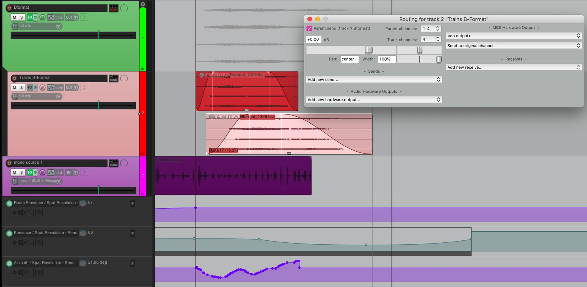

Now different interleaved files in the same format can overlap and be composed
on the same Track, and they will be summed to the Folder track, and therefore to same virtual source/object in Spat. 
All automation for that source should happen in the Envelope Lanes of the Parent Folder track.

## Setting up Spat SEND

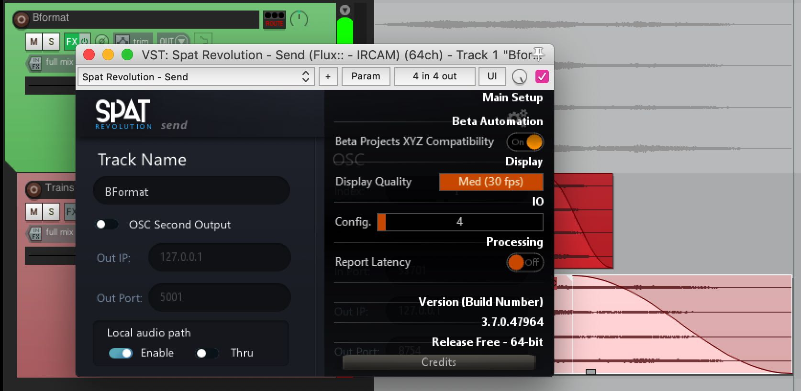

Simply insert the Spat SEND plug-in on a Parent Track. 
This means that as the composition grows, you may have multiple Child tracks sending different audio material to the same virtual source/object in Spat, through one SEND plug-in on the Parent Folder Track.

This is the least complicated way to build up a large project because the automation for the spatialization is managed in one place even though source material may be different at different stages of the composition. 
It is maybe not always necessary to have a different Spat SEND source/objects for every single audio file. 
The source automation can change in the envelope lanes of the Parent Folder, making it so that one Spat SEND is shared by child tracks with the same format. 
This will make more sense in practice.

Check the number of channels streamed between plug-in and Spat. 
Press on the little COG wheel icon at the top corner of the SEND plug-in to open the plug-in preference menu. 
The Spat _IO Config_ should have inherited the Channel count of the Track, which you have specified in the _TrackIO_ of the Reaper Track.

In the main page, enable **Local Audio Path**. 
If all is well, you will see the SEND appear as an input at the top of the setup environment in your Spat Revolution application. 
If you do not see it, you can try clicking on _Get send/return_ on the top actions or in *Setup/Pipes/Get send return* to force Spat to look for virtual IO.

In the above screenshot, the Orange ' _BFormat_ ' Send input is the one being routed
by the SEND plug on the Parent Track on the previous example. 
At first, it will appear in Spat as a Channel Based input by default - in this case it appeared as a 4.0 QUAD. If dealing with ambisonic 1st order such as AmbiX or B-Format, The input stream type in Spat needs tobe assigned manually.

## Optimization 

There are a couple of things to make sure to optimize the integration and avoid inconsistent behaviour:

!> Disable **Full Plug-in State** set by default in Plug-in Compatibility Preferences.

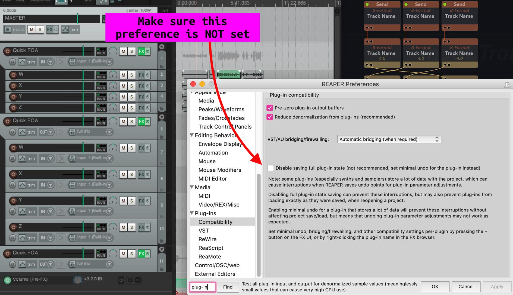

!> "Prevent Anticipative FX" should be enabled on tracks where SEND / RETURN are inserted.

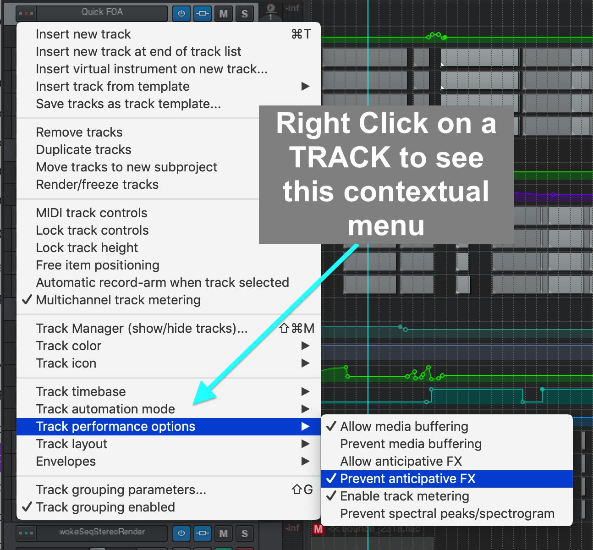

## Source/Object Automation

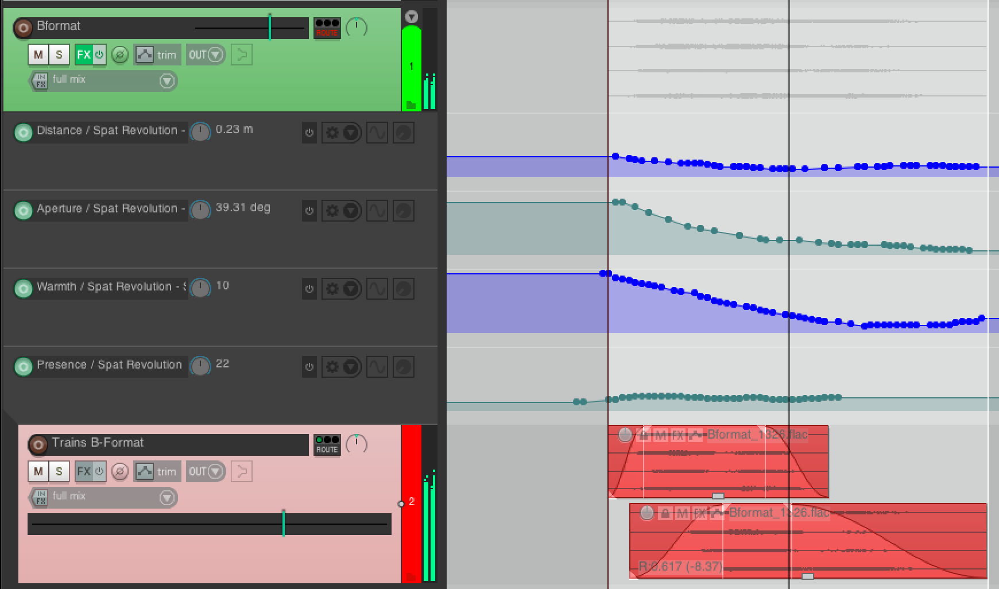

Now it is simply a case of adding some Envelope lanes for parameters you wish to automate from the DAW timeline. 
Here the B-Format source is being introduced from a distance automating _Aperture, Warmth and Distance_.

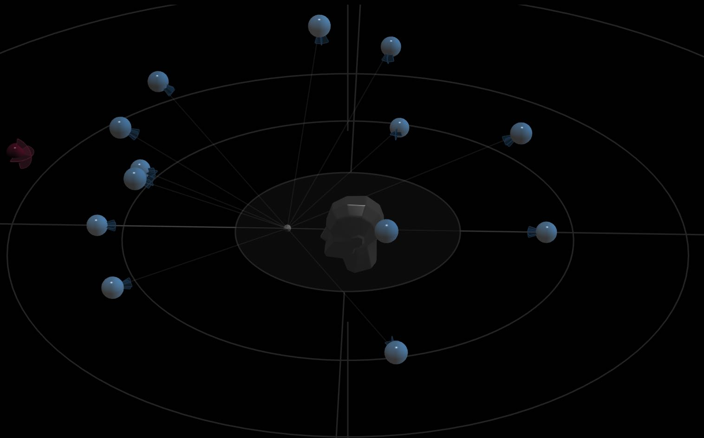

In the Spat HOA Room, we see the B-Format source (transcoded into an _Auro3D virtual speaker configuration_ in this example) fly gradually into the scene with the whole sound field transforming slowly as it comes over.

## Setting up controllers and LFO

In Reaper, it is easy to map any MIDI controllers (including 14-bit) to a Plug-In parameter. 
This is a great way to control source properties like _Azimuth_ or _Yaw_ using external MIDI controllers, so you can control some sources live by hand during a performance or while mixing for example.

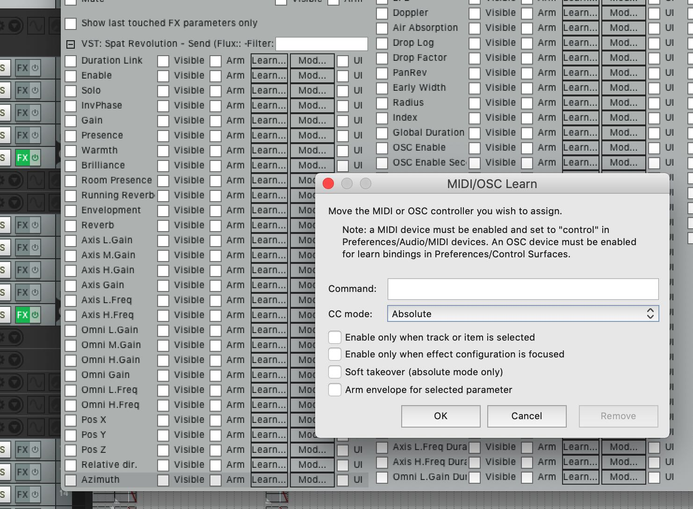

In the Automation parameter list for Spat SEND just click on the LEARN... button to
manually assign an external controller that you have set up in the Reaper Controller
preferences.

From this page by clicking on the MOD... button of an automatable parameter, it is also possible to animate sources with independent LFOs that run all the time in the background, quick and dirty way to spatialise live inputs sources with autopan type effects for example.

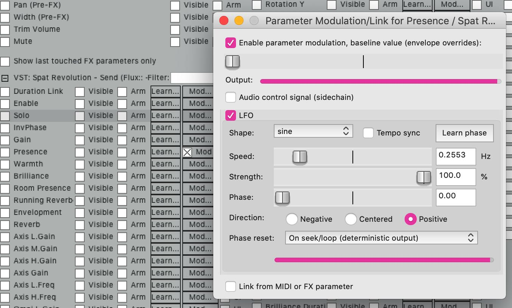

## Setting up Spat RETURN.

Now, to render the scene from the multi-channel room output to disk as an interleaved 3rd Order HOA, for example, we need to add a RETURN plug-in. 
We can calculate that 3HOA3D needs 16 channels.

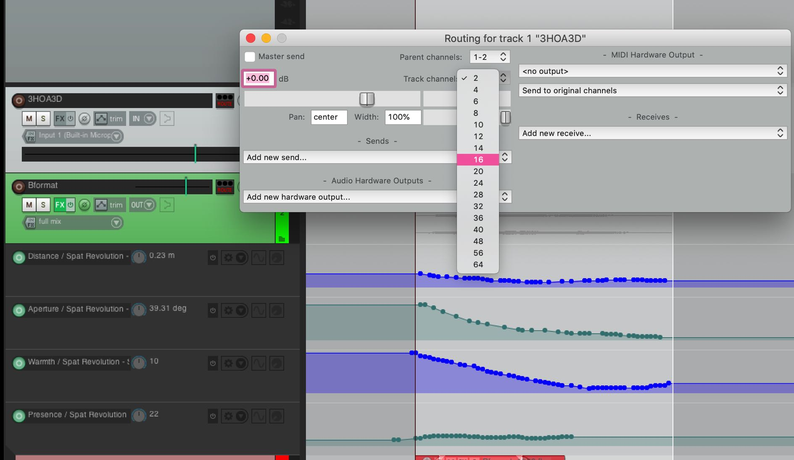

First of all set up a Track in Reaper that can handle 16 channels at once. 
Then add a
Spat RETURN plug-in on this track. 
It should automatically inherit the channel count, if not do it manually using the IO config of the plug-in, available from the little cog wheel in the top corner of Spat RETURN.

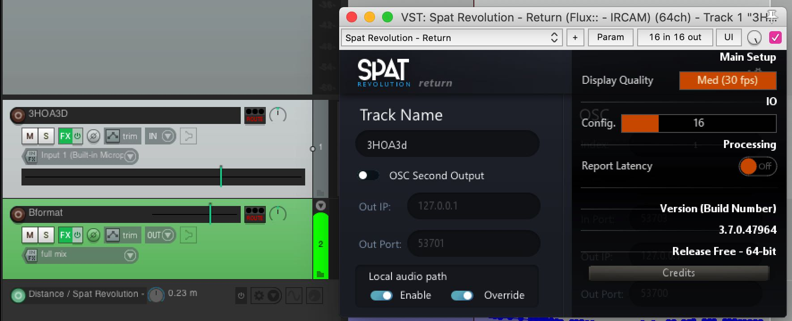

Enable the Local Audio Path: you should see a Return output module appear in
the Spat Setup Environment. Connecting it to the 3HOA3D stream output from the Room (or Rooms in a mixer/transcoder) and it should inherit the format.

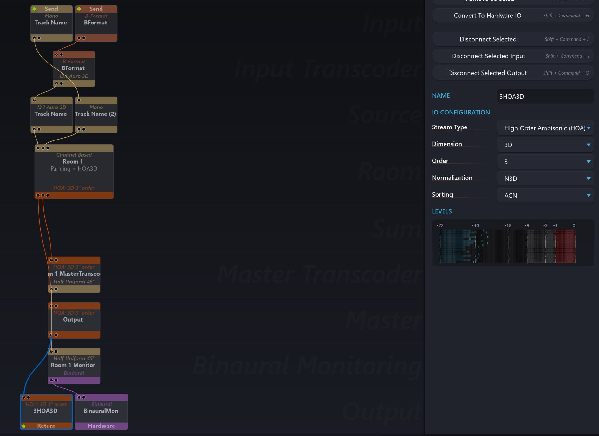

## Recording Immersive creation.

To do this, it is necessary to make Reaper record the software OUTPUT of the audio track:

- the audio coming into the Track is a virtual audio path through the Spat RETURN
plug-in, so it will _not_ appear at the _Inputs_ list of the Track. 
Right click on the record arm button on the track, and the Track record contextual menu will appear.

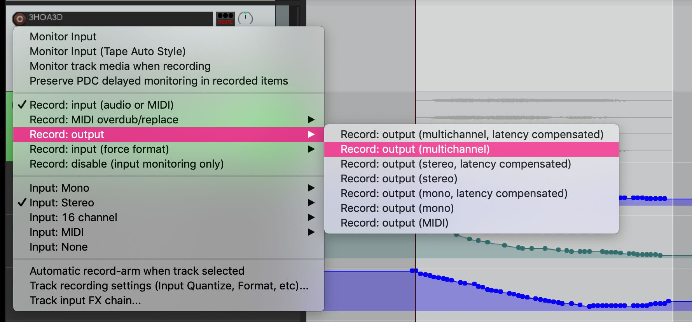

Arm the track to record, press play and render the scene to a 3HOA3D interleaved
16-channel WAV file (avoid using FLAC for higher than 8 channels). 
This is done in realtime.

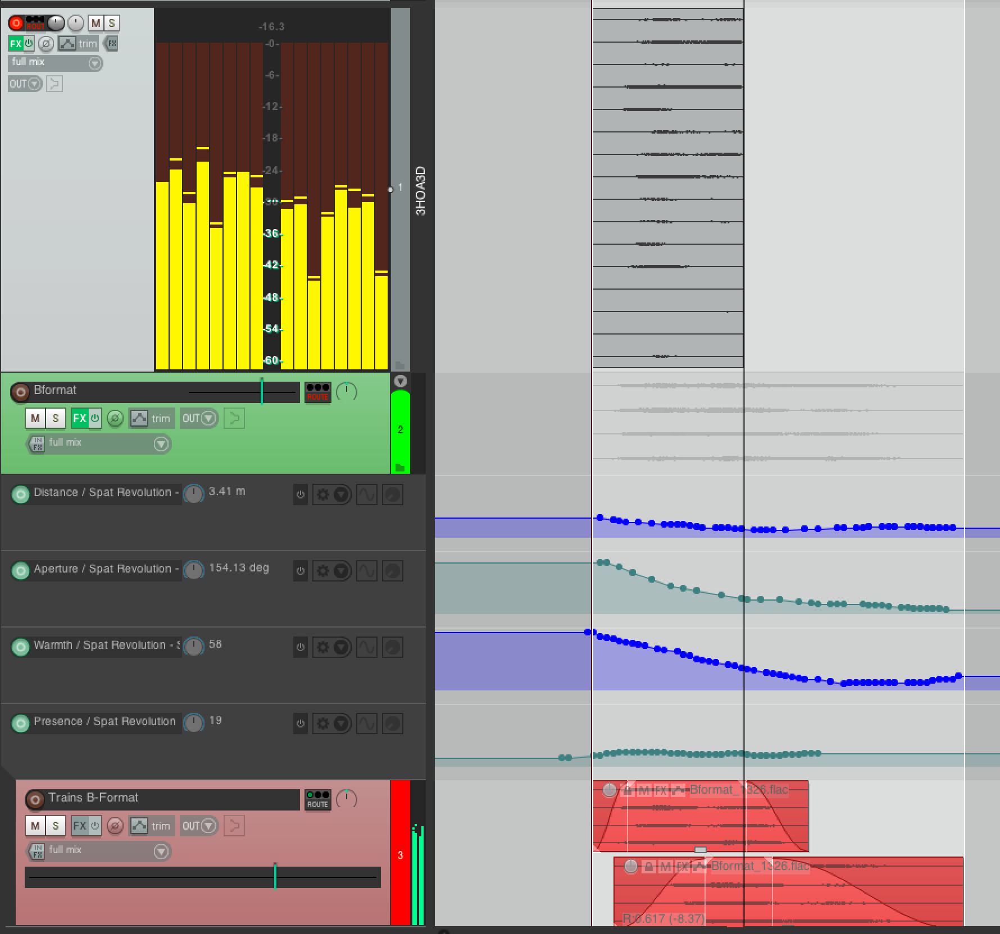

The same process can be followed to render any Channel Based or other stream
type from Spat Revolution to disk for further composition, mastering or final delivery.

