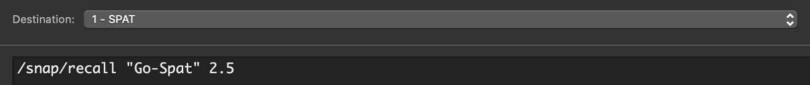
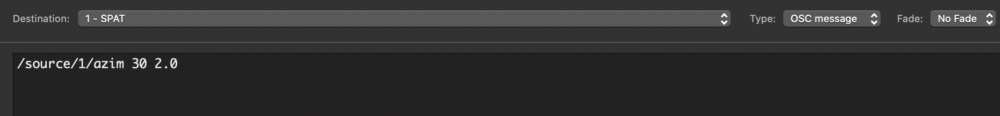
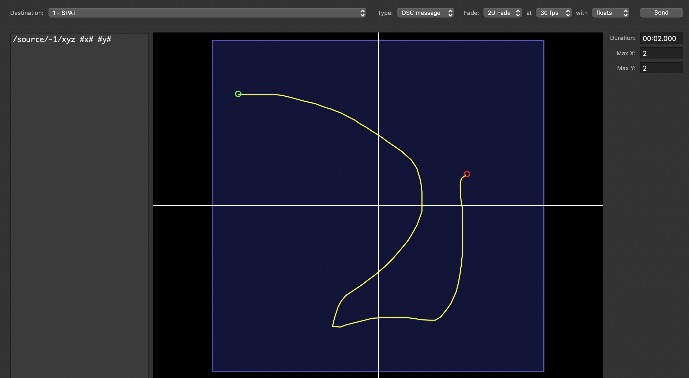
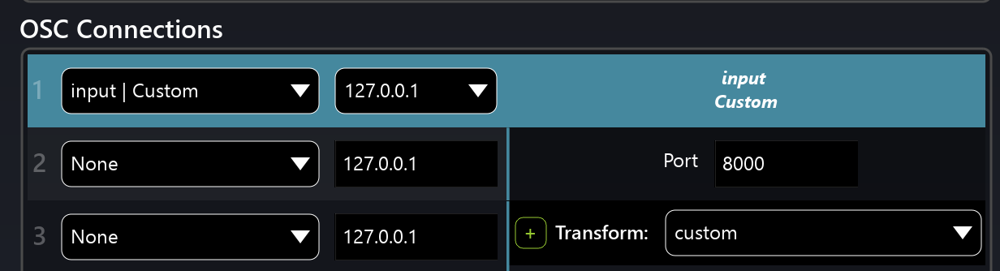
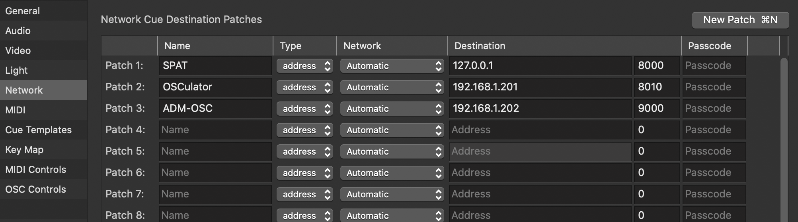
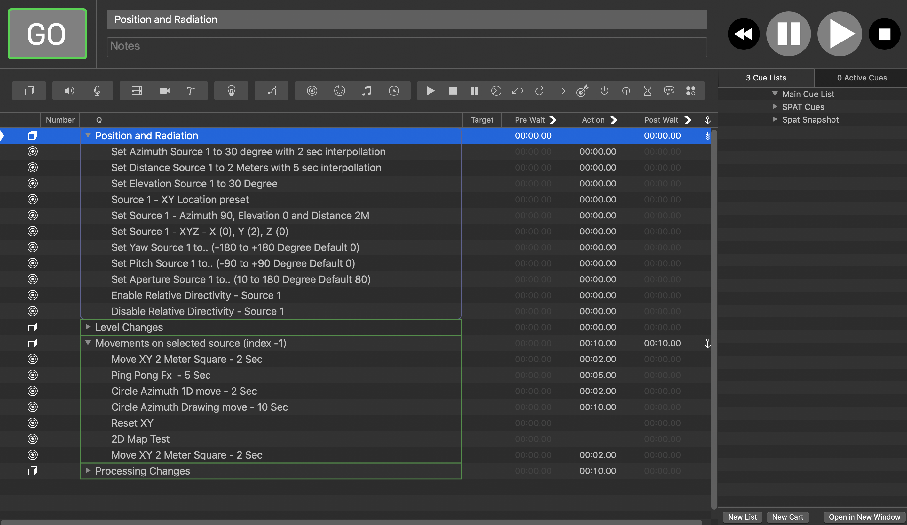

# Figure53 QLab

Rock solid and fully featured show control program, based under a 'cue' based paradigm, QLab is great for manually sequencing multiple media and show type events, running video, sound, lights and virtually any type of control scripts through its easy to use interface. Some of the more advanced control features in QLab make the most of its native OSC network integration - which is why it becomes a great integration partner to Spat Revolution.

## QLab Templates

New updated templates for QLab are available and provide cue examples that can be used with Spat Revolution. 

**[QLAB OSC SPAT SNAPSHOT CUE EXAMPLES.qlab4](https://public.3.basecamp.com/p/q8UEvjgJeRQmecxxf8GVeZ7B)**

With the release of the snapshot feature, this template shows how you can manage Spat Revolution snapshots within QLab and have some carts for quick actions. It demonstrates how interpolation time value can be used in the snapshot recall messages (last float, ex: 2.5).

---

**[QLAB OSC SPAT CUE EXAMPLES.qlab4](https://public.3.basecamp.com/p/q8UEvjgJeRQmecxxf8GVeZ7B)**

This template is our updated template and includes many cue examples using various messages types in Spat. Beyond direct cue send actions, it brings 1D and 2D fade (Parameter ramp, 2D trajectories and more). As of QLab4 there is a time interpolated 2D fade system for creating spatial XY gestures or similar multi parameter control ideas. X/Interpolation time value can always be used directly in your messages as well as shown in some template examples. With the latest release of Spat Revolution, the ability to send messages to the currently selected source (s) with index -1 is shown in this template as well.

## QLab messages via network cues

In a realtime situation, where performers or sounds are being spatialized live by Spat Revolution, and cues need to be sent in the right running order with the rest of the show, Network OSC type cues can be sent from QLab to Spat Revolution to control all aspects of the Spat rendering software. To do this interaction, it is necessary to setup the OSC communication. It is relatively straightforward. _In the Spat Revolution preferences make sure the OSC Enable is engaged._ (1)

> ★(2) Enable commands log to view the commands and confirm you are receiving data (Shift + F7 will open the log window). It is not recommended to leave it active all the time as it takes some system resources. 

**Setting the OSC Connection**

Go to the OSC connection section of Spat Revolution and:

* Change the pull down menu from *None* to the *Input | Custom* preset (meaning you are setting an OSC Input of Spat).

* Select the network interface you want to be receiving the commands from. Doing a local integration of QLab will require you to choose the localhost / loopback address 127.0.0.1.

* Unless you are already using the Port #8000 proposed, you do not need to change it. This is the corresponding QLab Network Patch Output Port to use.

**QLab Workspace Settings / Network**

On the QLab side, use the Network Patch settings to configure OSC destinations. One of them can be SPAT.

You can now send OSC network cues from QLab to Spat, and control **most if not all parameters** of this virtual environment using [Appendix C - OSC and ADM-OSC Table](Appendix_E_OSC_Table.md). Once you get the hang of it, this is really very straightforward. 

...

