# Avid Pro Tools 

Avid Pro Tools is a leading DAW in the professional audio community and is far from new to the object-based mixing workflow. Spat Revolution can use the AAX version of its plugin suite SEND, RETURN and ROOM to establish connection between Avid Pro Tools and the Spat Revolution environment. At the base, this is to provide the automation link via OSC for local or remote integration. All the Spat plugin parameters are made available to Pro Tools in order to record the metadata (automation) of the immersive creation.

## Workflow

As mentioned in the troubleshooting guide, **using specific tracks as your Spat object** is the best practice for dealing with these sources/objects you are sending for external rendering. You can simply use tracks as your audio objects. (similar to many object-based mixing workflows proposed by DAW). This way you can leave the session audio tracks and their channel insertions as they are, and simply send your audio tracks to the Spat Revolution object tracks. This allows you to send a single audio track or multiple ones (stem) to the Spat Revolution object tracks. Being with local audio integration (LAP) or alternate audio routing methods in single or dual computer setups (virtual audio bridge, network I/O, etc), this is flexible approach.

## Templates

**Project Sessions and Templates downloads.**

New updated templates are available for use with Avid Pro Tools. They are start sessions and can be used as examples to see how to integrate Spat Revolution using the Spat plugin suite SEND, RETURN and ROOM. They are .ptxt session template files and can be copied to your **Pro Tools Session Templates** folder. A Spat Revolution .JSON file is as well provided. They can be used with the Local Audio Path option of simply connecting the Aux track Spat Send objects to alternate audio routing methods in single or dual computer setups.

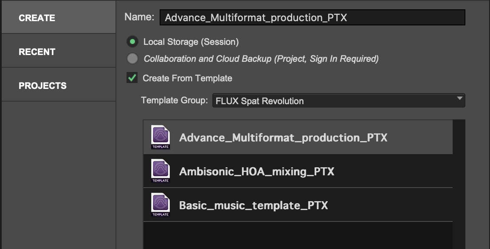 

A tutorial on **[How to set up Spat Revolution with Pro Tools](https://www.youtube.com/watch?v=QLCCQWyiBV8&t=1s)** is available here for a quick dive into this integration. 

You can download the following session templates and presets:

**Pro Tools and Spat Revolution Sessions**

* **[AVID Pro Tools Tutorial session](https://public.3.basecamp.com/p/SwLLzoRzj5jPPeQArM16yoBo)** is the session used in Pro Tools integration video tutorial and includes send and return setup for rendering Binaural, 5.1, and 7.1.2 output formats. 

* **[Basic AVID Pro Tools PTX session](https://public.3.basecamp.com/p/x1sVMdyagxSoxDHdJV1zjuxT)** is a basic the session with 8 audio sends and 2 stereo returns.

**Pro Tools Templates and Spat Revolution Sessions**

* **[Basic music PTXT](https://public.3.basecamp.com/p/1QCC5WtXqmfTARWLwoqw69KM)**  is a start template using SEND and RETURN to render Stereo, 5.1, Atmos 5.1.4  output formats with Binaural monitoring.

* **[Advanced multi-format PTXT](https://public.3.basecamp.com/p/rxdXr4Dx44jbfejfUt9Q3FRG)**  is a start advance template using SEND and RETURN to render Atmos 7.1.2, NHK 22.2 and multiple binaural output formats.

* **[Ambisonic HOA mixing PTXT](https://public.3.basecamp.com/p/3GKjiogWDxszrkwTk7qdF7U3)** is a start template for using HOA 3rd order and  binaural monitoring output formats.

**Pro Tools Track Presets**

* **[Avid Pro Tools - Track Presets](https://public.3.basecamp.com/p/ux78xLZDnjtihA3hm8xFKhCP)** can be used as a simple (and alternate) method to templates to add Spat Send objects (and return) on the fly into existing Pro Tools projects.

> Note: For Avid HDx users. Please make sure to use the specific Pro Tools HDX template session. This ensures that the Native Spat plugin gets instantiated under Pro Tools HDX systems using local audio path (the audio pipe or bridge function of Spat Revolution production suite).

For troubleshooting, please review the **[Appendix B - Troubleshooting](Appendix_B.md)**

## Setting Up Sync when using LAP

As the of latest release of Spat Revolution, buffer size in Pro Tools needs to be set to 1024 samples, in both ProTools and Spat Revolution if using the Local Audio Path option. In ProTools, go to *Setup/Playback Engine* then set H/W Buffer Size to 1024 samples.

> We highly recommend de-activating dynamic Plug-in processing.

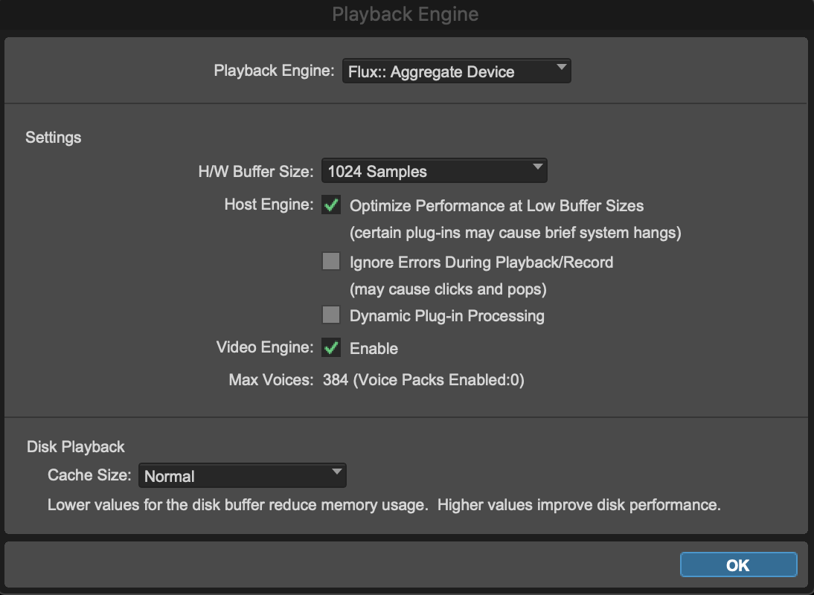

In Spat, go to *Preferences/Hardware IO* , then set :

* Device : None
* External Sampling Rate : Enabled
* Block Size: 1024

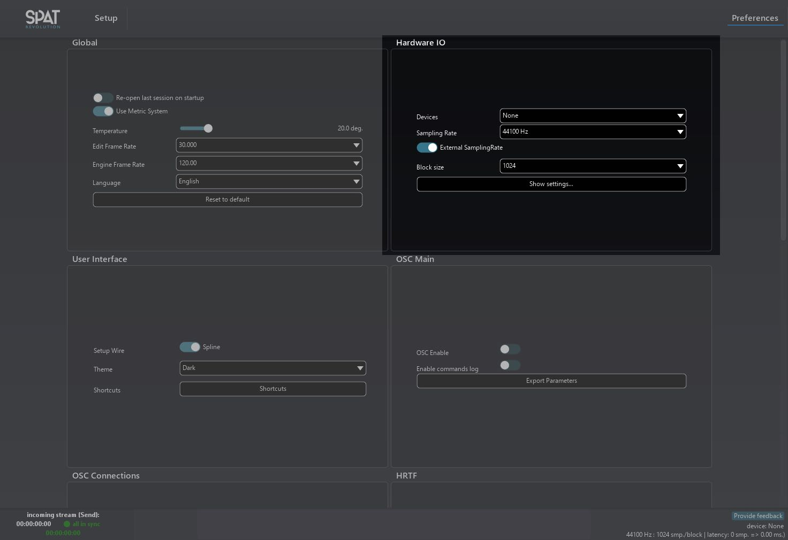

### Setting Up Object Tracks

Setup a Protools session to work with Spat Revolution using the Local Audio Path mode is simple. Just add SEND and RETURN plugins and enable the 'Local Audio Path' (LAP) option for each. When using FLUX Pro Tools templates or presets, although Spat plugins are instantiated, they don't have the LAP activated by default. (Supporting standard audio routing of objects to Spat Revolution as external renderer) 

Once you engage the *Enable* switch, SEND software inputs should show up at the top of the Spat Revolution setup enviroment page, and Return outputs at the bottom.

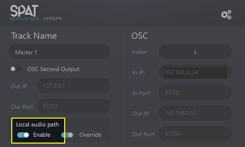

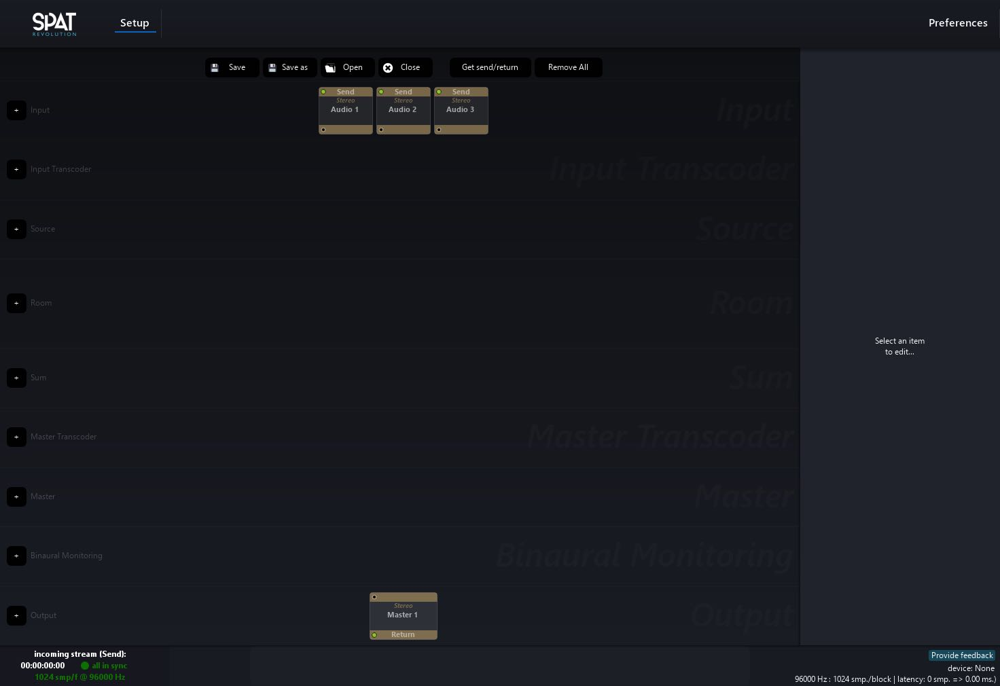

Select all the objects in the 'empty' signal graph using a drag select or Command click selection, then choose the 'connect selected' action. A default module routing will be completed automatically with a default stereo virtual room.

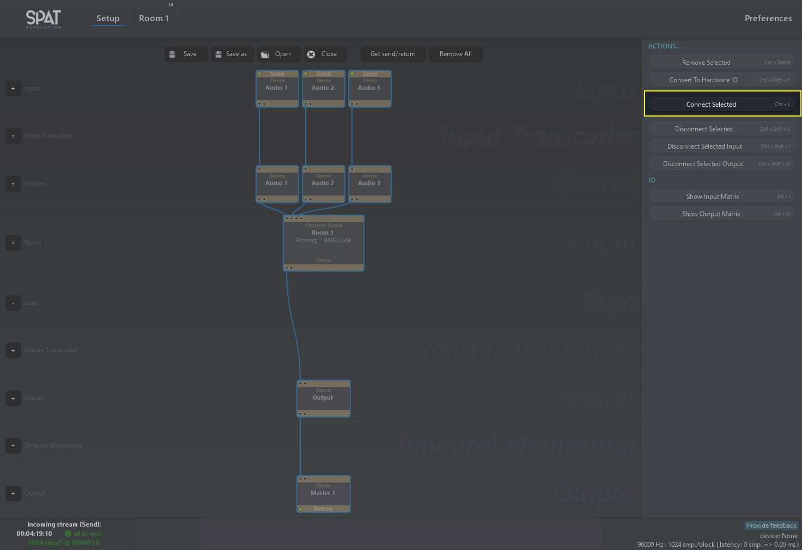

Now you should be able to send and receive audio streams from/to Pro Tools and spatialize your objects.

### The dummy bus and why

Quite simply, all tracks or Aux objects that have a Spat SEND need to be outputting to a common bus that is then feeding to all the Spat RETURN buses. Using FLUX:: Immersive Pro Tools templates, sessions and track templates provided avoid prevents the user having to do these steps.

A simple, nice and clean way to handle dummy bus for all scenarios and formats is to create a 16-channels ambisonic dummy bus (the largest bus that Pro Tools supports) and include all the sub arrangements from mono all the way to 3rd order ambisonic. (HOA3, HOA2,  HOA1, Atmos 7.1.2, 7.1, 6.1, 5.1, 5, 4, LCR, Stereo and Mono). Whatever track format Spat SEND plug-in is, it can be sent to this dummy bus that can handle all the formats. Then all, these buses are available to feed any Spat RETURN whatever the channel count.

This is the strategy used in templates and Spat Pro Tools tracks presets.

### Dealing with a standard Pro Tools license

As far as we are concerned, the Ultimate version of Pro Tools is highly recommended because of the use of multichannel buses. Using a standard Pro Tools license forces us to return our audio streams by groups of two channels. For example, you will need 12 Spat RETURNS plug-ins (and 12 x 2-channels tracks) to return a 22.2 stream from Spat Revolution.

This strategy is still used when dealing with channel-based format higher than the supported bus in Pro Tools. So for example for a NHK 22.2 bus in Ultimate, we can return this to 3 x 8-channels (7.1) bus or to 2 x 16-channels ambisonic buses where only 8 channels will be used on the second one. So, Pro Tools Ultimate is highly recommended. Pro Tools Advance Multi-format template for Spat Revolution reflects this. 

## Spat Source/Object Automation

To automate variable parameters in the Spat rendering engine from Pro Tools automation lanes, it is necessary to activate the parameters for each plugin instance first. This is already done in the above templates and track presets.

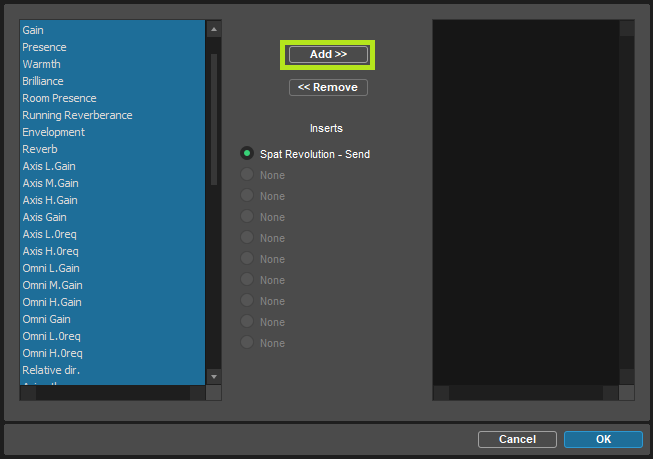

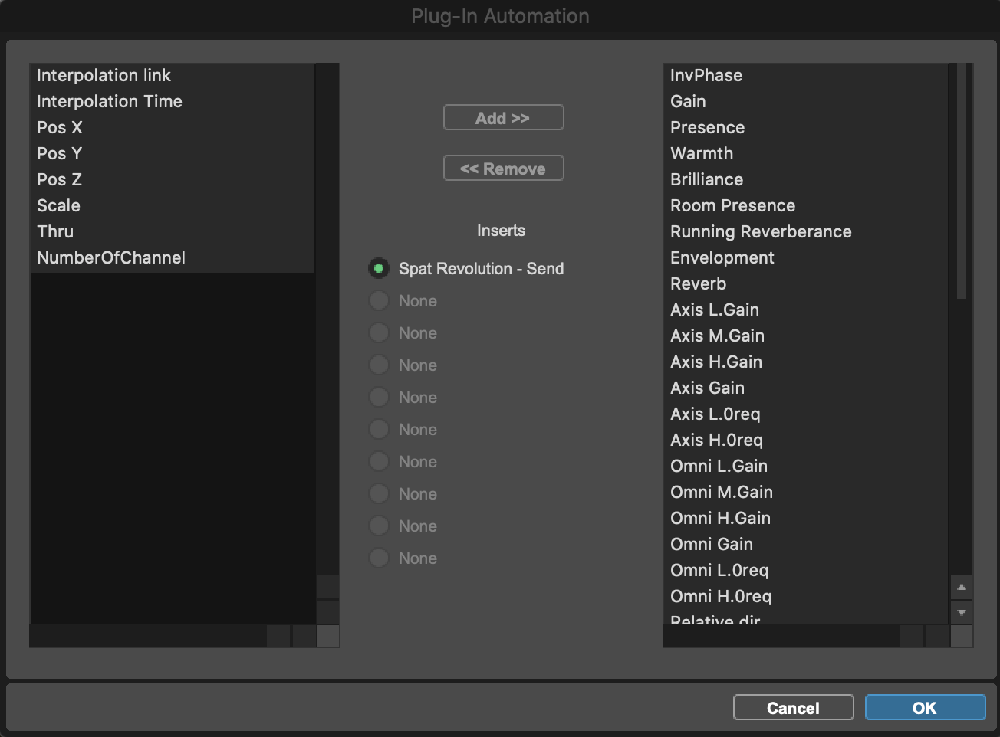

To do this one by one can be a laborious task. Save time by editing the Pro Tools preference for automation and enabling the '*Plug-in Controls Default to Auto-Enabled* ' option. When inserting a plugin, all its parameters will then be available for automation automatically.

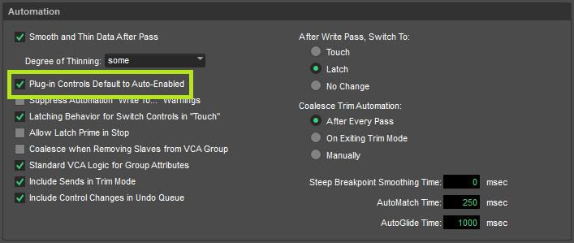

## Track presets

**FLUX:: Track presets for Pro Tools** is a simple strategy to rapidly add Send and Return objects into a Pro Tools session. **Session Templates** are great because they give a starting point. 

Spat Revolution is unique as it can deal with send sources/objects that can be mono, stereo, LCR and all the above (up to 16 channels with Pro Tools, 64 with other DAWs). The same applies for the return busses as we are dealing with the various stream formats you can create in Spat Revolution, for monitoring or rendering. Templates are often just a start point and are most of the time not exactly reflecting your desired session. 

Welcome the **[Avid Pro Tools - Track Presets](https://public.3.basecamp.com/p/ux78xLZDnjtihA3hm8xFKhCP)**.

Simply copy the **Track preset folder** to the Pro Tools track presets folder (/Documents/Pro Tools/Track Presets/Flux). With this in plac,e you will have track presets that can be used for SEND and RETURN:

- Send Mono
- Send Stereo
- Send 5.1
- Send 7.1
- Send 7.1.2
- Send HOA 1
- Send HOA 2
- Send HOA 3
- Return Stereo
- Return Binaural
- Return Quad
- Return 5.1
- Return 7.1
- Return 7.1.2
- Return HOA 3

With these track presets, integrating Spat Revolution in an existing session can be done quite simply. Click on the output selection button of a track and choose "New Track". A pop-up window will appear. Choose "Track Presets/Flux" in the category. Lastly, you'll find all the possible object send format accessible in Pro Tools. Select the one that matches your initial track format or your desired object format. This newly created object can be used by other audio tracks too. (Using it a stem object)

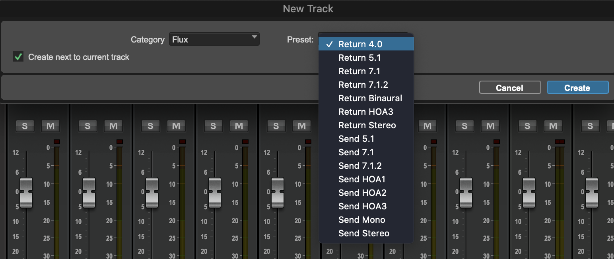

If you also want to send multiple tracks to a single SEND object to spat, you can do it easily. Select all tracks, old the option key and change the output of a track to New Track. Click in type, choose "Track Presets/Flux" and then choose the format of the send object that you want.

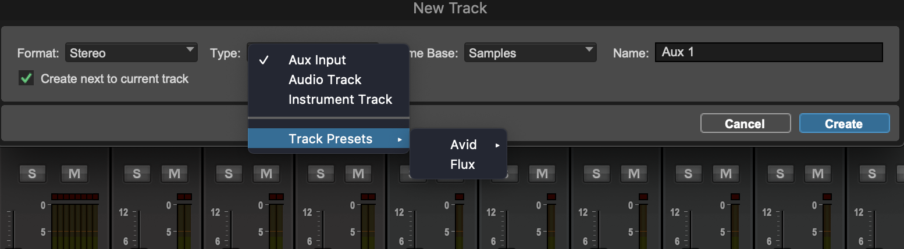

That’s it. All your selected tracks will be assigned to this newly created bus called Spat Send, your Spat source/object. It’s an aux track containing your Spat SEND plug-in instance ready to enable Local Audio Path or to route to external audio option (virtual audio bridge, network I/O). It’s your object track. Moreover, this creates the "all-format" dummy bus mentioned above, and your Send Object track is already assigned to it. You can do this on a single audio track or a series of tracks to send everything like a stem.

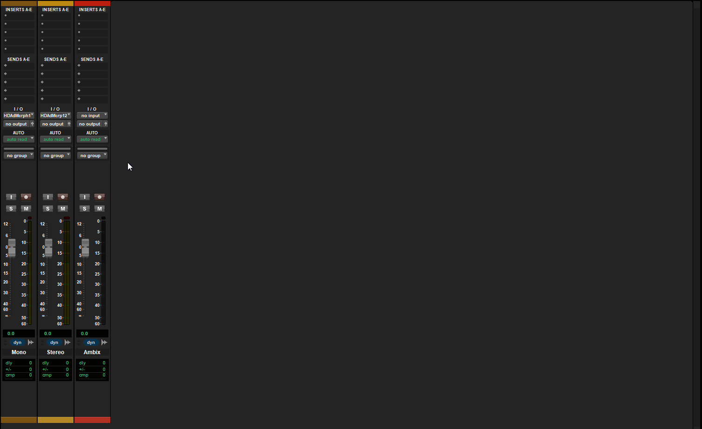

Why creating an aux Spat send object and not instantiating the plug-in directly on the audio track? Although this is possible as well (and you have to make sure your audio tracks have the proper routing), this simply allows to have a post-fader send to Spat Revolution, as plug-in insert in Pro Tools are always pre-fader. Using the aux track model is simple, clean and allows for creating Send stems.

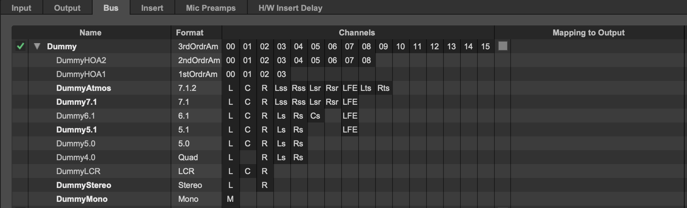

Last step, the RETURN plug-in. Create a new track. Choose track presets, choose FLUX:: and then choose the required format. Spat RETURN plugin will be instantiated on the newly created bus. The bus is already fed from the dummy bus previously created and you don’t have to worry about the routing for synchronization!

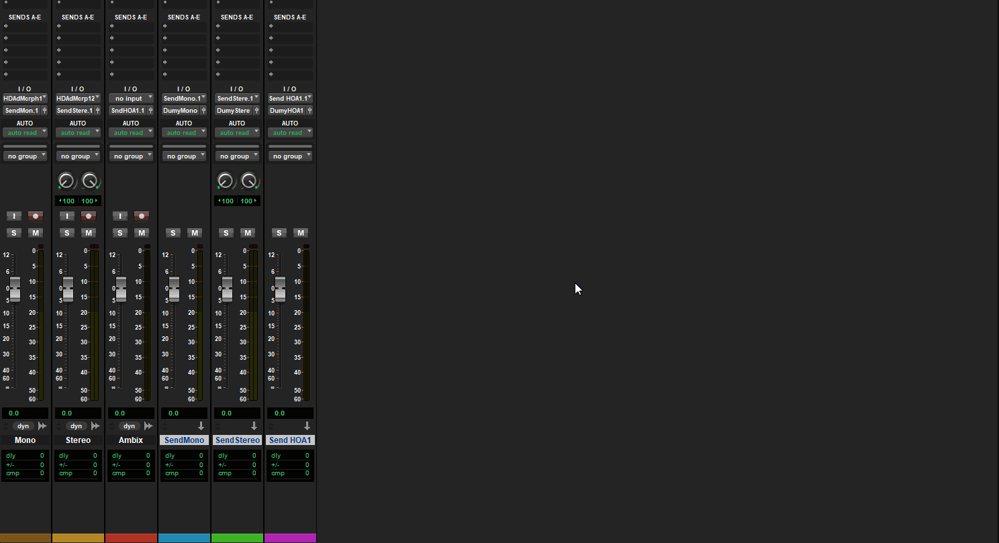

### Source/Object Index, moving from LAP to OSC

Another thing to keep in mind is that as you instantiate plug-ins, they generate automatically an Index # that gets used when in OSC mode (without local audio path). So, if you take a template (or a fully deployed session) and delete a bunch of plug-in instances or create new instances, you end up with a mix of index numbers which may mean manually having to change them later. That can be a tedious job when dealing with a larger session. Granted this is not important when using LAP, but the day that you decide to separate your playback of the rendering computer, disengaging the Local Audio Path (LAP), you end up with the same reality of Index # not reflecting your setup.

The rule of thumb is simple. The index # presents the Source # in Spat Revolution and deleting (or re-ordering in the case of Spat) will change the index number. When using the plug-in in OSC mode, this will have an impact on the source that the Spat plug-in is speaking too.

---
