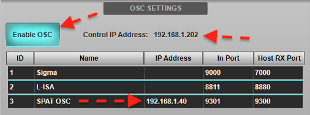
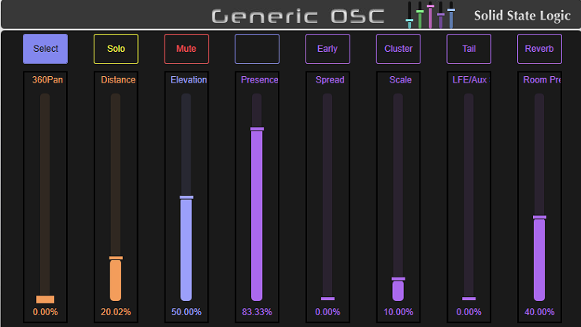
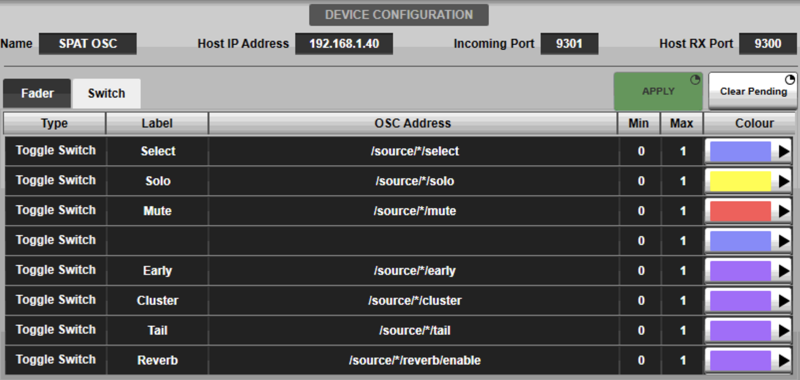
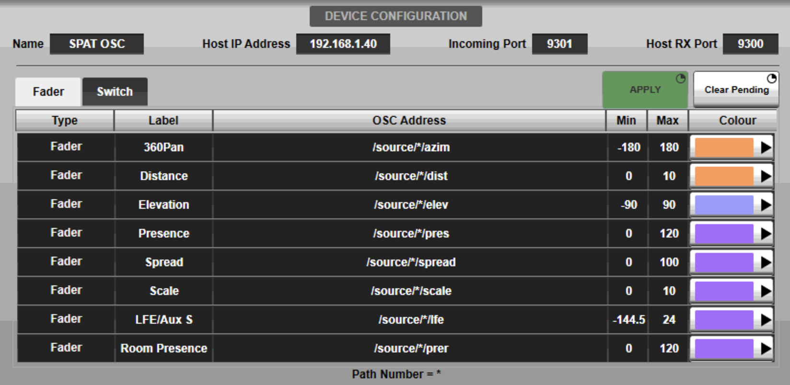
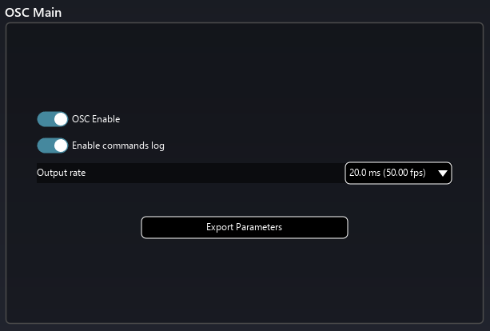
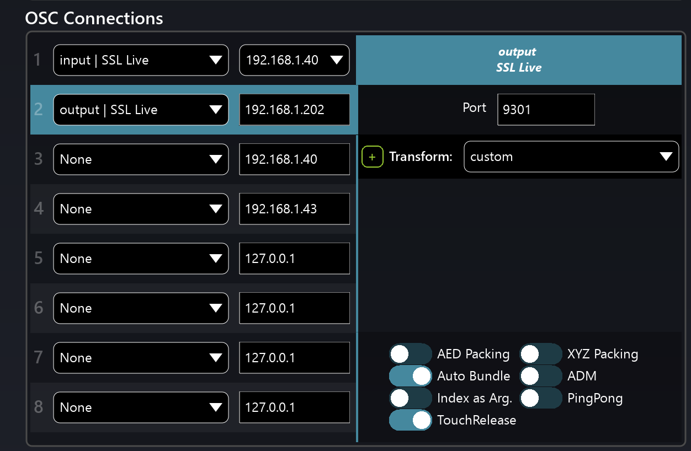

# Solid State Logic SSL Live Consoles

As of version 4.11, SSL is now supporting Open Sound Control (OSC). SSL Live console are now capable of remotely controlling other devices over its connectivity network ports. This is a bidirectional integration for Spat Revolution. 

## Template 

A simple template is available for downloading and provides a start point to configure this integration.

**[Solid State Logic SSL Live v4.11 - Spat Revolution 20.12 template](https://public.3.basecamp.com/p/CSWr2SGggU6bbdZfTysp6LXj)**

## Setting up SSL Live console

* Go to <code>MENU/Setup Option /EXTERNAL CONTROL</code> to configure remote control.

* Rename the Generic OSC to SPAT OSC and enter the Spat Computer IP address.

* Set In port # to <code>9301</code> and Host RX Port # to <code>9300</code>. They will match the SSL Live OSC Input and Output connection presets in Spat Revolution.

* Make sure to Enable OSC and note the Control IP Address. This address will be needed when configuring Spat OSC.

**SSL OSC Settings**

## External control fader and switches

**SSL Generic OSC - External Control**

With Solid State Logic live consoles, up to eight *Fader* (i.e. continuously variable) and eight *Switch* parameters per third-party device channel may be defined for control by the console. These control parameters (OSC messages) going out to Spat Revolution source/objects are accessible from each console audio path as well as dedicated OSC paths with no console audio processing associated with them. The provided template has all these configurations done for you but you can decide to customize with different or less parameters.

**SSL OSC Device Configuration and Address for Switch**

 
**SSL OSC Device Configuration and Address for Fader**

 

## Setting up Spat Revolution

* Start the Spat Revolution software and open the preference page.
* Enable OSC.

 

* In the OSC Connections section, use the pre-configured SSL Live OSC presets. In the pull down menu, choose **input |SSL Live** and select the local IP address you are using to communicate with the desk. Then set a second OSC Connection for the output from Spat Revolution to the desk. In the pull down menu, choose **output | SSL Live**. You will enter the desk IP address as found in the OSC settings. Ports # <code>9300</code> (Input) and <code>9301</code> (Output) are pre-configured.

 

----
