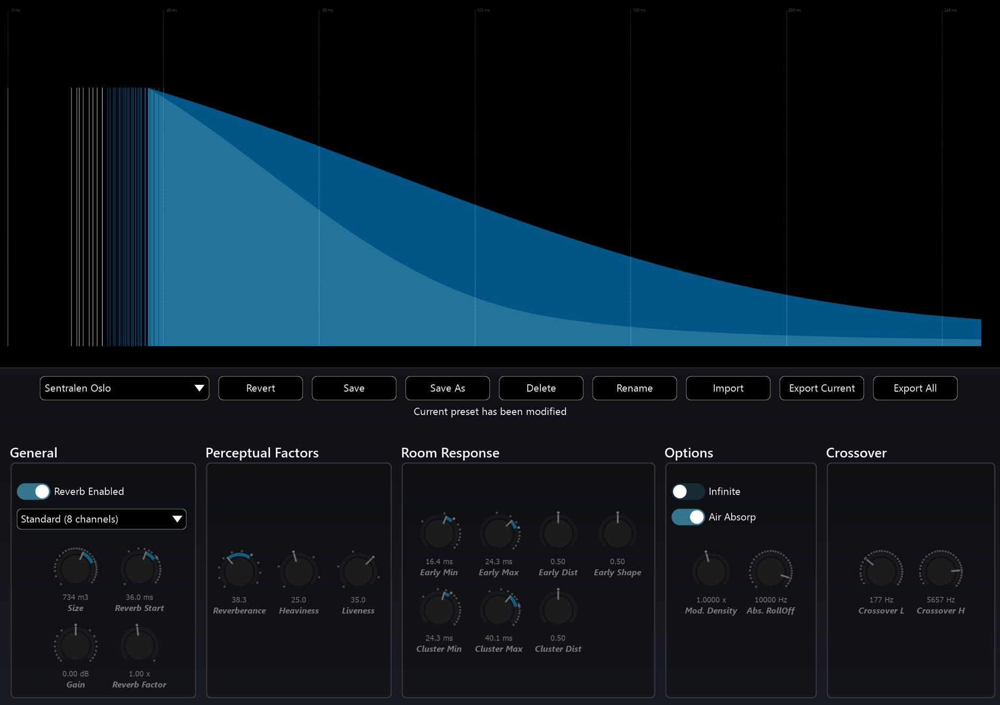

# Welcome to SPAT Revolution
[Product Page](https://www.flux.audio/project/spat-revolution/)
| [Shop Page](https://shop.flux.audio/en_US/products/spat-revolution)

First of all, thank you for acquiring _SPAT Revolution_. 
We hope it will provide you with new levels of productivity, creativity and experience in sound design. 
Our goal was to deliver the most comprehensive real-time spatial audio renderer ever designed, and to make the whole process of spatialized audio production powerful and intuitive for beginners and professionals alike. 
Our real-time audio environment provides easy access to some of the most advanced spatialisation algorithms currently available, at the very best sound quality currently possible.

_'SPAT'_ is short for _Spatialisateur_ in French. 
It is a real-time audio library that allows composers, sound artists, performers and sound engineers to control the localisation of sound sources in virtual and real 3D auditory spaces.

<!-- TODO: update the image -->

_SPAT Revolution_ wraps the 'Spat' processing library in a luxurious and characteristic graphic environment to help visualise many aspects of a spatial audio composition in realtime. 
This graphic interface allows sound mixes to be composed as interactive spatial models existing in _Virtual Room_. 
SPAT contains a powerful multichannel reverberation engine which can be applied to design and add a sense of auditory space in studio mixes and realtime on location.

> Artificial Reverberation Editor

<!-- TODO: update the image -->

> **SPAT Revolution maintains the highest audio quality throughout the entire signal flow**
>

## Different needs, different tools

_SPAT Revolution_ comes in different flavors: an **Essential** and an **Ultimate** version.
Both share the same audio engine and powerful 3D audio capabilities.

The **Ultimate** license brings the complete set of tool needed for professional already working for immersive audio creation content. 
It delivers the full flexibility, powerful routing and complex option sets of _SPAT Revolution_.

The **Essential** license supports the more common workflow scenarios in a more accessible manner. While it has the same audio capabilities, the intent is for a simpler user experience, with fewer options and a more straight forward approach to immersive audio creation.

## Ultimate and Essential : what's common?

The _SPAT Revolution_ software supports with the same installer (binary) both license options and  has the common features listed below:

 - An easy-to-understand setup page, showing a clear representation of the signal path.
 - A powerful mixing environment, using a 3D view and perceptive factor parameters.
 - An oriented-object audio engine allowing the user to render either channel-based, Higher Order Ambisonic (HOA) or binaural audio streams.
 - Support for mono, stereo and multichannel inputs streams.
 - A flexible speaker array editor allowing going beyond the usual standards.
 - A snapshot system to easily recall scenes on the fly.
 - An audio pipe technologies allowing receiving and sending audio from all the major DAW to and from _SPAT Revolution_.
 - An exhaustive list of OSC commands to allow a deep remote control of _SPAT Revolution_.

## Ultimate and Essential: Differences

SPAT Essential comes with a set of limitations:

 - The audio engine is limited to a sample rate of 96 kHz.
 - Total source channel inputs is limited to 32.
 - The number of rooms output is limited to either 16 speakers or HOA 3rd order.
 - Only one room can be used at a time: no simultaneous rendering.
 - Session configuration is simplified, using only the Setup Wizard.
 - Ambisonic decoding is done using AllRAD method

 **Complete specification is available [here](https://www.flux.audio/project/spat-revolution/#specifications)**

## Ultimate vs Essential sessions

Both Essential and Ultimate are based on the same session. 
In order to allow for sessions created with Ultimate license to be compatible (or simply opened) with Essential, a simple compatibility dialog tool welcomes you at session opening, offering for a partial read based on the limitations set by the Essential license. 
Speaker arrangements of any size can still be managed (created, imported, exported) but only valid ones for Essential can be applied to the session.

---

# SPAT Revolution's Heritage

> **SPAT Revolution is underpinned by 30 years of technical research and development in acoustics and sound.**

Behind _SPAT Revolution_ is the partnership of FLUX:: SE and Ircam in Paris, France. 
Founded in 1977, Ircam is one of the world’s leading public research institutes in the fields of musical expression, science of music, sound and acoustics. 
The first result of this partnership was the plugin suite IRCAM Tools. 
In that release was the first incarnation of SPAT as a DAW plugin based on over 30 years of research with Ircam’s Acoustic and Cognitive Spaces Team. 
After decades of development the next step was the full production environment for spatial audio - _SPAT Revolution_ through the elegant simplicity of the graphic interface, _SPAT Revolution_ represents a formidable achievement. 
It brings together the technical expertise from decades of academic research and development at IRCAM into an easy-to-use package that is flexible and powerful enough to meet all the demands of spatial audio production, from day to day surround sound post-production to the most challenging realtime installations. 
As you will discover, _SPAT Revolution_ can handle a virtually unlimited number of input and output audio streams and is prepared for all formats and 3D-audio workflows currently available or imaginable in the audio industry.

Although this user guide cannot cover every technical aspect of the algorithms and expert knowledge contained within _SPAT Revolution_ we hope you will feel assured that the science behind the sound is absolutely correct.

---

# About this Guide

This guide has been written for practitioners already working in immersive sound production yet new to the SPAT Revolution software environment. 
Is also intended to be read as a practical introduction to surround and immersive audio production for those who are new to the medium and coming to it through SPAT Revolution. 
Of course, there is plenty more knowledge to be had in the field of immersive audio and the technology behind it, which will strengthen your understanding and decision-making.

We strongly suggest spending the time to read through this guide before starting on your first major production and keep it on hand during the process. 
Expert support and advice can also be sought from the  **[FLUX Immersive FB user group ](https://www.facebook.com/groups/fluximmersive.usergroup/)** and the **[Web-based Knowledge base](https://www.flux.audio/knowledge-base/category/spat-revolution/)**.

Let us start now with a practical guide on getting the software installed and running.
