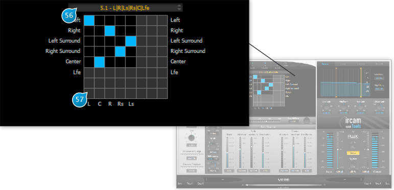

# Routing

This sub-panel is accessed by clicking the Setup button.

## (56) Output routing arrangement
The preset list above the routing matrix gives quick access to a list of typical I/O routing profiles allowable given the current 
input and output counts.

## (57) Output routing 
The user is a presented with an N by M I/O routing matrix, where N is the number of input channels across, and M the number of output channels vertically. The current I/O assignment is displayed, an output assigned to an input being indicated 
by a blue matrix cell. Click on an unassigned cell to reassign the channels.
