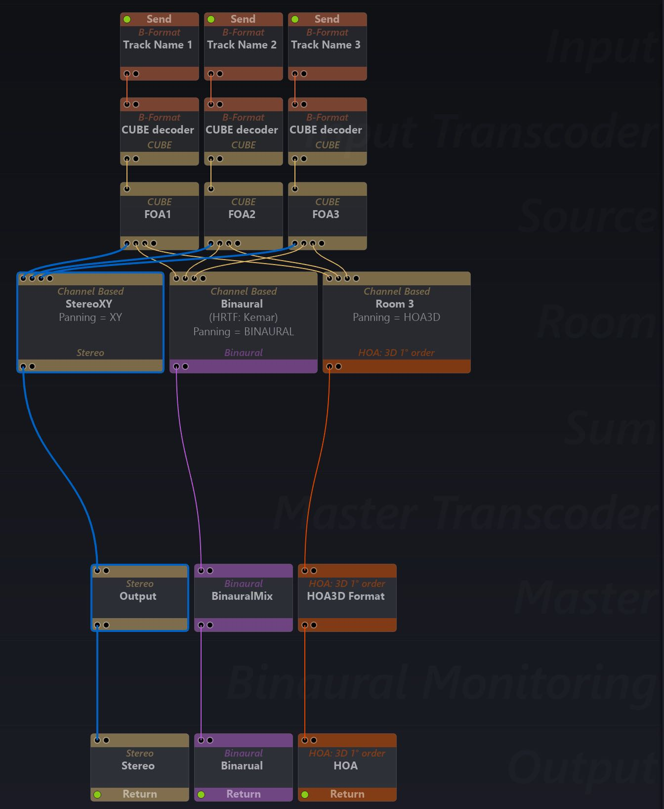

# 11.1 Parallel Room Mixes

Use the lasso-selection or command-click selection to make a selection of all
Source modules in the Sources row of the graph. Use the Connect Action to wire
them into another Room module. This can be repeated, according to how many
alternative Room mixes are needed.

The mix and automation of all sources will be rendered identically in each room,
except of course the Room format, panning type and artificial reverberation could
all be different.

The parallel Rooms technique is used to create simultaneous versions of the
project mix at the outputs. For example a scene can be computed as a Channel
Based mix, an HOA encoded mix and a Binaural mix simultaneously.

See example below.

