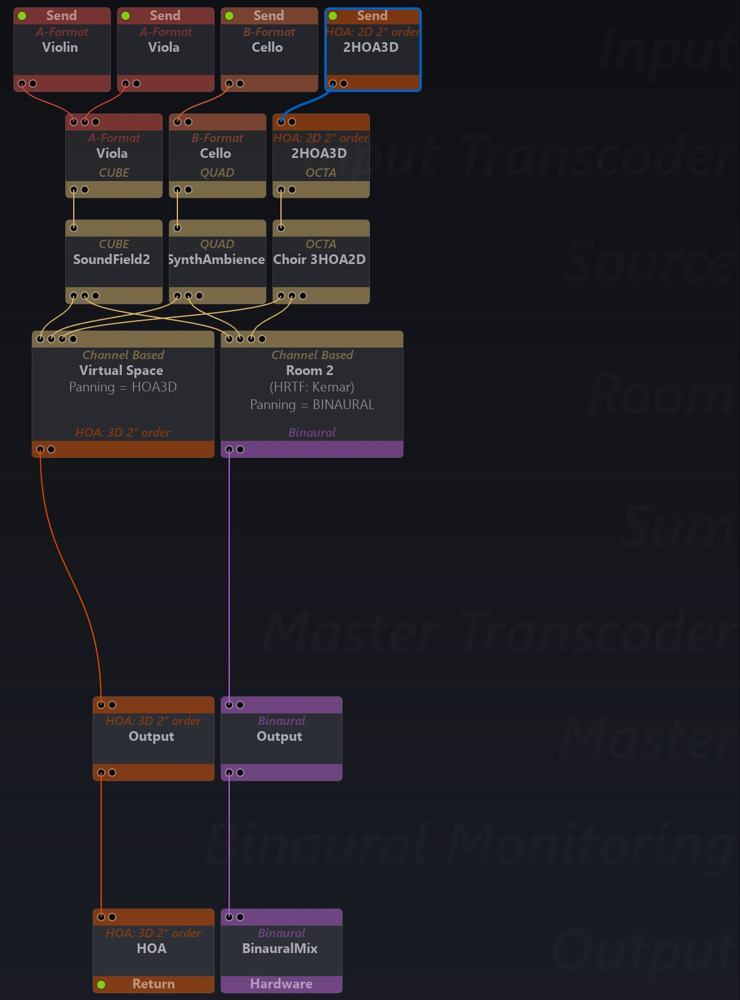
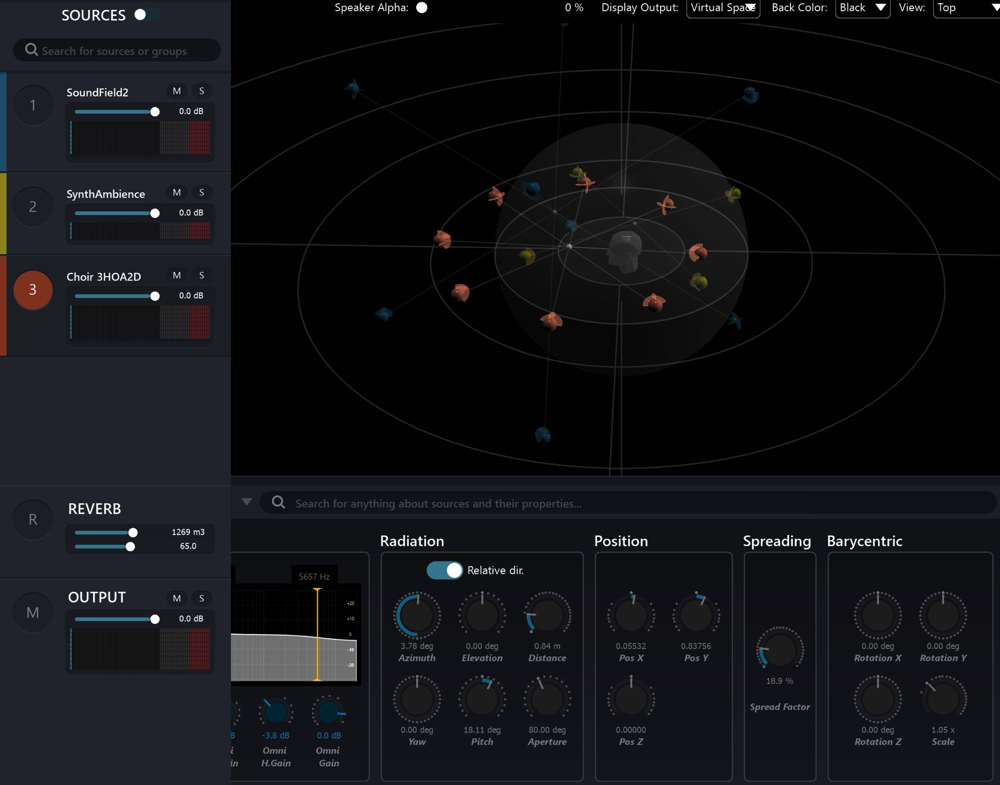
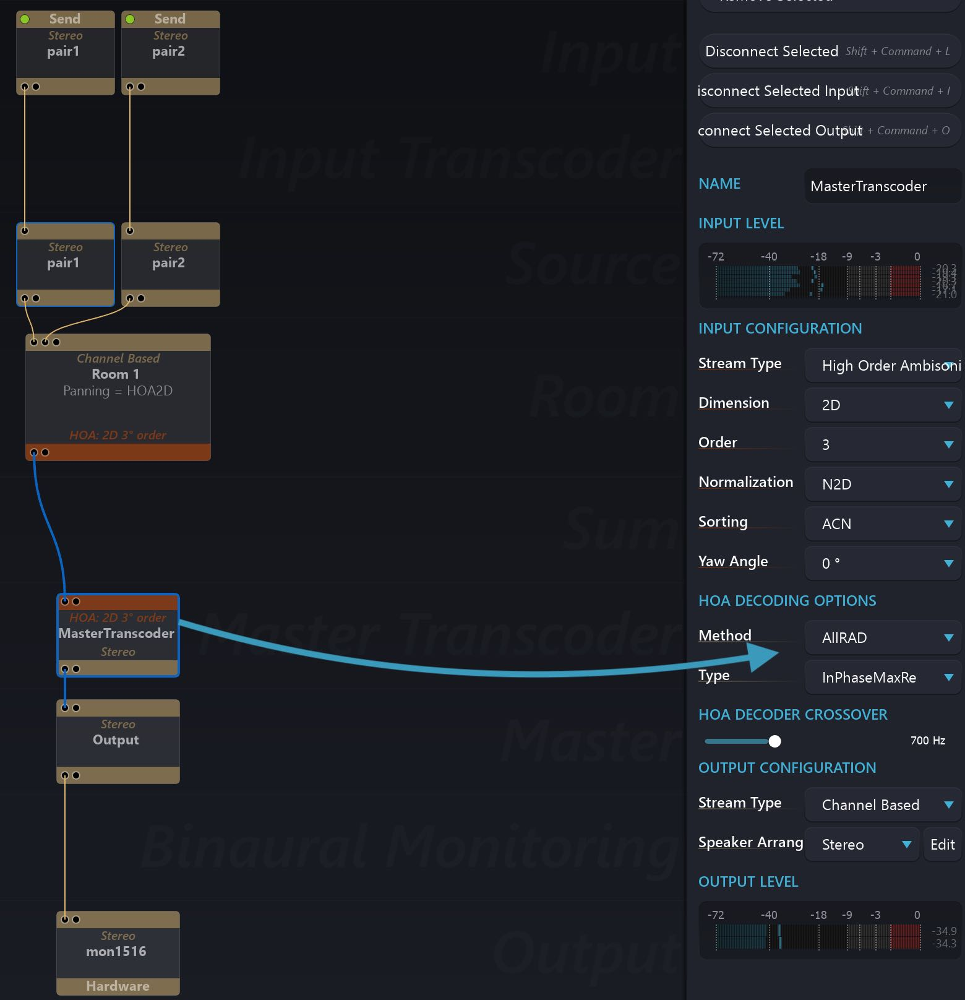
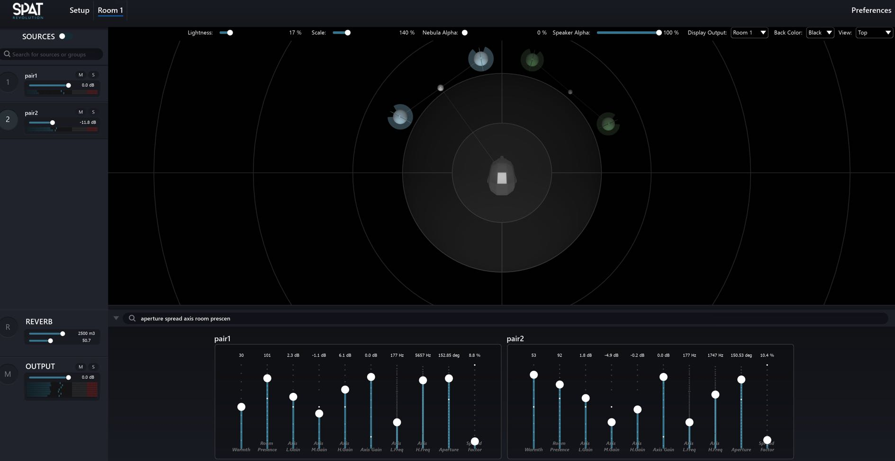

# 11.6 Ambisonic Mixing

**_Setup View_**

- A-Format SoundField microphone sources need input transcoding
- Ambisonic format inputs transcoded (decoded) to virtual configurations
- Suggest CUBE for BFormat3D / Quad for BFormat2D / OCTA for 2nd Order
    HOA2D

**_Room View_**

- Mix by manipulating virtual channel based Groups in HOA Room using
    Source Properties
- Record to HOA and/or Binaural
- Monitor to Binaural

**Explore Ambisonic Decoding Methods**

**_Setup View_**

Explore how different Ambisonic decoding Methods and Type options actually
_sound_ in realtime. Here - even just decoding 3rd Order Ambisonics down to basic
stereo - many balances of mix separation can be achieved exploring different Ambisonic decoding methods.

**_Room View_**

- Filter some faders to create a multi source interface
- Mix using selected parameters and graphic positioning of source
- Design a High Order Ambisonic reverb that works for well for the HOA decoder you have selected