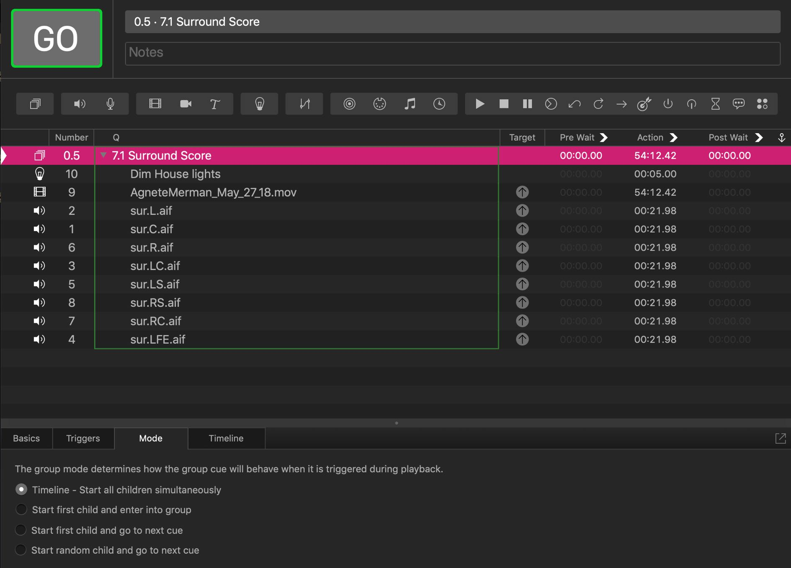
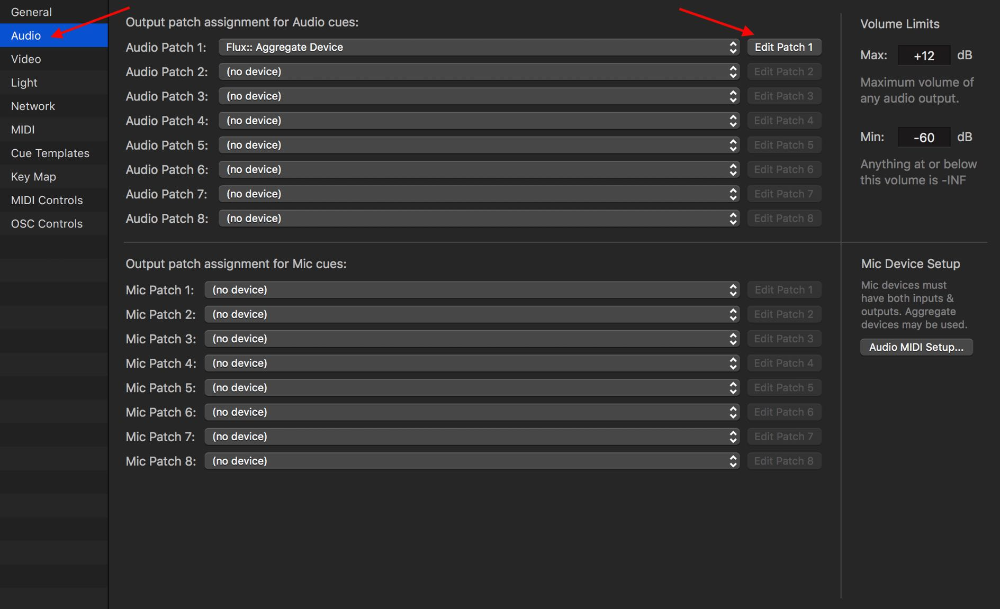
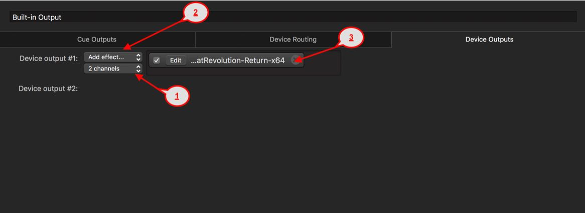
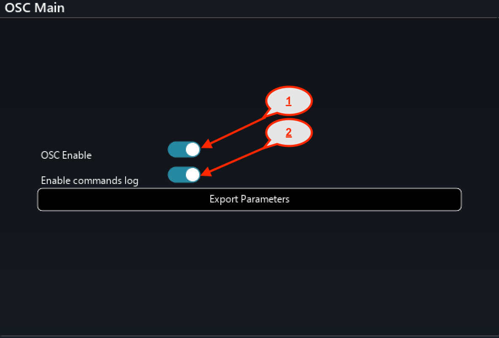
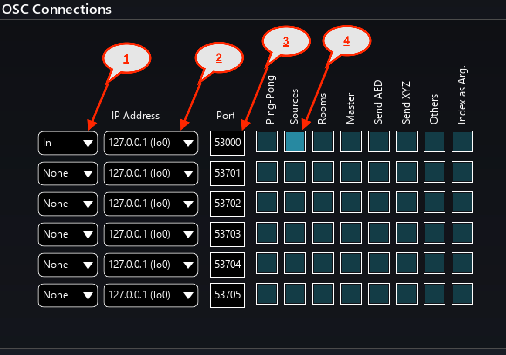
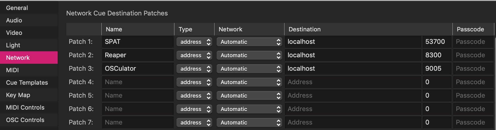
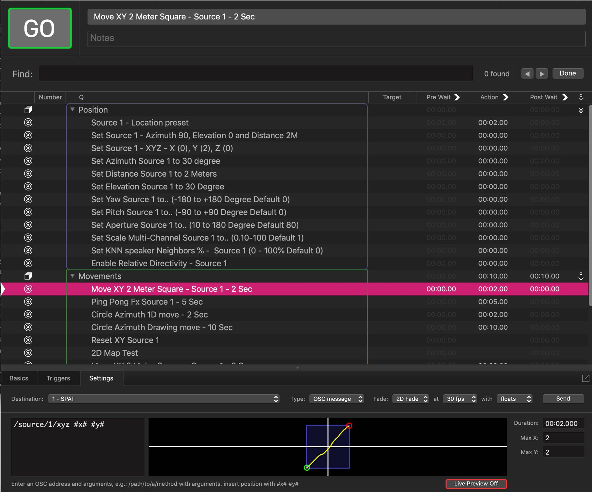
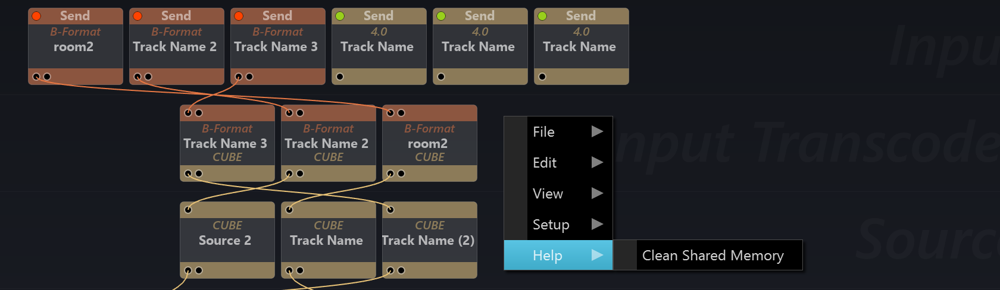

# 12.4 Figure53 QLab

Rock solid and fully featured show control program, based under a 'cue' based
paradigm. QLab is great for manually sequencing multiple media and show type
events, running video, sound, lights and virtually any type of control scripts through
its easy to use interface. Some of the more advanced control features in QLab
make the most of its native OSC network integration - which is why it becomes easy
to integrate with Spat Revolution.

One of the great features of QLab is that it can handle multi-channel audio stems at the moment, it is only possible to handle multichannel Send and Returns two
channels at a time. The Cue Outputs in WLab will allow to route the pairs of channels to the correct destination. Despite this little workaround needed for multichannel operation, QLab is still without doubt the most straightforward and reliable way to synchronise a video screening with a pre-rendered multichannel surround soundtrack made in Spat. We will take a look at this simple example set up
now.

**Film with Multichannel Audio**

If you are making a screening for a client or an audience and do not want to go
down the Dolby DCP route, then this is a simple way to do it in QLab. All the stems
were rendered to disk from Spat Revolution and are now played perfectly together
with the speaker routing handled by the QLab routing system.

**Local Audio Path in QLab**

The Local Audio Path integration between QLab and Spat Revolution is possible
using Spat send and Spat Return in AU Plug-in format. In this case both applications are running on the same local computer and audio is being routed to
and from QLab and Spat Revolution. In this setup, QLab remains the audio software application managing the inputs and outputs to your core audio device.
The ability to insert the Spat Send and Spat Return Plug-in to the Output patch
assignment for Audio cues in Worskspace Settings (Command + ,) allows to send

Cue Outputs to Spat Revolution software Inputs in Single (1) or Dual (2) channel
arrangements. A total mix of 64 Cue Outputs are available for this thus providing
64 single channel inputs, 32 dual channel inputs or a mix of both.

To do this, first open your QLab project with leaving Spat Revolution application
close and go to the Workspace Settings in QLab. Click the Audio Section then
choose and Audio Patch to Edit by clicking on the Edit Patch section.

Click the Add effect, Scroll to the Flux category and Choose SpatRevolution-Sendx64. The Spat Revolution Send Plug-In User interface will appear with the default
Local audio path disable. Make sure to initialise the audio and automation path by
clicking on the enable button.
Continue doing this for the amount of Cue Outputs desired. Next will be to insert
the Spat Return Plug-In. You will be able to return to QLab as many Outputs as the
Core Audio Device chosen in the Audio Patch and that you are currently editing.
Note that Qlab offers single (1) and Dual (2) channel arrangements for Device output plug in insertion.

> ★ Although the return buses will appear in 2 channels in Spat
Revolution they will be able to be fed from larger multichannel room
and you will be able to patch the desired output to the desired return busses.

To do this, please press on the Device Outputs tab in QLab.

_1_ Choose either 1 or 2 channel arrangement in the pull down menu.
_2_ Click the Add effect
_3_ Scroll to the Flux category and Choose SpatRevolution-Return-x64.

The Spat Revolution Return Plug-In User interface will appear with the default Local
audio path disabled. Make sure to Enable the audio path by clicking on the enable
button. The Index is automatically generated for you and will be either 1 or the next
available index if you have multiple instances of Spat Return in your current workspace. Note that the index represents the output number in Spat and is unique to
each Spat Return instance.

**QLab and Spat Revolution via Network Control**

In a realtime situation, where performers or sounds are being spatialised live by
Spat Revolution, and cues need to be sent in the right running order with the rest
of the show then Network OSC type cues can be sent from QLab to Spat to control
all aspects of the Spat rendering software. To do this amazing interaction, it is necessary to setup the inter-application OSC communication. It is relatively straightforward.
In the Spat Revolution preferences make sure the OSC Enable is engaged.

> ★ Enable commands log to view the commands and confirm you are
receiving data (Shift + F7 will open the log window)

_1_ - Change the pulldown from None to In (meaning you are setting a OSC Input to Spat)

_2_ - Select the network interface you want to be receiving the commands from. Doing a local integration will require you to choose the localhost / loopback address
127.0.0.1

_3_ - Set the Port # to the corresponding QLab Network Patch Output Port. In this case 53000

_4_ - Choose if you want OSC only for Sources or Add Room to permit to change Room Parameters

**QLab Network Cues**

On the QLab side, use the Network settings to setup multiple OSC destinations.
One of them can be SPAT - another could be Reaper or OSCulator or whatever
else.

You can now send OSC network cues from QLab to Spat, and control _ALL PARAMETERS_ of the virtual sources using Spat's OSC command dictionary. Once you
get the hang of it, this is really very straightforward. As of QLab4 there is a time interpolated 2D fade system for creating spatial XY gestures or similar multi parameter control ideas.

> ★ Flux team have created a full command template for QLab available on request

**Clearing Shared Memory**

Currently with Spat Revolution v1.1 some users have experienced an issue where
Spat SEND and RETURN plug-ins are not cleared from RAM after using certain
third-party hosts. QLab is one of those.

If this happens, Spat SEND and RETURN modules will appear in the Spat setup
graph editor, when there is no host software running in the background. It can
cause problems, when a host with plugins is launched and more SEND and RETURN plug-ins appear to be doubled.

The workaround, if this is happening with your particular 3rd party software, is to
invoke a special debug action in the Spat setup editor. It is called _Clean Shared
Memory_. It is available by right-clicking anywhere in the background of the signal
graph editor. A pop-up menu will appear with various options and shortcuts. Scroll
to the bottom and choose _Help/Clean Shared Memory_

When this command is executed, **both** Spat and the plug-in host will then need to
be restarted.

