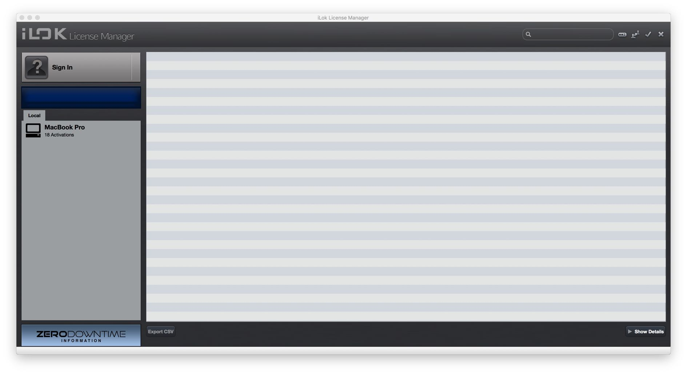

# 2.2 iLok License Manager

If you already have an iLok user account, licenses will have been connected directly
to your account. Skip ahead to the next section guiding you through the _Flux Center_.

For new iLok users, the first step is to download and install the iLok license manager available on the home page of the iLok website. When your user account is
successfully activated and the iLok license manager correctly installed, you can
start the software and log in to your iLok user account.

Pressing on the Sign In button will allow you to connect to your account. After Logging in, you are now ready to transfer any licenses to a computer or to any iLok
USB key if you happen to have one. The process of transferring a license is as simple as dragging the license from the _Available_ tab to your Local Computer on the
left side.

You are then set with a license on your Local Computer or on an iLok USB key.

If you require further information about iLok and managing licenses please refer to
iLok.com website.

