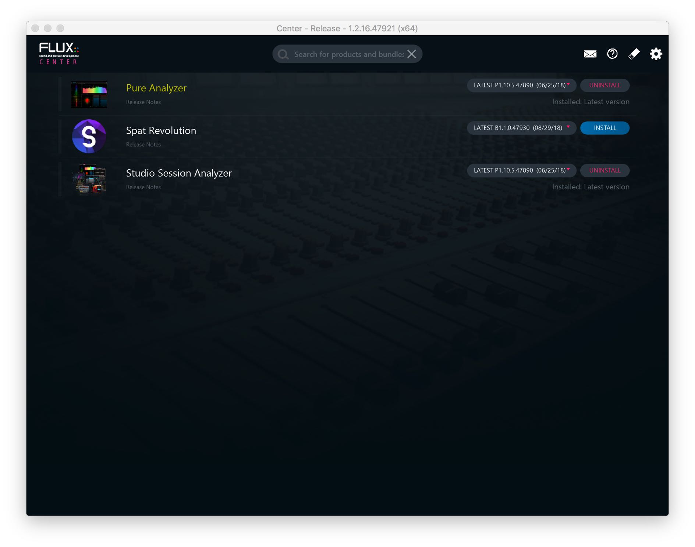

# 2.3 Flux Center

Next step is to get the installers for the _Flux_ products you are licensed for. All the
software and plugins from _Flux_ are available via our custom _Flux:: Center_ software.
This is a Mac or Windows application we have created to help keep your _Flux_
products up to date and to give you a clear overview of what you have installed.
Firstly, please visit the download section of the _Flux_ Website to get the installer for
the _Flux:: Center_ application at https://flux.audio/download/ .

On this page you will find a Mac OS X, Windows 32-bit and Windows 64-bit version
of the installer. After downloading and installing, you can open the _Flux:: Center_
application to begin the process of installing the Spat Revolution software.

