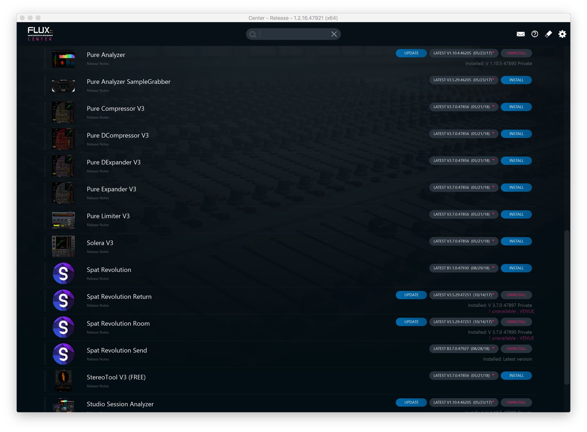
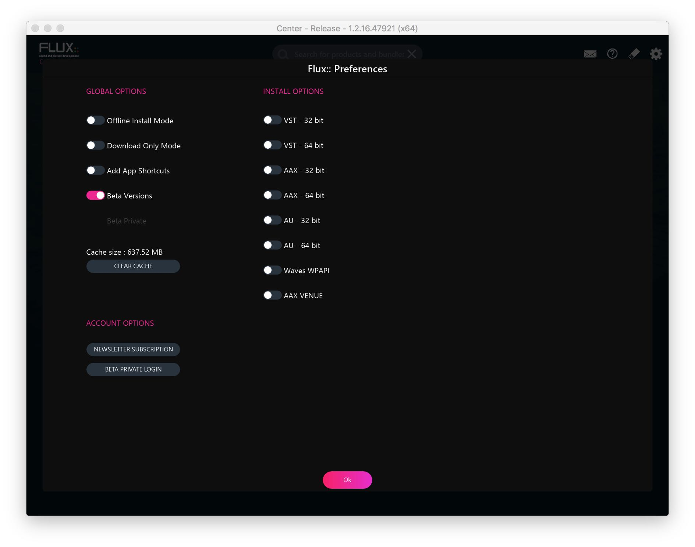

# 2.4 Installation Options

When you open _Flux:: Center_ you will see a page that lists all _Flux_ products available for you to install. You will also find information about which version you have
currently installed on your system and which new versions might be available for
you to update to. You can select versions to install - or uninstall if necessary - using
the pull down menus. If you would like to access more installer options such as
your preferred plug-in format, please click on the gear icon to the top right of the
header area.

This preferences page will allow you to choose various installation options such as
preferred plug-in formats for your system. Choosing your format and returning to
the main page by pressing the OK button will show all your install options for software and plugins based on the desired formats chosen. When an option is enabled, the corresponding checkbox is pink.

!> _Spat Revolution Send/Room/Return plugins are available in VST-64bit, AU-64bit_ _and AAX-64bit only_

