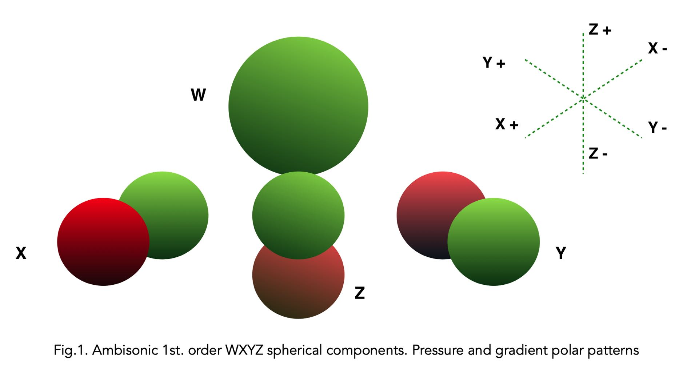

# 4.7 Introduction to Ambisonic

Simply put: Ambisonic is a specific method for creating, capturing and playing
back spatial audio. It is radically different from other surround techniques as the
technology is capable of reproducing a spherical representation of sound where
the directional information of a source is located in a 3D soundfield.

Ambisonic is also both a recording and a spatial synthesis technique, where one
can capture the full environment in 3D sound through the use of so called A or Bformat microphones such as the: Soundfield SPS200, Røde NT-SF1, Sennheiser
Ambeo, Coresound TetraMic and more. Alternatively, a sound field can be synthesised from any mono, stereo and multichannel sources to Ambisonic, constructing
a virtual 3D sound environment by placing the sources at locations in a virtual 3
dimensional field.

In the simplest form of Ambisonic - the 1st order ( also called **B-format** ) - only 4
channels is needed to represent a full 3D sound. The 4 channels or spherical components W, X, Y and Z resemble the pressure patterns found in an omni microphone (W) and three figure-of-8 microphones for left/right (Y), front/back (X) and
up/down (Z) as depicted in Fig.1.

Ambisonic as opposed to other surround and spatial techniques and methods
dœs not carry a speaker signal. It is an **encoded** audio signal that has to be **decoded** to the speaker signals. This encoding / decoding scheme has the advantage of being very portable and flexible since one is not bound to a specific
speaker setup. i.e you can have your ambisonic mix played on a number of speaker
setups, for instance Quad, headphones (binaural), 5.1, 6, 8, 7 speaker etc. based on
the chosen decoder.

When Ambisonic is played back on speakers all the speakers contribute to the directional content, what one is hearing is not the sound coming from a specific
speaker but from a specific direction.

Overview of a 5 HOA 3D Ambisonic File created by Tine Surell Lange

Ambisonic was originally developed by the late British mathematician and sound
engineer Michæl Gerzon and others in the 1970s. Although it was a commercial
failure at the time, this very powerful spatial technique has since been advanced
greatly by a number of composers, sound designers and researchers. With the introduction of Virtual Reality, fast decoders and related technology, Ambisonic is
getting a new renaissance being a perfect format for such applications.

If you want to learn more about Ambisonic and its mathematical foundation here
are some good starting points:

[https://www.researchgate.net/publication/280010078_Introduction_to_Ambisonics](https://www.researchgate.net/publication/280010078_Introduction_to_Ambisonics)

[http://flo.mur.at/writings/HOA-intro.pdf](http://flo.mur.at/writings/HOA-intro.pdf)

