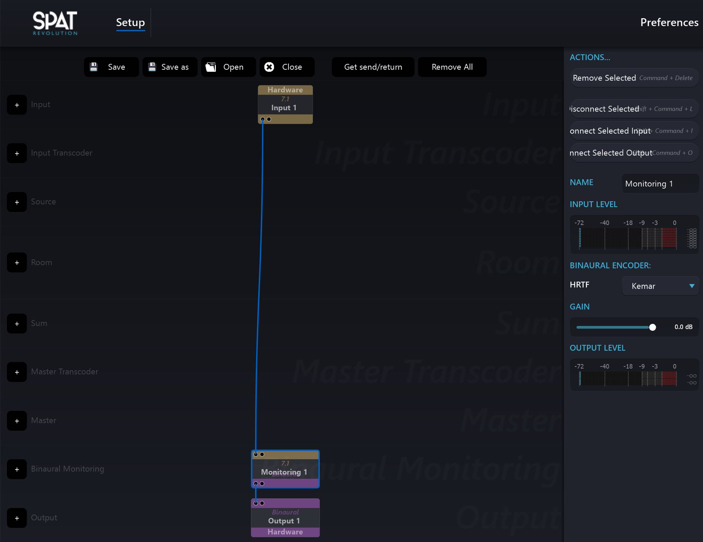

# 5.1.3 Binaural Monitoring Module

In the _Environment Setup_ of Spat Revolution, you will find a module dedicated to
Binaural Monitoring. Its purpose is to monitor any kind of speaker setup using
headphones and binaural encoding. This can give you an impression of how your
spatialisation might sound on a particular channel based system when you are off
location.

You can add a Binaural Monitoring Module by clicking on the + icon of the Binaural Monitoring row towards the bottom of the **Environment Setup** graph. The
module is very simple to use. It will automatically detect the type of channel based
audio stream you connect into it.

The Binaural Monitoring module works by virtualising each speaker, not each
source, so any real world speaker phenomena will be reflected in the binaural rendering. For example, a virtual source positioned in the centre between two virtual
speakers will be rendered with the same 'phantom speaker' in the binaural monitoring as in the physical world, because there is no virtual speaker at the centre
point either.

To listen to the binaural stream on headphones, you should select the HRTF you
would like to use for the encoding, and connect the output from the module to a
dedicated output module at the bottom of the graph. The output should be routed
to the headphone monitor outputs of your audio hardware.

