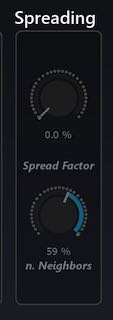

# 5.6.4 K Nearest Neighbour (KNN)

KNN is another panning type that dœs not depend on a sweet spot to be perceived correctly. It is a version of a 'Nearest-neighbour' interpolation algorithm.
These family of algorithms are also used in the fields of complex systems, 3D
graphics and network science to name a few. In Spat Revolution you can sonically
explore a network of loudspeakers using this panning type and some virtual sound
sources.

**How does it work?**

An interesting difference between DBAP and KNN is that the user gets manual control over one of the main cœfficients in the underlying algorithm. The parameter is
called _Nearest Neighbour Spreading_. It sets a maximum limit to the number of
speakers that the algorithm can use as neighbours - the parameter becomes available as a continuously variable percentage _for each virtual source_ in a Spat room.

What makes this particularly interesting is that different sources can activate less or
more of the sound system dynamically and in a very smooth way. For example, one
virtual sound source might seem to pop in and out of individual speakers because
its _Nearest Neighbours Spread_ parameter is set a low percentage. For example, on
a 10 speaker arragnement :1-10% will use 1 speaker, 11% to 20% 2 and so on. Another sound source could seem diffuse over the entire sound system, because its
spread variable is set to 100%.

> ★ Try automating the Nearest Neighbours Spread in a relationship with
another source property of the same sound source such as room presence.
