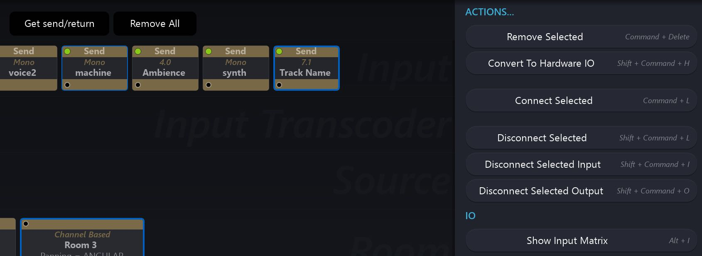
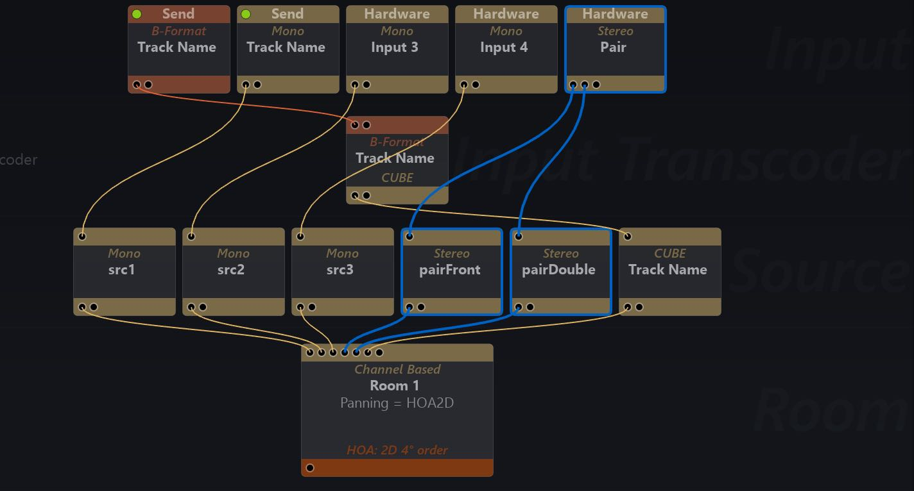

# 6.2 Environment Setup Editor

This is where you will generally start a project by designing the signal flow graph
that you will be working with. _Setup_ is also where you manage the loading and saving of projects to disk.

The _Environment Setup_ editor is a relatively simple modular environment. The signal flow starts from the inputs at the top of the graph and concludes with the outputs at the bottom. You add modules to rows using the small (+) icon to the left of
the window.

Connect or disconnect modules by using _command+click_ to select some followed
by any of the Actions available in the options panel on the right of the window. Various keyboard shortcuts are also available for each Action. As you connect modules
and build up a signal graph, you will see some 'wires' appear which connect modules together. In Spat Revolution these 'wires' represent connections in the signal
graph diagram, you do not directly interact with them. It is not a 'patching' type of
interface.

> ★ Select multiple modules using drag/lasso selection before an Action

There is no UNDO/REDO paradigm in the signal graph editor at this point. Instead
it is advisable to use **Connect/Disconnect Selected** actions to re-structure the signal graph. Try to avoid deleting modules until you are certain that is the correct action.

> ★ Modules can be connected to multiple destinations

It is possible to connect some modules, such as Input or Source, to multiple destinations, as a way of making doubles in a single or doubling a single source into different virtual rooms.

