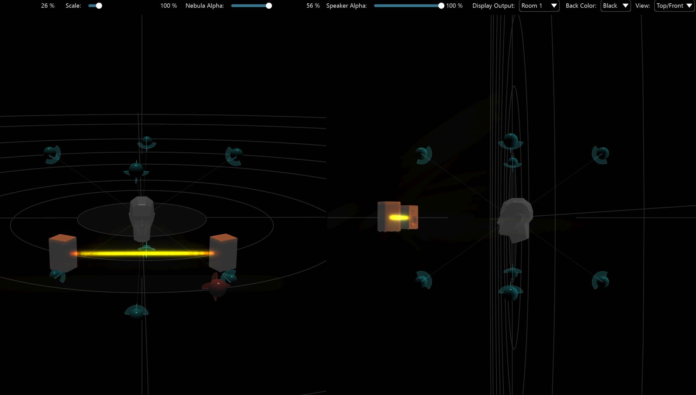

# 6.7.2 Room Camera View

The camera angle of the 3D scene can be moved continuously using a **controldrag** mouse or trackpad gesture applied directly onto the Room view. This will reposition the camera. A _forwards and backwards scroll_ on the mouse or trackpad will
zoom the camera in and out of the scene. Furthermore a change (or resetting) of
view orientation can be selected from the _View_ pull down menu, to show 'topdown' view of the scene.

A split screen Top-Front view is also available
