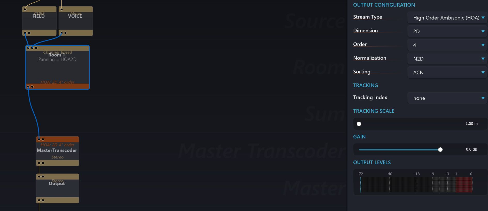

# 6.7.8 High Order Ambisonic Room

One of the most straightforward methods to start working with HOA spatialisation
in a signal flow is to connect input sources directly into an HOA Room. To convert a
Room to be HOA, you select High Order Ambisonic as the _Output Configuration
Stream Type_.

All inputs to a Room must be in some kind of Channel Based format, even when it
is an Ambisonic or Binaural Room. That is the workflow at the time of writing (Spat
Revolution v1.1). This makes most intuitive sense, when using Ambisonic format inputs as pre-encoded "3D sound field" type inputs into a room. You cannot just add
them into an HOA room, even though they may be HOA format. Why is that?

This is because Ambisonic audio always needs to be _decoded_ into a channel
based format to hear the spatialised audio on speakers ( as we have mentioned a
few times already). And so in a virtual room, an Ambisonic source needs to be decoded to a _virtual_ speaker configuration. The choice of what virtual speaker configuration you decode the Ambisonic audio to, will influence the way the source's direct signals will sound and its sound will be altered by the way it interacts with the
Virtual Room Acoustics. If it is a 1st or 2nd Order B-Format source, then a Cube
configuration for 3D or an Octaphonic for 2D is usually a good choice. The important thing to keep in mind, is that a higher order of Ambisonic encoding, will sound
more accurate on a higher density channel-based configuration - and if the source
Ambisonic encoding is 3D, then you really should choose a 3D type of channel
configuration.

!> _Ambisonic encoded audio is not intended to be listened to without decoding_

The other important thing to keep in mind, is that by decoding Ambisonics to a vir
tual Channel Based configuration, allows for some very special transformations and
re-designing possibilities of the original Ambisonic source. When a B-Format
source becomes an arbitrary configuration of virtual emitters in the virtual Room,
the ambisonic sound-field becomes a group that you can manipulate and transform using all the source parameters - especially, the barycentric source parameters which are really useful for rotating and transforming the original sound field in
many ways (see section 9.9).

> ★ Ambisonic encoding is a convenient way to share and archive spatial sound mixes

The output from an Ambisonic room must always be _decoded_ into a channel
based stream in order to hear the resulting spatial image (see section 4.7 introduction to Ambisonic). But even though it is not speaker compatible, it is still an audio
data stream - so therefore it is quite possible to record and HOA stream to disk
without decoding. This is a powerful way to work, as the HOA format encodes full
sphere spatial information which can then be decoded/transcoded at a later stage.

In an HOA Room, the Order and other Ambisonic encoding parameters can be
changed at the output configuration of the room very easily, by selecting a different value pull down menus. When you have correctly set up a speaker compatible
decoding method for the HOA stream coming out of a Virtual Room, you should
clearly hear the difference in focus and the way that the Artificial Reverberation behaves as the Order gœs up. Do not be complacent about the simplicity of the HOA
interface. There is plenty going on under the hood but Spat makes it feel simple to
explore how different Ambisonic Orders sound. Similarly, other encoding options
are available to apply and listen to directly.

An HOA Room simulates many different Ambisonic decoding options in realtime.
When you decode (or Transcode) an HOA Room output into a Channel Based or
Binaural stream, you will be able to hear how different Ambisonic encoding and
decoding options (such as Method and Type) will sound. The topic of Ambisonic
decoding options such as Type, Normalisation, Sorting and Method is a particularly
large one but in the end, it comes down to how the sound field will come across and this involves listening. Similar to how Sommeliers get to know the nuances of
wine by opening lots of bottles, the best way to get to know Ambisonic options
and understand for yourself how they affect the sound, is by decoding and listening on different setups. And perhaps also digging into some of the literature you
will find online.

One thing we can already guide you in, is how each Order affects spatial precision.
This knowledge may be beneficial to understand when you are rendering and mixing Ambisonic sound fields. The precision with which a source can be localised in
Ambisonics is directly linked to the Ambisonic Order. Sources encoded as first order (FOA or B-Format) can be quite diffuse in their localisability when decoded.
Higher Orders, such as 3 or 7 can render precisely localisable point sources in 3D.
The cost is in computation and increasing audio channel count ( see Section 6.45 ).

Some types of source material such as ambience or field recordings can benefit
from the more immersive feeling of lower Orders, but point sources may need encoding in higher Order to get a more localisable result.

