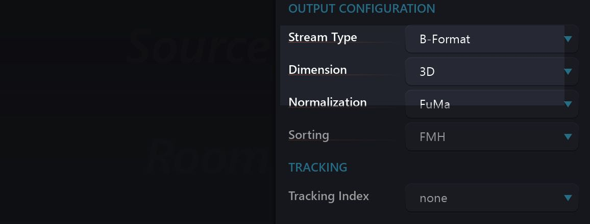

# 6.7.9 B-Format Room

This is a First Order Ambisonic (FOA) room which is correctly suited for mixing BFormat Ambisonic signals. B-Format is 4 channel interleaved Ambisonic format,
which is already widely used as a 3D audio format in the audio industry, as it can be
decoded quickly and efficiently in realtime. If you are producing content that is intended for realtime decoding in B-Format, you can work in a B-Format Room.

The output configuration is preset for B-Format Room, although it is possible to
change to 2D or 3D.

In the classic Furse-Malham (FuMa) sorting system for 1st order is: WXYZ. W is the
mono sum and it is carried on channel 1. In the ACN channel order convention a
1st order signal is arranged as: WYZX.

