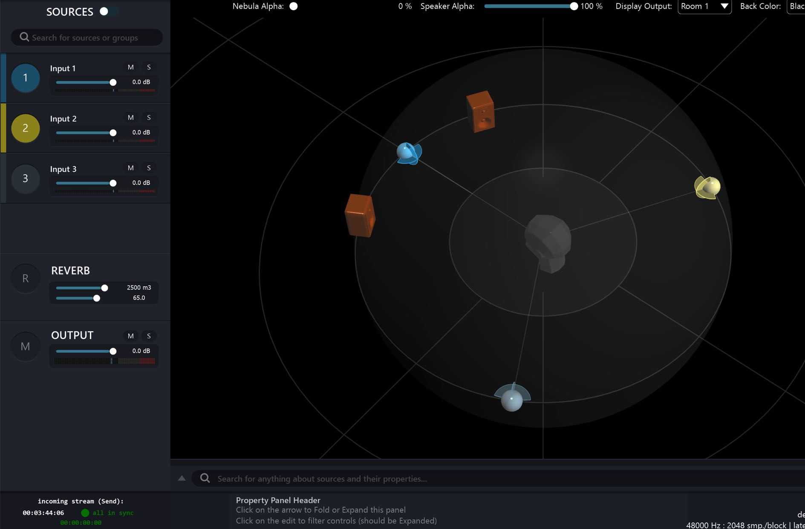

# 9.3 Multiple Source Selection

You can shift-click on the Index number of separate Sources to create an ad-hoc
edit group. When you have group Sources in this way, you can perform a number
of group edit actions.
When you Right Click on an ad-hoc group selection a menu will pop up where
you can:

- distribute the sources in the group evenly in a circle spread
- generate different colours for the sources
- reset the positions of the group

When you have selected an ad-hoc group using the shift-click technique, you can
then pop-up the _Source Parameter_ panel by clicking on the property panel header
'fold arrow' as shown in the screenshot below.

Any Source Parameter variables you adjust manually will assign that same setting
on all selected sources in the group. A barycentric will then become practical to
work from a center of mass perspective. For example, transformations like scaling,
distance, rotation and directivity of the group is managed by Spat controlling each
member of the group a barycentric relationship. Consider referring back to section
6.8 about groups in Rooms to read more about how they are represented.

